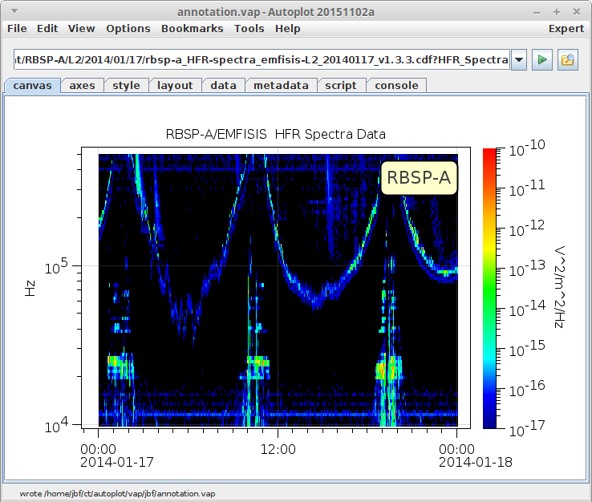
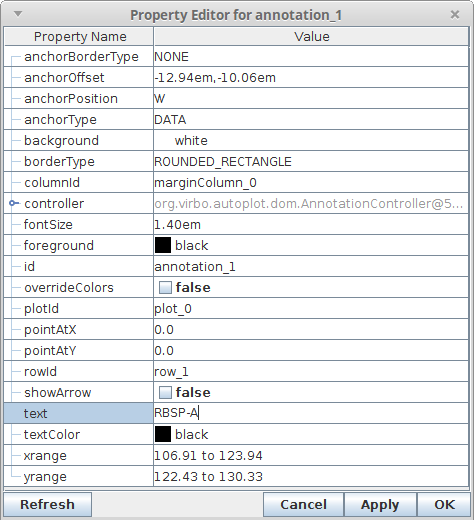

Audience: Scientists

See also: <http://autoplot.org//help.annotationCommand>

# Introduction

Annotations add additional text to the page. They are free text that can
be attached anywhere to the canvas or attached to data. This is a step
usually left to another software as the figure is prepared for
publication, such as Photoshop or Power Point, but it's useful to be
able to do this within Autoplot for communication with a colleague and
to get the display all the closer to be ready for publication.



# Adding Annotations

To add an annotation, right-click on the plot image and select "Add
Annotation." This will ask for starting text and will optionally allow
the annotation to be anchored to a point on the plot. This annotation is
now a part of the dom configuration and will be saved into a .vap file.
Right-click on the annotation to edit its properties or to delete the
annotation.

The text can contain "granny" codes like E=mc\!u2\!n (E=mc<sup>2</sup>),
and either \!c or \<br\> will start a new line.

# Anchor Location

The annotation properties can be edited with the properties dialog.
These annotations have a set of controls that is a bit overwhelming, and
some are used more often than others. When anchored to the canvas, the annotation
is positioned relative to a row and a column, and by default this is the
row and column of the plot which created the annotation. The rowId and
columnId properties can be reset, or set to an empty string to mean the
entire width or height of the canvas. The annotation can be positioned
at any of the corners or the center of this row-column box, and inside
or outside of the box. There is an anchorOffset that allows the
annotation to be moved, which is "1em,1em" initially. This means 1em
towards the box center in horizontal and vertical position. If the
annotation were positioned outside of the box, then this would be away
from the box.

When the annotation is positioned relative to the plot, the plot row and
column are used, as with canvas, but the plot bounds will clip the
annotation. TODO: verify this\!

When the annotation is positioned relative to data, the xrange and
yrange define the box position. The annotation is then relative to the
box specified by these two properties.

In 2020, a new property "splitAnchorType" was added so that the X and Y
position of the annotation can be set separately. For example, if we
want the X position to follow the data, but the Y position to follow a
plot, then splitAnchorType=True and
verticalAnchorType=AnchorType.CANVAS, while anchorType=AnchorType.DATA.

# Font and Colors

By default the annotation inherits its font and colors from the canvas.
The background will be the same as the canvas background and foreground
the same as the canvas foreground. When overrideColors is true, the
foreground, background, and textColor are used instead.

Although the font cannot be changed, the font size used is specified
relative to the canvas font. So the default "1em" means that the font
size should be the same as other labels on the canvas. "2em" would be
twice as big and "1.0em+2pt" would be 2 points bigger.

# Pointing at Features

Annotations can point at a datum pair, indicating the X and Y values at
which the arrow should point. These are the pointAtX and pointAtY
properties. There is an additional property pointAtOffset, which when
non-empty backs off the arrow head so that what it's pointing at is not
obscured. For example pointAtOffset='1em' means the arrow will be
shortened by 1em (the current font height) away from the pointAt
location.

For v2020a\_13, new properties referenceX and referenceY were added,
which are a semicolon-delimited list of Datums which will be pointed at.
This allows one label to point at multiple targets.

# Adding Annotations in Scripts

Autoplot has an "annotation" command simplifying use in Jython scripts:

```
a= annotation(0,text="Annotation",borderType='Rounded_Rectangle')
```
The "0" is like the plot command's index, where it is just an index so
the page isn't filled with annotations as the script is run repeatedly.
Arguments will be converted if possible, so for example,

```
ann= annotation( text='featured point', anchorOffset='1em,1em', anchorType='data', anchorPosition='SW', pointAt='12,14' )
```
points at (12,14) and 1em,1em offset from this point, with the point to
the south west (SW) of the annotation.

# Macros in Annotations

The following macros are available for use in annotations, when the
annotation is connected to a plot. If the plot has one or more
plotElements, then the first is used to provide a dataset, from which
properties may be resolved. For example,

```
%{USER_PROPERTIES.name} 
```
will show the value of the tag "name" in the USER\_PROPERTIES map, and

```
%{METADATA._RecCount}
```
will show the number of records in a CDF file. Other examples include:

```
%{PROPERTIES.DEPEND_0.UNITS}
%{CONTEXT}
%{TIMERANGE}
```
# Control Sequences

There are some control sequences which are useful in labels (axis labels
as well as annotations) as well:

```
!(color;saddleBrown)
```
will set the color to "saddleBrown", and \!(color) will return to the
initial drawing color. See
<https://github.com/autoplot/dev/blob/master/rfe/sf/625/demoBuiltIns.jy>.

Labels also support also support custom drawing code, defined in
scripts. See
<https://github.com/autoplot/dev/blob/master/rfe/sf/625/demoPainterAnnoPsym.jy>
which shows how to draw plot symbols, and
<https://github.com/autoplot/dev/blob/master/rfe/sf/625/demoPainterAnnoCustom.jy>
which shows how to draw using graphics commands for lines and circles.

