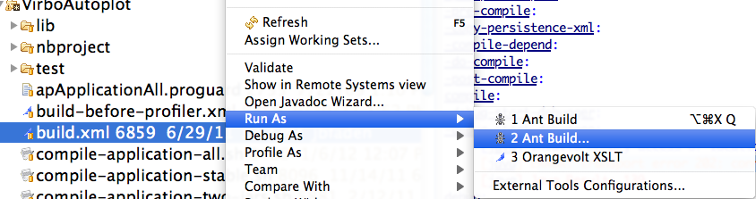
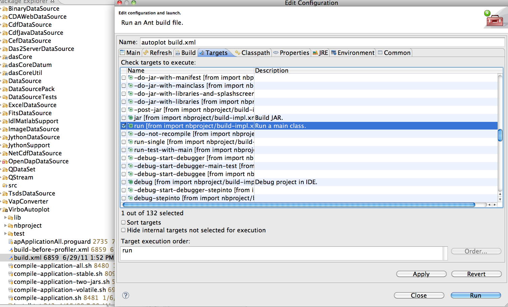

# Building on command line using Ant

Ant is a build system for Java, similar to the old "make" command. This
assumes that you have Java 1.7 and Apache Ant version 1.8.2 available.

The svn for Autoplot is
<https://svn.code.sf.net/p/autoplot/code/autoplot/trunk>. Tagged
versions are in <https://svn.code.sf.net/p/autoplot/code/autoplot/tags>.
Branch versions are in
<https://svn.code.sf.net/p/autoplot/code/autoplot/branches> but are
rarely used.

```
 svn co https://svn.code.sf.net/p/autoplot/code/autoplot/trunk/ autoplot
 cd autoplot
```
`&nbsp;git&nbsp;clone&nbsp;`&lt;https://github.com/das-developers/das2java.git&gt;

Check out the sources with Netbeans or some other svn client into the
directory "autoplot"

There are a number Netbeans projects that can be built with ant. They
are:

  - Autoplot -- Autoplot gui and application model
  - CDFDataSource -- support for CDF.
  - JythonDataSource -- dataset mashups using python code.
  - WavDataSource -- the result of the wav tutorial
  - DataSourcePack -- a number of data sources, including NetCDF, excel,
    and ascii tables.
  - DataSource -- data source plugin interface and utilities.
  - QDataSet -- the data model that unifies various data media into one
    uniform model.
  - APLibs -- an empty project with no sources, but all the libraries
    (jar files like iText for PDF) needed are in APLibs/libs.

The "src" directory of each of these folders contains the java source
code. Together these should show nicely what's going on under the hood.

Das2 is the library that provides interactive 2D graphics. It comes from
a different svn, but should be checked out automatically along with the
Autoplot source from SourceForge.

To build using ant, change into the Autoplot project, and run: "ant
jar". The default target will compile all sub projects, and the
resulting jar files will be in dist.

```
 cd autoplot/Autoplot
 ant jar
```
To run the Autoplot you have built, in the Autoplot folder try:

```
 ant run
```
# Building in Netbeans

Purpose: this document describes the process of checking out and
building Autoplot using the Netbeans IDE from Sun.

Netbeans 8.2 has been used for quite a while as the primary platform for
development. Netbeans 9.0 changes a lot of things, and should not be
used.

## platform

This document assumes you have installed Netbeans 7.3 on your desktop.
Subversion is included within Netbeans.

## procedure

The images here are of Netbeans 6.9, but the procedure with newer
versions will be similar. Netbeans is freely available at the [Netbeans
website](http://netbeans.org).

Netbeans out-of-the-box looks something like this.


Use Subversion to checkout the Autoplot source.
Versioning-\>Subversion-\>Checkout...


<https://svn.code.sf.net/p/autoplot/code/autoplot/trunk>


Select "Skip trunk and checkout only its content..."


Specify the location for the source on your desktop.


Netbeans detects the projects within. There are many projects, each
corresponds to a jar file (similar to a .so or .dll) that provides
access to a new data source, implements the GUI, the data model, etc.


Select "Autoplot", or more if you are interested.


Autoplot appears in the projects tab.


The project label is red because it is missing the dasCore library.
Newer versions of Netbeans will correctly check this out.


right-click on the project and select "Build."


It should take a minute or two to build the first time.


The build was successful.


We can run it by right-clicking on the project and selecting "Run"


Works\! 

From the Autoplot menubar, select Help-\>About Autoplot. This will show
all the resources the application is using.


Select the "Files" tab to look at the files within each project.


Under the Autoplot project, in the folder "dist," you'll find the jar
files the Netbeans build has created.


## Adding more projects

To add additional projects to the application, for example to add a new
data source, right-click on the VirboAutoplot project node and select
properties. In the properties dialog, select Libraries to see the list
of libraries and third-party jar files used. Scroll to the right and
click on "add Project" to add another project.

# Building in Eclipse

These instructions are designed to explain how to set up an Autoplot
project in [Eclipse](http://www.eclipse.org/). Note that the Eclipse
user interface varies from one version to another, but the steps are
similar.

You will need [Eclipse](http://www.eclipse.org/), of course, with a
[Subversion](http://subversion.tigris.org/) plugin such as
[Subclipse](http://subclipse.tigris.org/).

See
[1](https://sourceforge.net/tracker/?func=detail&aid=2929412&group_id=199733&atid=970682)
for notes on problems related to Ant 1.7.1.

## Installing Subclipse

To see if you have already have the Subclipse plugin installed, select
the "About Eclipse" in the "Help" menu of Eclipse. Select "Plug-in
Details" on the pop-up and look for something related to "SVN" or
"Subversion". If you do not have the Subclipse plugin, that is easily
rectified:

Select the "Software Updates" option in Eclipse's "Help" menu and add a
new remote update site. The URL for the Subclipse update site is
<http://subclipse.tigris.org/update_1.4.x>. Once you have added this
update site, select the Subclipse components that you want to install.
You won't need the optional parts.

## Checking Out from SVN

**<font color="red">When you see a pop-up about a security certificate,
you must click Accept Permanently</font>**. If not, your build will fail
when the das2 part of the repository is checked out.

Start by adding the "Subversion Repositories" view to Eclipse via the
"\[Menubar\]-\>Window-\>Show View-\>Other..." menu. In the "Subversion
Repositories" view, add a new SVN repository (upper right icon). Enter
the URL to the Autoplot repository:
**<https://svn.code.sf.net/p/autoplot/code/>**

Once you are connected to the repository, drill down to
**autoplot/trunk**. Right click on **trunk** and select "Checkout...".
Go with the defaults and you should end up with a Java project called
"autoplot" in the "Package Explorer" view.

NEW WITH LUNA: I did from the project explorer: new SVN project. Check
out **autoplot/trunk**.

Note, for your "convenience," eclipse puts all the source code and jar
files near the top of the project (note the "package" and "jar" icons).
This may make it look like you have duplicate folders in your project.
You can use eclipse's "Navigator" view to see the actual directory
structure of the project.

## Configuring the Project

Once you have checked out the Autoplot code from the Subversion
repository, the project should appear in Eclipse's "Package Explorer."
There will be a white-on-red "X" on the project name indicating that it
is not happy. The problem is that we need to build some jar files to
meet all the dependencies. Before building, you must:

  - Set source level to 6.0 using File -\> Properties -\> Java Compiler
    -\> Compliance Level -\> 6.0
  - Set JAVA\_HOME
      - Windows - In Windows File Browser, find directory name of a jdk
        on your system, for example, C:\\Program
        Files\\Java\\jdk1.6.0\_09 and copy the name into the clipboard.
        Right click on My Computer \> Properties \> Advanced \>
        Environment Variables \> New \> Enter JAVA\_HOME and C:\\Program
        Files\\Java\\jdk1.6.0\_09.
      - Linux and OS X - Set variables on command line
        <http://help.eclipse.org/help32/index.jsp?topic=/org.eclipse.platform.doc.isv/reference/misc/runtime-options.html>
        (Should be able to do this on Windows by modifying the eclipse
        shortcut to include the -vm option)
      - Linux 64-bit Ubuntu - there are many problems with Eclipse
        crashing that is no fault of Autoplot. Do a web search and try
        many things. I don't know how I got it to work, but I did. Here
        is the output of ps
            /usr/lib/eclipse/eclipse -vm /usr/lib/jvm/java-6-sun/bin/java -install /usr/lib/eclipse -startup /usr/lib/eclipse/startup.jar -vmargs -Djava.library.path=/usr/lib/jni -Dgnu.gcj.precompiled.db.path=/var/lib/gcj-4.2/classmap.db -Dgnu.gcj.runtime.VMClassLoader.library_control=never -Dosgi.locking=none

## Compiling Autoplot

  - Right-click on VirboAutoplot/build.xml
  - Select Run As -\> Ant Build (second option)
  - Select "run" checkbox and un-select "default" checkbox
  - Select run



  

## Compiling Autoplot alternative approach

(Does not work completely)

  - Click the green button and select AutoplotUI in the dialog that
    comes up.
  - NOTE: Jon V. found that Eclipse doesn't handle the META-INF
    discovery correctly and so only the first
    org.autoplot.asdatasource.AudioSystemDataSourceFactory.extensions
    file is read. The result is that only this data format can be read.
    The work-around is to copy all of the META-INF/\*.extensions files
    into the
    org.autoplot.asdatasource.AudioSystemDataSourceFactory.extensions
    file.
  - With LUNA this does not appear to be necessary.

# Building Servlet

A simple servlet is found in the repository at
<https://svn.code.sf.net/p/autoplot/code/autoplot/trunk/AutoplotServlet>.
This shows how Autoplot can be used to create graphics on the
server-side, when used with a J2EE container like Apache Tomcat.

  - Check out and build Autoplot sources as described above.
  - The location of a server's classpath must be specified. Locate a
    J2EE instance, such as Tomcat.
  - change directory to the location of the ant build script, build.xml:
    cd AutoplotServlet
  - Use ant to compile the servlet, using (where the classpath is set to
    your server location):

<!-- end list -->

    ant -Dj2ee.server.home=/usr/local/apache-tomcat-7.0.34/ dist

ant 1.7.1 is required to compile the source.

  - The war file will be found in the "dist" folder.
  - Installation depends on the web server. For example can be installed
    in the Tomcat server by simply copying it to
    /usr/local/apache-tomcat-7.0.34/webapps/

# Building Applet

Use as an applet is no longer supported. It could be done, but so few
people have applets enabled that this use case has been abandoned.

# Building "jumbojar" (All Classes)

Autoplot/compile-application-all.sh is a script that builds
dist/AutoplotAll.jar. This script uses the environment variable
$JAVA\_HOME, which by default is /usr/local/jdk1.8/. (Verify that
$JAVA\_HOME/bin/javac and $JAVA\_HOME/bin/jar exist.) This script works
by unpacking all the library files and recombining them into one \~30MB
jar file. The output will be in Autoplot/dist/AutoplotAll.jar, and can
be run by changing the permissions and double-clicking on the jar file.

The script compile-application.sh creates both the jnlp release and
jumbo jar "autoplot.jar" and the download page
(http://autoplot.org/jnlp/latest/).

Note these scripts are used on
<http://jfaden.net/jenkins/job/autoplot-jar-all/>.

