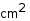
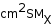

See also https://github.com/das-developers/das2java/wiki/Granny-Text-Strings which describes use in Das2 apps.  This describes Autoplot extentions as well.


"Granny Strings" are from IDL are supported, so !A will move the pen up, and !N will return to its original level.  Over the years support for additional controls has been added, namely some support for HTML, like &lt;br&gt;, and LaTeX is planned.  
Color control strings are added which can modify the graphics context.  And beyond that, Java/Jython codes can be plugged in which allows any customization.

| Code            |      Description     |
|:-----------------|:---------------------|
| !A | shift up one half line |
| !B | shift down one half line  (e.g.  !A3!n-!B4!n is 3/4). |
| !C | newline | 
| !D | subscript 0.62 of old font size. |
| !U | superscript of 0.62 of old font size. |
| !E | superscript 0.44 of old font size. |
| !I | subscript 0.44 of old font size. |
| !N | return to the original font size. |
| !R | restore position to last saved position |
| !S | save the current position. |
| !K | reduce the font size. (Not in IDL's set.) |
| !! | the exclamation point (!) |
| !(ext;args) | extension and arguments for the extension, examples follow. |
| !(color;saddleBrown) | switch to color. |
| !(painter;codeId;codeArg1) | Plug-in Java code for painting regions. |

A table of example control strings and their rendering follows.

| Label Text      |      codes used      |  Rendering      |
|-----------------|:---------------------|:---------------:|
| cm!A2    |  !A is shift up |  |
| cm!A2!nSM!BX!n    |  !n is return, !B is shift down |  |
| Bulk!cFlow   |  !c is newline |  |
| Bulk&lt;br&gt;Flow | &lt;br&gt; is also newline |  |
| Flow !(color;blue)Positive!(color) !(color;red)Negative!(color)  | colors, note no argument<br>returns to default color |  |
| !(color;SaddleBrown)&amp;#9608;!(color) Brown Points | Unicode block used,<br>to show color<br><a href='http://etetoolkit.org/docs/2.3/_images/svg_colors.png'>SVG Colors</a> |  |
| &amp;Delta;M Parameter | HTML Entities <a href='https://unicodelookup.com/#greek/1' target='_blank'>Table</a> |  |
| &amp;#9742; 555-1212 | HTML Entities |  |
| some &lt;b&gt;Bold&lt;/b&gt; text | Bold text |  | 

# Standard Painters
Two standard painters are added to all GrannyTextRenderers.  The painter;psym or painter;img identify the painter,
and the arguments follow.
| Code            |    Arguments |  Description     |
|:-----------------|:---------------------|:---------------------|
| !(painter;psym;boxes;size=0.5em) | arg0 is non, triangles, circles, etc<br>size is ems or pts <br>connect is solid,none,or dots<br>lineThick is line thickness.| Draws a plot symbol at the position |
| !(painter;img;https://autoplot.org/Logo32.png) | arg0 is the image URL<br>arg1 is the size in em or px. | Draws an image at the position |

# Autoplot Extentions
# Macros in Annotations

The following macros are available for use in annotations, when the
annotation is connected to a plot. If the plot has one or more
plotElements, then the first is used to provide a dataset, from which
properties may be resolved. For example,

```
%{USER_PROPERTIES.name} 
```

will show the value of the tag "name" in the USER\_PROPERTIES map, and

```
%{METADATA._RecCount}
```

will show the number of records in a CDF file. Other examples include:

```
%{PROPERTIES.DEPEND_0.UNITS}  -- grab units from a dataset's timetags
%{CONTEXT}
%{TIMERANGE} -- display the dom timerange, using the xaxis position or plot context property
%{TIMERANGE;FORMAT=$o}  --  display the orbit number when an orbit time range is used, like orbit:rbspa-pp:960  Note this only works when special orbit range objects are found (objects containing the spacecraft context), and these are easily lost as axes are tweaked.
%{TIMERANGE;CONTEXT=ts2-roi-list;FORMAT=$o} -- explicitly declares the spacecraft context, and will allow for 10% fuzz around the start and stop of the interval.
```
Note that .vap files themselves can have macros, which share the same namespace as
annotations.  See https://github.com/autoplot/documentation/blob/main/md/MacrosInVaps.md .


# Arbitrary Extensions Using Painters
These strings are rendered by an object called GrannyTextRenderer, and it allows for custom handlers to
be plugged in.  For example, you can plug in a code that draws a plot symbol, and then use plot 
symbols within the strings.  

Here is an Autoplot Jython script showing how this is done, see https://github.com/autoplot/dev/blob/master/rfe/sf/625/latexPainter.jy.
LaTeXPainter is a GrannyTextRenderer.Painter, which draws content onto the graphics and returns a bounding box showing where the content
was drawn.  This LaTeXPainter is then created and assigned the painter label "latex", so any time !(painter;latex;...) is found in the
string, the painter is called upon to paint the content.

# Granny Text Editor
An editor provides a GUI method for creating text strings.

