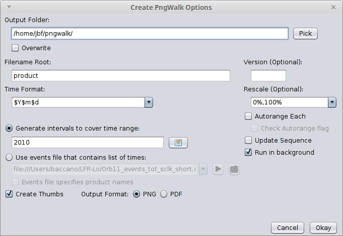
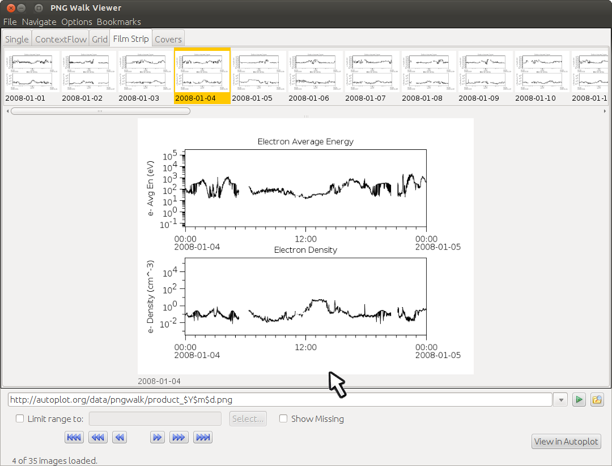

See also: [PNGWalks](PNGWalks.md)

# Introduction

Often in our field we need to survey long data sets, looking through
images one at a time for interesting features. Autoplot's PNG Walk Tool
facility will generate fixed images for intervals covering time range,
or a "PNG Walk." For example, you have a useful product (vap file) that
shows a day of data from a four year mission. You can then tell Autoplot
to create daily plots for each day of the mission, producing roughly 4
\* 365 images. Autoplot's PNG Walk Viewer is a tool which allows you to
then look at this PNG walk, where you can flip through the images
quickly. Several different layouts of the thumbnails are provided, and
you can click on the "View in Autoplot" button to reload Autoplot with
the configuration used to make the image.

The PNG Walk Viewer is designed to work with any folder filled with
images, from other groups' image walks, to test output and vacation
pictures. The files need not be pngs either, .gif and .jpg files will
work as well. To look at another group's walk, point the PNG Walk Viewer
to either a templated file location like
<http://autoplot.org/data/pngwalk/product_$Y$m$d.png> or simply a
wildcard like `http://autoplot.org/data/pngwalk/product_*.png`. The PNG
Walk Viewer will look for Autoplot features, like a folder called
"thumbs400" where thumbnails can be loaded quickly.

# Creating Pngwalks

## GUI

Selecting `[menubar]->Tools->Create PNG Walk` shows



**Output Folder** is the location where the PNGWalk will be written.
Note multiple PNGWalks can exist within the same folder.

**Overwrite** will delete all the files found in the folder before
creating the PNGWalk.

**Filename Root** is a fragment to put in each file name. For example,
"product\_20150824.png" has the root "product".

**Time Format** is the format used to label each image. Note this
implies the interval covered by each image, so $Y$m$d will be daily
files. See
<[https://github.com/hapi-server/uri-templates/wiki/Specification#user-content-Full_List_of_Field_Codes](https://github.com/uri-templates-time/uri-templates-time-code/wiki/Specification#user-content-Full_List_of_Field_Codes)>

**Version** if specified, then a version string will be added.

**Rescale** will rescale the time axis to provide context or overlap.
For example, "-10%,110%" will add an additional 10% each end of the time
axis.

**Autorange Each** will autorange the plots as they are produced,
resetting the other axes use best range. The "check autorange flag" box
below this will only autorange axes that have the autorange property set
to true. This allows some axes to be held constant while others are
reset for each interval. Note too that an axis with the autorange
property set may also use its "autorangeHints" property as well, which
allows more precise control, such as "includeZero" or
"widths=10,100,1000".

**Update Sequence** will only generate images where the output file does
not exist already.

**Generate intervals to cover time range** is the default mode, where a
span is specified. For example, if you want to look at daily images for
the month of August in 2015, this would be "Aug 2015" and the time
format would be "$Y$m$d", creating 31 files. Note Autoplot always allows
times relative to the present, so you can say "P10D/now" to run the past
10 days. A Time Range Tool is provided to help specify this field. Note
that for some missions, such as RBSP, Autoplot has identified orbit
numbers which can be used to specify the span as well.

**Use events file that contains the list of times** allows a file with a
list of time ranges to specify the intervals. Note the default behaviour
is to use the Time Format to create the filename for each file, so this
should have sufficient specification, so for example, $Y$m$d\_$H$M might
be suitable when there are several spans within each day.

**Events file specifies the product names** will instead use the third
column of the events file to name each file. "Output Folder" is used to
locate the files, and the thumbs folders will be created in this folder.

**Create Thumbs** will create reduced versions of the images which can
be transmitted quickly.

**Output Format** allows PDF output to be produced instead of PNG.

## Command Line

CreatePngWalk can be called from the command line for batch processing.
For example, mission operations runs the pngs for their data products
nightly, so the scientists they serve can easily check that data is
coming in.

```
wget -N http://autoplot.org/latest/autoplot.jar
java -Djava.awt.headless=true -cp autoplot.jar org.autoplot.pngwalk.CreatePngWalk
```
Roughly the same controls are available, but in command line form. They
are:

```
spot10> java -Djava.awt.headless=true -cp autoplot.jar org.autoplot.pngwalk.CreatePngWalk
CreatePngWalk 20200819
Usage: CreatePngWalk 
  --timeFormat=, -f= 	timeformat for png files, e.g. $Y is year, $j is day of year 
  --timeRange=, -r= 	time range to cover, e.g. 2011 through 2012 
  --batchUri=, -b= 	optionally provide list of timeranges 
  --batchUriName= 	use $o to use the filename in the batch file 
  --createThumbs=, -t= 	create thumbnails, y (default) or n 
  --product=, -n= 	product name in each filename (default=product) 
  --outputFolder=, -o= 	location of root of pngwalk 
  --outputFormat= 	output format png or pdf 
  --vap=, -v= 	vap file to plot 
  --uri=, -u= 	single URI plotted 
  --rescalex= 	rescale factor, such as '0%-1hr,100%+1hr', to provide context to each image 
  --version= 	additional version string to add to each filename, like v1.0 
  --autorange  	rerange dependent dimensions Y and Z
  --autorangeFlags  	only autorange axes with autorange=true
  --update  	only calculate missing images
  --removeNoData  	don't produce images which have no visible data.
  --testException  	throw a runtime exception to test exit code

One of the following needs to be specified: vap, uri
```
# Browsing PNG Walks

The PNGWalk tool provides an efficient browser for sets of images.
Designed for a series of pre-rendered plots, including those not created
by Autoplot and even vacation pictures. It takes a template for the
filenames, deriving the time coverage of each file. For example, if
pointed to `https://autoplot.org/data/pngwalk/product_$Y$m$d.png`, it
indicates the time covered by each png file. When a template cannot be
made, a wildcard like \* can be used as well
(`https://autoplot.org/data/pngwalk/product_*.png`), and in this case the
filenames are indicated.



Note the pngwalk provides a number of views of the data: the single
image with thumbnails of adjacent images above, a grid view with all
thumbnails, and the "context flow" which shows the image in the context
of the surrounding intervals.

When Autoplot creates a PNG walk, it will also generate the thumbnails.
The PNGWalk Tool looks for these in the subdirectories thumbs100 and
thumbs400. Also it creates a .pngwalk file, which can be used to refer
to the entire pngwalk. For example, typing in this filename into the
Autoplot address bar will launch the PNGWalk Tool with the correct
template. A .pngwalk file is also used to describe a set of files in a
different location or even server.

["Rich PNGs"](richPng.md "Rich PNGs") are pngs that have additional metadata, indicating axis
information. When the image is clicked, the status message towards the
bottom indicates the click location, in data coordinates. When the Rich
PNG metadata is not available, the pixel coordinates are indicated.
There's a digitizer that will collect these click positions so that new
datasets can be derived from the pngwalk.

Quality control (QC) is a facility that allows metadata to be added to
the PNG Walk, such as red flags indicating that the interval needs
attention.

The "View in Autoplot" button will be enabled when a .vap file has been
embedded within the PNG Walk. It will be combined with the image time to
launch Autoplot with the configuration used to create the image. As of
v2022a\_3, when the "Run Batch" tool is used to create images, the
script and its arguments are embedded within the .png and the "View in
Autoplot" button will re-run the script after verification from the 
scientist.

# .pngwalk Files

A .pngwalk file can describe pngwalks in the same directory or even on a
different server. The following name/value pairs are found in the
.pngwalk file:

```
version     the version of the pngwalk.
baseurl     the location of the png files.
vapfile     the location of the .vap file associated with the images, used to launch back into Autoplot.
filePattern the name used for the files, used when product is not.
product     the product name, which results in the filePattern product_timeFormat.png or product_timeFormat_vers.png.
timeFormat  each files' time format identifier, like $Y$m$d.
qcturl      the base for the quality control files.
pwd         the web location of the .pngwalk, since they will be downloaded and put into arbitrary locations before passed to Autoplot.
```
