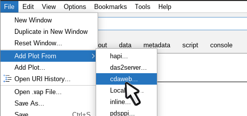

# CDAWeb server

URI prefix: vap+cdaweb:

The [CDAWeb group](https://cdaweb.gsfc.nasa.gov/) at
[NASA/Goddard](https://gsfc.nasa.gov) provides a large volume of data in
[CDF](https://cdf.gsfc.nasa.gov) files which Autoplot can read. This
plug-in knows how to query the database to see what is available and
provides a GUI for searching and filtering the list.

  
Then a dialog similar to the CDF data source editor is shown, allowing a 
parameter to be picked:

Files covering the time range selected are downloaded and the parameter is plotted.
Note the availability checkbox, which will (quickly) show where files containing 
the data are found, instead of plotting data.
