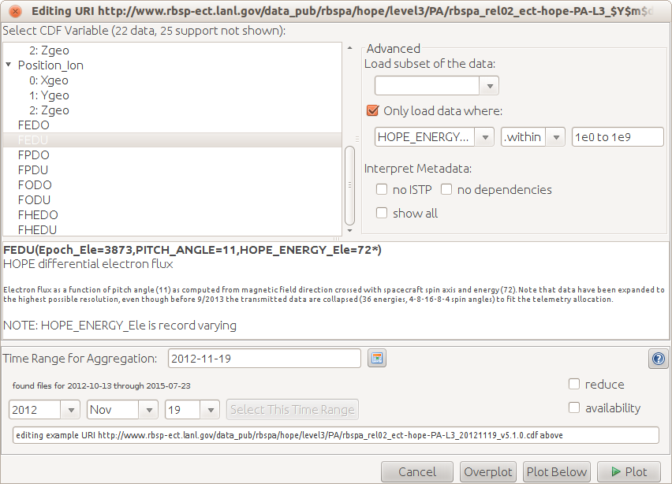

## Reading CDF

CDF files are a special file format developed at NASA/Goddard and used
to store data in a binary format, but with named parameters within the
file. These parameters have metadata containing labels and units, but
also indicating relationships between variables. Dependent parameters
like "Density" are declared to be dependent on an independent parameter
like "Time" or "Epoch." In this way the files store data in a more
abstract form than ASCII and other file formats, and Autoplot can
leverage this information.

### Select variable parameter

Select the variable to be plotted. Note when a parameter has components,
such as a 3-component B-field, then individual components (Bz) can be
plotted by opening the folder. This is the list of parameters that have
been marked as "data" and not "support data" in the metadata. For
example, the timetags variable "Epoch" is not shown. To see all
parameters, select the "show all" checkbox.

In the middle of the panel is information about the variable. These come
from the CDF metadata "CATDESC" and "VAR\_NOTES". Minor problems found
in the CDF may be indicated here, for example if two variables don't
have the same number of records.

### Advanced Sub-panel

"Load subset" allows a subset of the records to be loaded. For example,
0:100 will load just the first 100 records. ::2 will load every second
record.

"Only load data where" will load a second variable and filter the data
when this condition is true. For example, "within" "1e0 to 1e9" will
only load the FEDU data when HOPE\_ENERGY is with in this range. (TODO:
make more useful example.)

"Interpret Metadata" allows non-conforming CDFs to be used. For example,
a variable with poorly formed metadata cannot be plotted, and this
allows these conventions to be ignored and data plotted.

# X and Y panels
The X and Y panels allow alternate variables to be used as tags for the data. 
For example, the file might have L(T) and Density(T), but you can set "X"
to be L(T) to get a Density vs L plot.