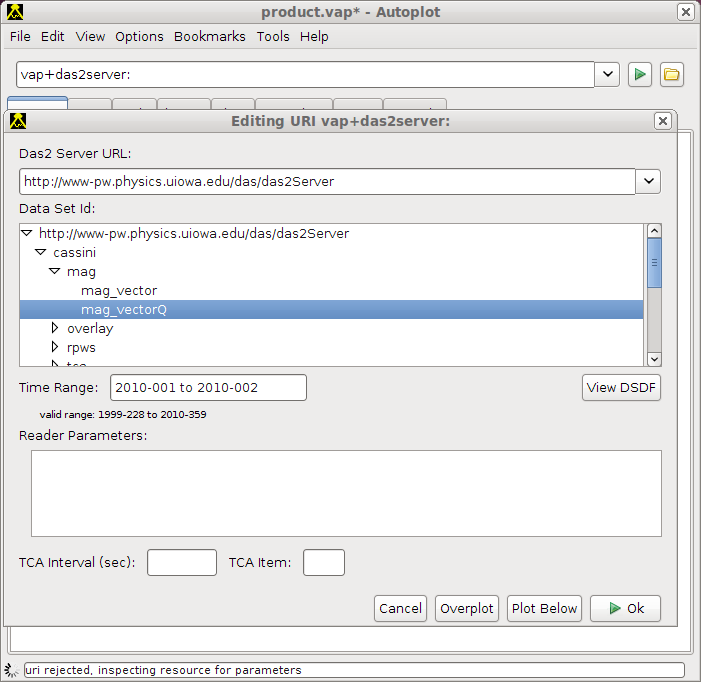

# Das2Server source

URI prefix: vap+das2server:

Das2 servers are used to supply data to Das2 applications for the University
of Iowa's Plasma
Wave Group and its collaborators. Since Autoplot is a Das2 application,
it's easy to make these data sets available for plotting in Autoplot.
Data sources that identify an example range should
work for this range, and they will be adding automated tests to ensure
this.

Note the Das2Server sends data to Autoplot via das2streams or QStreams.

##### parameters

  - **\_res** explicitly set the data loading resolution, for example
    \_res=10s will always request 10s data. This is confused with
    "resolution" and is supported because resolution will be reset to
    the axis resolution.