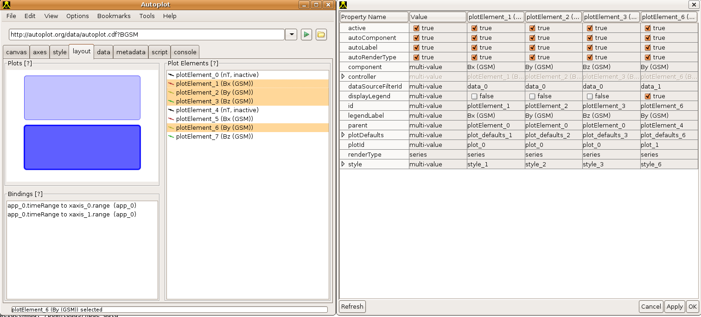

The Cookbook is a set of user-submitted entries on how to do handy
operations in Autoplot.

# Address bar

## vap file modifiers

A vap file may be modified in the address bar by adding `?` and the node
name:

<http://autoplot.org/data/vap/PO_H0_HYD0.vap?timerange=1999-05-30>

since this vap shows the time range editor instead of the dataset
selector, we change multiple nodes:

<http://autoplot.org/data/vap/PO_H0_HYD0.vap?options.useTimeRangeEditor=false&timerange=1999-05-30>

# Complex Configurations

The folks at LANL asked for a page with images associated with complex
plot panel configurations or styles and the procedure to create them:
[Cooking at LANL](Cooking_at_LANL.md "wikilink"). See also
<http://autoplot.org/developer.renderTypes>

## L-shell as Y axis

This script shows how the data is reformed to make a spectrogram with
Time and LShell (sometimes called LvsT plot). This script shows how data
is read in from two sources and combined.

``` python
reset()

tr= getParam( 'timerange', '2014-03', 'parameter timerange' )

monitor.setTaskSize(100)
monitor.started()
fdpu= getDataSet('https://rbsp-ect.newmexicoconsortium.org/data_pub/rbspa/rept/level3/pitchangle/$Y/rbspa_rel03_ect-rept-sci-L3_$Y$m$d_v$(v,sep).cdf?FPDU', tr, monitor.getSubtaskMonitor(0,50,'FPDU') )
l= getDataSet('https://rbsp-ect.newmexicoconsortium.org/data_pub/rbspa/rept/level3/pitchangle/$Y/rbspa_rel03_ect-rept-sci-L3_$Y$m$d_v$(v,sep).cdf?L', tr, monitor.getSubtaskMonitor(50,70,'L Shells') )
l= synchronize( fdpu,l ) 

fdpu= collapse1( fdpu )  # collapse all pitch angles 
fdpu= fdpu[:,4]         # slice at one energy

lgrid= linspace( 1, 7, 40 )
  
monitor.setTaskProgress(80)

from org.virbo.dsutil import LSpec
lspec= LSpec.rebin( l, fdpu, lgrid, 1 )

ttag= lspec.property( QDataSet.DEPEND_0 )
ttag= collapse1(ttag) #  collapse1 takes the average of the min and max time tags.

lspec= link( ttag, lspec.property( QDataSet.DEPEND_1 ), lspec )

sliceAtL= lspec[:,10]
plot(lspec,renderType='nnSpectrogram')
plot(1,sliceAtL)
```
`
```

## Events Bar under all plots

  - plot the top plot
    <http://jfaden.net/~jbf/1wire/dot4_data/$Y/$m/$d/10.592044000800.$Y$m$d.d2s?timerange=2013-01-26>
  - File-\>Add Plot, plot below
    <http://jfaden.net/~jbf/1wire/dot4_data/$Y/$m/$d/10.952040000800.$Y$m$d.d2s?timerange=2013-01-26>
  - layout tab, select both plots.
  - right-click, canvas-\>add hidden plot..
  - deselect all but the x axis.
  - select the new plot element, make it active
  - in the address bar,
    "vap+inline:createEvent('2013-01-26T016:00/PT15M',0xffa0a0a0,'event1')"
    to make an opaque bar

Now that leaves the hidden plot above others. We want this to be below
the others.

Here is a tutorial PDF of how to add events bars over two plots:
<http://autoplot.org/data/tutorials/20180129_events/20180129.pdf>

## Use Events List to control time ranges

Suppose you want to look at burst data which is collected for a few
seconds every few minutes. To explore the data using the scan next and
scan previous can be a bit tedious. You can use an Events List to
control the time ranges. If you have a list of times formatted like so:
timeStart, timeEnd, and then other columns, like the file here:
<http://emfisis.physics.uiowa.edu/events/rbsp-b/burst/rbsp-b_burst_times_20120910.txt>.
You can look at the intervals with the URI:
<http://emfisis.physics.uiowa.edu/events/rbsp-b/burst/rbsp-b_burst_times_20120910.txt>
or
<http://emfisis.physics.uiowa.edu/events/rbsp-b/burst/rbsp-b_burst_times_20120910.txt>.
Autoplot detects this special text file format with its first two time
columns, and treats it is an events list. To use the data as an events
list, use \[menubar\]-\>Tools-\>"Events List", and then enter
<http://emfisis.physics.uiowa.edu/events/rbsp-b/burst/rbsp-b_burst_times_20120910.txt>
into the address bar there. This can be made into an aggregation, and
then entire set can be browsed.

TODO: There's an odd bug that the aggregation requires the
"eventsListColumn" switch to be used, as in
<http://emfisis.physics.uiowa.edu/events/rbsp-b/burst/rbsp-b_burst_times_$Y$m$d.txt?eventListColumn=field3&column=field0&timerange=2013-03-03>

# User Interface

## collection of scripts

See <http://autoplot.org/data/script>. Scripts that make the application
do things (.jy):
<https://sourceforge.net/p/autoplot/code/HEAD/tree/autoplot/trunk/Autoplot/src/scripts/>
Scripts that load data (.jyds):
<https://sourceforge.net/p/autoplot/code/HEAD/tree/autoplot/trunk/JythonDataSource/src/>

## editing entries from address bar recent history

  - click on down arrow to show droplist of recent entries.
  - use keyboard arrows to select entry to edit.
  - hit escape
  - edit line
  - hit return or the green play button.

## where's my data?

If you were looking at data recently, but can't remember where it was,
you can look at Autoplot's history. Every URI plotted is recorded in
$HOME/autoplot\_data/bookmarks/history.txt. From the menu, you can enter
a GUI to browse this file, use File-\>Open Recent. (Note there's no
mechanism to remove old entries now. Just remove the file and restart
Autoplot.) Also, adding "nohistory=true" to any URI will make it so it
is not logged, and logging is not done in headless mode.

# Labels

For a complete description of labels, see
[help\#Axes](help.md#axes "wikilink").

## Hide Axis

Right-click on axis-\>Axis Properties-\>Visible or axis-\>Axis
Properties-\>"Tick Labels Visible"

## IDL strings

IDL's formatting strings are supported, based on the specification of
Grandle and Nystrom. With "granny" strings you can set the title to
"E=mc\!U2\!n" or m\!A2\!Ns\!A-2\!N formats m<sup>2</sup>s<sup>-2</sup>

  - \!A superscript
  - \!B subscript
  - \!E superscript with smaller font size
  - \!D subscript with smaller font size
  - \!N normal position

## Greek and Math Symbols

You can use greek symbols such as &rho; and &pi; in axis labels as well as
unicode characters. Here are a few:

  - Greek letters: \&Alpha; \&Beta; \&Delta; \&alpha; \&beta; \&delta;
    \&pi; \&rho; \&omega;
  - Math symbols: \&amp;sum; (&sum;) \&amp;plusmn; (&plusmn;)

Here's a tool for looking up entities:
<http://entity-lookup.leftlogic.com/>

## Modify Many Labels

Layout -\> Plot Elements, highlight multiple elements,
Right-click-\>Edit Plot Element Properties and a window will appear. The
Value column is used to apply a setting to all other columns to its
right.



  

## Add Axis Annotations

You can add annotations to the X-axis, for labelling ephemeris.
Right-click on the X-axis, select "Add additional ticks from..." and put
in the name of another dataset with a common X-Axis. Autoplot will use
this dataset, picking nearest neighbors to label the axis.

Note only one URI can be specified.

## Background/Foreground images

The canvas object has methods for adding "decorators" which paint under
all plots and above all plots. A Painter is a class with one method,
paint, which takes a Java 2D graphics context calls methods for painting
on it. These methods include drawImage, drawString, as well as drawing
and filling shapes. This Jython script shows how images can be added to
the canvas.

``` python
# Das2's canvas object has two hooks for decorating the plot, to plot below and
# above the normal graphics.  These provide direct access to the Graphics object
# that paints the canvas.  This demos how they are used.
 
reset()
 
import javax,java
import org.das2.graph
 
ur= 'http://cottagesystems.com/honeycomb.1.gif'
image= javax.imageio.ImageIO.read( getFile( ur, monitor ) )
 
class BottomPaint(org.das2.graph.Painter):
  def paint( self, g ):
     g.drawImage( image, java.awt.geom.AffineTransform(), None )
 
 
class TopPaint(org.das2.graph.Painter):
  def paint( self, g ):
     g.rotate( -15*PI/180,300,300 )
     g.setFont( java.awt.Font.decode( 'sans-42' ) )
     g.setColor( Color( 255,255,255,80 ) )
     g.drawString( "Provisional", 252,302 )
     g.setColor( Color( 0,0,0,80 ) )
     g.drawString( "Provisional", 250,300 )
 
bottom= BottomPaint()
top= TopPaint()
 
dom.canvases[0].controller.dasCanvas.removeBottomDecorators()
dom.canvases[0].controller.dasCanvas.removeTopDecorators()
dom.canvases[0].controller.dasCanvas.addBottomDecorator( bottom )
dom.canvases[0].controller.dasCanvas.addTopDecorator( top )
dom.plots[0].controller.dasPlot.setOpaque(True)
dom.dataSourceFilters[0].uri='http://cdaweb.gsfc.nasa.gov/istp_public/data/polar/hydra/hyd_h0/$Y/po_h0_hyd_$Y$m$d_v01.cdf?ELECTRON_DIFFERENTIAL_ENERGY_FLUX&timerange=20000109'
```
`
```

# Add Annotations

For several years, people have been able to add annotations to their
plots. These are arbitrary text or images which are drawn on top of
other components, or on top of the data within a plot. To add an
annotation, right-click on a plot and select "Add Annotation", which
presents some options for the annotation. Once added, the annotation can
be moved and made to point at data coordinates. These annotations are
then saved into .vap files as part of the canvas. Annotations can also
be images, where a URL is used to locate a .gif, .jpg, or .png file.

LaTeX, a system for typesetting math equations (pronounced La-Teck), can
be used with this, by first using one of many sites which render LaTeX
to an image, such as quicklatex.com.

Here is a tutorial that shows how to use annotations and to draw LaTeX:
[HTML](http://autoplot.org/data/tutorials/20180403_annotation_latex/20180405_1448.html)
or as a
[PDF](http://autoplot.org/data/tutorials/20180403_annotation_latex/latexInAnnotations.pdf).

# Interaction

## tweaking plot position

Holding shift while mousing over a plot brings up control points that
allow the plot position to be tweaked. By default Autoplot automatically
adjusts the outside bounds to make room for colorbars, but this can be
used to adjust heights.

## time axis scan buttons

The X axis has hidden scan buttons at the beginning and end of the axis
(lower right and left corners of the plot box). Mousing over these
locations reveals the buttons. Note these are enabled after zooming in.

## zoom with mousewheel

You can use the mouse wheel to zoom in and out. But did you know that:
mouse wheel on the ends of the axis will adjust that axis in one
direction. For example, put the mouse on the end of the time axis. Mouse
wheeling will adjust the beginning of the axis range... Also, pressing
control while spinning the wheel will adjust the range to pan along a
dimension without changing the scale.

## no mousewheel

The das2 graphics library was developed on Suns that didn't have
mousewheels, and its controls are still around and handy when you are on
a laptop without a mouse. Left click and drag along an axis to zoom in.
Click and drag down slightly to zoom out. An arrow will be drawn to
indicate the pending action. If you do have a middle mouse button, it
will pan the axis when dragged.

# Loading Data

## watch an ASCII file

Autoplot can watch a file and get updates by polling it regularly. The
following script computes the time for a `wget` command to execute.

``` bash
 #!/bin/bash 
 SERVER="http://autoplot.org/"
 LOG="/tmp/webtest.log"
 COUNTER=0
 rm -f $LOG
 while [ $COUNTER -lt 100000 ]; do
     let COUNTER=$COUNTER+1
     START=`date +'%Y %m %d %H %M %S.%N'`
     start=$(date '+%s.%N')
     wget -q -O /dev/null $SERVER
     end=$(date '+%s.%N')
     delta=$(echo $end-$start | bc)
     echo "$START $delta" >> $LOG
     echo "$START $delta"
     sleep 1
 done
```
`
```

It writes to the file "/tmp/webtest.log". To continuously view this
file, use the undocumented (and not fully tested) feature by appending

```
&filePollUpdates=1&tail=100
```

to the URI, which will plot the last 100 lines of a file every second:

`vap+dat:file:/tmp/webtest.log?time=field0&column=field6&timeFormat=$Y+$m+$d+$H+$M+$S&filePollUpdates=1&tail=100`

The "\&filePollUpdates=1" will work with almost any file-based data
reader.

## handling time ranges with implicit fields

You can have implicit fields, so that the time parser can work in more
cases. Suppose you have a file 2000-03-04.dat which contains for the
first field $H-$M-$S. Here's a few lines of the file
<http://autoplot.org/data/noDate.dat>:

```
09:45:23  3.4
09:46:26  4.5
09:47:22  5.6
```

You could use implicit fields to parse this:

<http://autoplot.org/data/noDate.dat?column=field1&timeFormat=$(H;Y=2000;m=3;d=4>`):$M:$S&time=field0`

## Load in only data within an interval (not "at least")

By default, Autoplot will load at least the data within the interval
specified, which can result in surprises and must be dealt with in some
analysis. For example, the following script will load a day's worth of
data, even though only three hours are requested:

``` python
tr = '2017-11-28T12:00 to 15:00'
l_erg= getDataSet('vap+cdaweb:ds=ERG_ORB_L2&filter=erg&id=pos_eq[:,0]',tr)
plot(l_erg)
```
`
```

To fix this, a "trim" command must be inserted:

``` python
tr = '2017-11-28T12:00 to 15:00'
l_erg= getDataSet('vap+cdaweb:ds=ERG_ORB_L2&filter=erg&id=pos_eq[:,0]',tr)
l_erg= trim( l_erg, tr )
plot(l_erg)
```
`
```

# Launching (OS-Specific)

## Associate .vap files in Gnome

  - right-click on a file (.vap or .cdf, for example.)
  - Open with... Other application...
  - Use custom command...
  - Enter "/usr/local/java/bin/javaws
    <http://autoplot.org/autoplot.jnlp> -open ". (Look on your system
    for Java.)
  - Autoplot should now be the default mechanism to open this file. The
    association is described in \~/.local/share/applications.

## Using MIME types to launch

At the Radio and Plasma Wave Group, we defined vap to be MIME type
`application/x-autoplot-vap+xml` so this could be associated with the
Autoplot application. We have a single-jar version of autoplot, but
Webstart should work as well, with something like:
```
 /usr/local/jdk8/bin/javaws  `<http://autoplot.org/autoplot.jnlp>
```
-open %S ` (I think we might have to make a unix script to wrap this...)

# Scripting

See also [scripting](scripting.md "wikilink"),
[developer.scripting](developer.scripting.md "wikilink"),
<http://autoplot.org/data/jyds>, and <http://autoplot.org/data/tools/>.

See [script.cookbook](script.cookbook.md "wikilink") which is just for
scripts.

Last, there's a github repository with hundreds of searchable examples,
see <https://github.com/autoplot/dev/>

## Animation

This loops over the day 2012-11-01, shifting to 2012-11-02, making pngs
at one minute intervals:

``` python
# plot vap or uri to configure the display
plot( 'vap+das2server:http://emfisis.physics.uiowa.edu/das/das2Server?dataset=rbsp/RBSP-A/HFR_spectra.dsdf&start_time=2012-11-01T00:00:00.000Z&end_time=2012-11-02T00:00:00.000Z' )

tr= DatumRangeUtil.parseTimeRange('2012-11-01')

onemin= Units.seconds.createDatum(60)
count= 24*60

monitor.started()
i=0
monitor.setTaskSize(count)
while ( i<count ):
  dom.plots[0].xaxis.range= tr
  writeToPng( '/tmp/anim20121110/%5.5d.png' % i )
  i=i+1
  tr= DatumRange( tr.min().add(onemin), tr.max().add(onemin) )
  monitor.setTaskProgress(i)
monitor.finished()
```
`
```

For creating a movie, see
[\#Add\_to\_Jython\_Search\_Path](#add_to_jython_search_path "wikilink").

## Browse a timeseries

Any jyds script with `getParam('timerange')` has the "Time Series
Browse" capability, and it will be added when the jython data source is
loaded. See examples in <http://autoplot.org/data/jyds>.

## getParam

The function `getParam(param,default,label)` is a special function that
allows arguments to be passed into a script. When a script is edited and
getParam is found, and GUI is automatically created. getParam is used in
all contexts: for data sources, it gets named arguments like `&p=1&s=a`.
For command-line scripts (`--script=`), command line parameters are
passed in. For application scripts, the default value is used unless ALT
(option on a Mac) is held down with the Execute button.

## Take the average of many images

David at Google made this script which takes the average of many flags:
<https://plus.google.com/117808384777851490555/posts/WEBtTuDRubF>

## Open a web browser

``` python
import org.autoplot.AutoplotUtil
org.autoplot.AutoplotUtil.openBrowser(String url)
```
`
```

## Tweak DOM parameters not saved to VAP

Not all properties in the DOM are saved to the VAP file (anything under
"controller" is not saved). As a work-around, load a VAP file and then
modify the non-saved DOM elements with a script.

``` python
ds= 'file:/tmp/webtest.vap'
plot( ds )
dom= getDocumentModel()
dom.plotElements[0].controller.renderer.cadenceCheck = False
```
`
```

Save the above as /tmp/webtest.jy and enter

```
script:`<file:/tmp/webtest.jy>`    
```

in the address bar. (Autoplot 2011 now has cadenceCheck in the DOM, so
editing Plot Element Properties can accomplish this as well.)

Note that vaps can be embedded within a .jy script as well.

## Plot to specific subpanels

Subplots may be selected:

``` python
setPlotLayout(2,3)
plot(0,ripples(20))
plot(1,ripples(30))
plot(2,ripples(40))
```
`
```

This will add plots until the there's a spot "2" for the data. The
command setPlotLayout(2,3) will make two rows of three plots each.

## list remote website files

In the script panel (enabled via options):

``` python
 for i in listDirectory('http://autoplot.org/data/*.cdf'):
   print i
```
`
```

## make a plot for each file

In the script panel (enabled via options), enter

``` python
 
 for i in listDirectory('http://autoplot.org/data/*.qds'):
   plot( 'http://autoplot.org/data/'+i )
   writeToPng( '/tmp/' + i+'.png' )
```
`
```

## Python/Jython is great with strings

``` python
product= 'c1'
date= '20010101'
plot( 'http://www.autoplot.org/data/%s_%s.dat' % ( product, date ) )
```
`
```

%s plugs in the corresponding string, %d an integer, %f a float. Often
you need the result to have a fixed number of characters, so you might
say %9f so that 9 characters are always used. Prefixing the number with
a zero will zero-pad the field: %09d. Last the number of decimal places
can be specified with: %9.2f.

``` python
print '%s' % 'string'  # 'string'
print '%09d' % 2       # '000000002'
print '%9.3f' % 3.14   # '    3.140'
```
`
```

## mash data

Jython (Python in Java) scripts can be used to mash data. The
getParam(parmName,default) function allows data to be passed into a
script via the URI:

```
 vap+jyds:`<file:///home/jbf/inbox/larry.20100212.icee/icee.jyds?type='e_star>`'
```

Here's the script:

`&nbsp;`&lt;http://autoplot.org/data/jyds/icee.jyds&gt;

Note the script can be read directly from the http web site, this one
has local file references. Note too that the menu item
\[menubar\]-\>Tools-\>Data Mash Up... allows you to mash data without
code.

## compare calibrated and uncalibrated data

I had data in two files that I needed to compare, but a simple
calibration had been applied to one but not the other. I could easily
apply the calibration with a jython script in autoplot. Instead of
plotting the data, I (enable and) flip over to script tab in Autoplot
and enter the script:

``` python
 # code to apply calibration to compare my cdf to Dan's
 
 ds= getDataSet('vap:file:///home/jbf/temp/rbsp/fm1/L1/2041/01/14/rbsp-a_ws_emfisis-L1_20410114_v1.1.3.cdf?BuBu')
 ds= sqrt(ds) 
 ds= 20 * log10( 2 * ds / 32768. )
 
 data= ds
```
`
```

These scripts work by plotting the variable "data" by default. Note I
can right click in the script tab and select "getDataSet" and the
getDataSet command is entered with the current URI. Select "data source
context" and hit the execute button, and I need to save this to a file
with a .jyds extension before Autoplot can use it. I'd be able to plot
this against the other data, except it has units and this new dataset
doesn't. I can remove units from Dan's the same way:

``` python
 # code to remove units from Dan's CDFs
 ds= getDataSet('vap:file:///home/jbf/temp/compareFeb3/rbsp-a_wf_emfisis-L1_20110114134618_v1.1.99.cdf?BuBu')
 ds= putProperty(ds,QDataSet.UNITS,None)
 data= ds
```
`
```

Now I can plot one against the other, and plot slices on the same plot.
Note Autoplot will plot data of different units on the same axis, but
with a warning message.

## generating time ranges in Jython

In the application script dialog (Options-\>Enable Feature-\>Script
Panel), you can create a list of timeranges:

``` python
trs= generateTimeRanges( '$Y-$m-$d', '2012' )
for i in trs:
  print i
```
`
```

You'll see the output in the java stdout or on the console
(Options-\>Enable Feature-\>Log Console) if it's enabled.

Here's a more useful script:

``` python
# plot all datasets for the year 2012
trs= generateTimeRanges( '$Y-$m-$d', '2012' )
for i in trs:
  ds= 'http://cdaweb.gsfc.nasa.gov/istp_public/data/ace/swepam/level_2_cdaweb/swe_k0/$Y/ac_k0_swe_$Y$m$d_v01.cdf?He_ratio&timerange=%s' % i
  plot( ds )
  writeToPng( '/tmp/ap/%s.png' % i )
```
`
```

## remove the fill data from a list

Remove fill data from a list with the where and valid functions:

``` python
list= dataset( [ -1e31, 37.6, 43.2, 55.1, 97.0] )
list= putProperty( list, QDataSet.FILL_VALUE, -1e31 ) 
r= where( valid( list ) )
list= list[r] 
```
`
```

## interpolating dataset onto another dataset's timetags

Ivar asked about a function I've always meant to implement explicitly,
but I found the current implementation is fine. He has data at timetags
with one cadence, and wishes to interpolate them to another dataset's
timetags. Here's the script:

``` python
# syncTimeTags.jy
# Show how one dataset is synched to another.  Density at 5 min resolution is loaded in,
# and interpolated onto a grid of flux at roughly 4min resolution.
 
flux4min= getDataSet( 'http://cdaweb.gsfc.nasa.gov/pub/data/ace/sis/level_2_cdaweb/sis_h1/2017/ac_h1_sis_20170117_v05.cdf?flux_He' )
density5min= getDataSet( 'http://cdaweb.gsfc.nasa.gov/pub/data/ace/mag/level_2_cdaweb/mfi_k0/2017/ac_k0_mfi_20170117_v01.cdf?Magnitude')
 
t5min= density5min.property(QDataSet.DEPEND_0)
t4min= flux4min.property(QDataSet.DEPEND_0)
 
findx= findex( t5min, t4min )  # 5min tags interpolated to 4 minute tags
density4min= interpolate( density5min, findx )
 
plot( 0, density5min, title= 'This is the original data' )
plot( 1, t4min, density4min, title='These line up with the flux data' )
plot( 2, flux4min, title='This is the flux' )
```
`
```

Here's a generic "synchronize" routine that syncs up data:

``` python
flux4min= getDataSet( 'http://cdaweb.gsfc.nasa.gov/pub/data/ace/sis/level_2_cdaweb/sis_h1/2017/ac_h1_sis_20170117_v05.cdf?flux_He' )
magn5min= getDataSet( 'http://cdaweb.gsfc.nasa.gov/pub/data/ace/mag/level_2_cdaweb/mfi_k0/2017/ac_k0_mfi_20170117_v01.cdf?Magnitude')
BGSE5min= getDataSet( 'http://cdaweb.gsfc.nasa.gov/pub/data/ace/mag/level_2_cdaweb/mfi_k0/2017/ac_k0_mfi_20170117_v01.cdf?BGSEc')
( magn, BGSE ) = synchronize( flux4min, [magn5min, BGSE5min] )
```
`
```

Keywords: synchronize synchronizing

## run test script to see that everything in history is still plottable

In Jython editor:

``` python
from test.endtoend import TryHistory
TryHistory.main( [] )
```
`
```

This attempts to load every URI in
$HOME/autoplot\_data/bookmarks/history.txt as a QDataSet, printing the
result and load times, and then finally reporting the statistics for the
run. A future version may also plot each one to a png file.

## add a Jython/Python script to the Tools menu

Jython scripts can be added to the tools menu by putting them in the
bookmarks file AUTOPLOT\_DATA/bookmarks/tools.xml. Set the label for the
script by adding a comment to the script: "\# label: My Script Label".
When running a script, Autoplot will show the parameters, and there is a
checkbox to add it to the menu.

## Share a script with others

An application-context script can be shared with others, so that editors
can pass scripts to new users. For example, type in the address bar:

`script:`<http://autoplot.org/data/tools/flashFocus.jy>

and a GUI is presented asking if you'd like to run the script. A
checkbox allows the script to be added to your tools menu. Here are some
other useful scripts to try (omit the \#comment part):

```
script:`<http://autoplot.org/data/tools/flashFocus.jy>`     # flash the current plot Element that's selected
script:`<http://autoplot.org/data/tools/reloadAllUris.jy>`  # reload all loaded data (remote files in cache will not be loaded from server if the timestamp hasn't changed)
script:`<http://autoplot.org/data/tools/testHtmlConnection.jy>`   # test to see if we're on line.  (This should be renamed testHttpConnection.jy.)
script:`<http://autoplot.org/data/tools/toggleDayOfYear.jy>`      # toggle the day-of-year setting
```

Note scripts can contain the special comment "\# label:" that gives them
nice labels.

Note "\*.jy" is now always a script, and the "script:" prefix is no
longer needed.

## Reduce a long time series

Often we need to reduce a long high-resolution time series, leaving a
process running overnight. This loads the URI with the time series
browse capability and saves out a reduced version. This only loads for
26 days, but it can be modified to run over years (with your data).

``` python
# title: hourly averages demo shows how to take hourly averages over a long interval
# label: hourly averages

from org.virbo.dsutil.Reduction import reducex
import java.util.LinkedHashMap
import java.lang.Exception

uri= 'http://sarahandjeremy.net/~jbf/1wire/data/$Y/$m/$d/610008002FE00410.$Y$m$d.d2s?timerange=%s'
dr= DatumRangeUtil.parseTimeRange('2012-09-01')     
endt= DatumRangeUtil.parseTimeRange('2012-09-26' )  
targetRes= dataset('1 hr')    # '1 min' '2 hr' '3 days'.  Use Length mouse action for examples

exceptions= java.util.LinkedHashMap()

monitor.started()
dsall= None
while ( dr.min().lt( endt.max() ) ):
   monitor.progressMessage= "%s until %s" % ( dr, endt )
   uri1= uri % dr.toString()
   try:
      ds= getDataSet( uri1 )
      ds= reducex( ds, targetRes )
      dsall= concatenate( dsall, ds )  # TODO: this probably won't scale, replace with dataset builder.
   except java.lang.Exception,ex:
      exceptions.put( uri1, ex )
   dr= dr.next()

formatDataSet( dsall, '/tmp/reduced1Hr.qds' )

print 'Exceptions encountered:'
for ex in exceptions.entrySet():
  print '== %s ==' % ex.getKey()
  print ex.getValue()
```
`
```

## Import set of common functions

You can import a set of common functions using getFile and "execfile":

``` python
ff= getFile( 'http://emfisis.physics.uiowa.edu/pub/jy/dev/jbf/operators/experimentalFunctions.jy',monitor.getSubtaskMonitor('import'))
execfile( ff.toString() )
 
flux4min= getDataSet( 'http://cdaweb.gsfc.nasa.gov/pub/data/ace/sis/level_2_cdaweb/sis_h1/2017/ac_h1_sis_20170117_v05.cdf?flux_He&slice1=0' )
density5min= getDataSet( 'http://cdaweb.gsfc.nasa.gov/pub/data/ace/mag/level_2_cdaweb/mfi_k0/2017/ac_k0_mfi_20170117_v01.cdf?Magnitude')
dst60min= getDataSet( 'http://cdaweb.gsfc.nasa.gov/pub/data/omni/omni_cdaweb/hourly/2017/omni2_h0_mrg1hr_20170101_v01.cdf?DST')
 
t5min= density5min.property(QDataSet.DEPEND_0)
 
( density, flux, dst ) = synchronize( t5min, density5min, flux4min, dst60min, nn=1 )  # experimental function (note there is a built-in function in Autoplot v2017a.
plot( 0, density )
plot( 1, flux )
plot( 2, dst )
```
`
```

This introduces some possible security concerns, and this may be
restricted in the future.

## Linear Fit Routine

There's a code to does linear fits:

``` python
from org.das2.qds.util import LinFit
x= linspace(0,5,40)
y= x * 6 + 6 * randn(40)
setLayoutOverplot(2)
plot( 0, x, y )
lf= LinFit( x,y, 6*ones(40) )
plot( 1, x, x*lf.b + lf.a )
print lf.chi2 / (x.length()-1)
```
`
```

## Arbitrary Layout

Autoplot v2015a and more recent versions allow scripts to plot to
arbitrary locations on the page, bypassing the automatic layout. For
example:

``` python
plot(0,rand(2000),rand(2000),xpos='20%,90%',ypos='20%,50%')
plot(1,linspace(0,1,20),randn(20),xpos='50%,70%',ypos='60%,80%')
```
`
```

Em offsets (when an em is the current font size) can be used as well,
and pixel locations:

``` python
plot(0,rand(2000),rand(2000),xpos='4em,100%-4em',ypos='4em,100%-4em')
plot(1,rand(2000),rand(2000),xpos='100px,200px',ypos='100px,200px')
```
`
```

## Add to Jython Search Path

I want to add the ability to create a video. I can add this to the
search path in Jython like so:

```
import sys
addToSearchPath(sys.path,'`<http://central.maven.org/maven2/org/jcodec/jcodec-javase/0.2.2/jcodec-javase-0.2.2.jar>`',monitor.getSubtaskMonitor('jar1'))
addToSearchPath(sys.path,'`<http://central.maven.org/maven2/org/jcodec/jcodec/0.2.2/jcodec-0.2.2.jar>`',monitor.getSubtaskMonitor('jar2'))
```
  
```
from org.jcodec.api.awt import AWTSequenceEncoder
from javax.imageio import ImageIO
from java.io import File
```
  
```
enc = AWTSequenceEncoder.createSequenceEncoder(File("/home/jbf/tmp/filename.mp4"),24)
dd= '/tmp/ap/kris/'
ff= listDirectory(dd+'demoSound_*.png')
monitor.setTaskSize(len(ff))
monitor.started()
monitor.setProgressMessage('encoding the movie')
for f in ff[0:10]:
   monitor.setTaskProgress(monitor.getTaskProgress()+1)
   img= ImageIO.read( File(dd+f) )
   enc.encodeImage(img)
enc.finish()
monitor.finished()
```

See <https://sourceforge.net/p/autoplot/feature-requests/584/>.

# Use Screenshots Tool and Pngwalk Verify

I used the pngwalk verify tool to select frames from the screenshots
tool. First, I recorded my movie with the screenshots tool. In Autoplot,
run <http://autoplot.org/data/tools/startScreenShots.jy>. This starts
dumping screenshots into /home/jbf/temp/ap. I quit Autoplot when I was
finished with the sequence, and then started up pngwalk and turn on the
quality control. I could go through the screenshots and mark the frames
I wanted to keep, which would then put .ok files next to my images. Then
the unix command to extract my files was `for i in *.png.ok; do echo $i;
cp ${i%.ok} movie20130208; done`

## Bind Two PNGWalks Together

I needed to compare two pngwalks, created in two different directories
but with files of the same name. A while ago I added properties to the
pngwalk tool so that they could be bound together:

```
1. start the two pngwalk tools
2. on the console, get references to the two pngwalk tools via the app manager:
   * from org.autoplot import AppManager  
   * pw1= AppManager.getInstance().getApplication(1)
   * pw2= AppManager.getInstance().getApplication(2)
   * print pw1,pw2   # to verify we got the correct references
3. and bind their "SELECTED_NAME" property:
   * bind( pw1, pw1.PROP_SELECTED_NAME, pw2, pw1.PROP_SELECTED_NAME )
```

The two pngwalks can be used to compare images now, advancing in one
will advance on the other. Note the timerange property can be bound as
well, for comparing pngwalks with different filenames or comparing a
pngwalk to Autoplot's dom.timerange.

## Make a tutorial web page

You can make effective tutorial html pages (like
<http://sarahandjeremy.net/~jbf/autoplot/tutorials/findJava8/20160204_1502.html>)
using the script: <http://autoplot.org/data/tools/makeTutorialHtml.jy>.
This will create an html page showing slides marked as "Okay" with the
QC tool. This demo shows how this is done:
<http://autoplot.org/autoplot/data/tutorials/20160116meta/20160116_1426.html>

# Writing to PDF files for embedding in a science poster presentation

The pixels on the desktop correspond to points when printing to PDF. So
if you want a 5in by 5in figure, you should have a 360 by 360 pixel
canvas (72 dpi). To get this, see the style tab, then under Canvas,
Canvas Size:

  - uncheck "Adjust to Fit into Application"
  - Set the width to 360 (points)
  - Set the height to 360 (points)

<!-- end list -->

  - \[menubar\]-\>Auto-\>"AutoLayout" can be turned off to get more
    control of the layout. This will disable the code that makes room
    for color bars and new plots.
  - Plot edges can be tweaked to by holding the shift button while
    mousing over plot boundaries. Control blocks will appear to resize
    the plot.
  - axes tab, Y Axis, Isotropic will lock the <data:pixel> ratio for the
    x and y axes, when the units are compatible.

# Connecting to SAMP Hub

ESA (European Space Agency) software often uses the "SAMP Hub" to
communicate data references between software packages. Autoplot has some
support for the SAMP hub, being able to start a hub and accept requests.
To start Autoplot with SAMP support, run Autoplot with the --samp switch
turned on, like so:

/usr/local/java1.8/bin/java -jar autoplot.jar --samp

or run the script
"script:<http://autoplot.org/data/tools/startSampHub.jy>" on the
Autoplot address bar. Note this can be added to the tools menu using the
checkbox at the bottom of the "Run Script" dialog.

Autoplot now includes Tools-\>"Start SAMP Hub" (a bookmarked tool) on
new installations.

# Analysis on each image of mp4 file

Presently Autoplot can only access png and jpg images, so you need to
use ffmpeg to split up the mp4 video into jpg files:

```
ffmpeg -i chargeMac.mp4 /tmp/ap/frames%05d.jpg
```

Now Autoplot can load each (or the aggregation) using
/tmp/ap/frames%x.jpg.

# VAP files

## Embedding data within a .vap file

Autoplot's save-to-vap option has a checkbox "embed data" which when
checked will write a .vap.zip file, which is a zip file containing data
as well as a .vap file. Any data which is local to the machine will be
inserted into the zip file, and the references in the .vap will contain
the macro %{PWD} which refers to the .vap file location.

