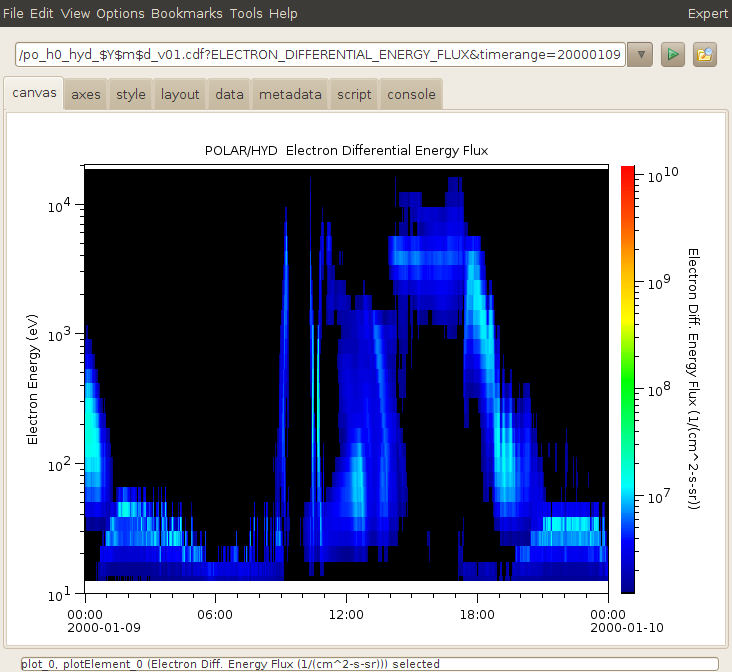

Audience: Scientists wanting some sort of organized documentation and
developers of the book.

Purpose: Create an outline for the Autoplot book, from Jeremy's
perspective. Bob will be creating one of these too, and we'll see where
the overlaps are to create a final outline for the book.

Similar books: <http://www.amazon.com/dp/1590595874/ref=rdr_ext_tmb>

<b>

Autoplot

</b>

Here's a handy reference: <http://cds130.org/Devel#Wiki>

# Table of Contents

## **About**

1.  Audience
    1.  Engineers who want a variety of ways to get thier data from the
        device to a graphic that they can interpret
    2.  Scientists who want to an easy way to get at and share data with
        their colleagues, and perform common operations to their data
    3.  Data Providers who wants to add plotting capability to a
        database.
    4.  Students who want free options for analyzing their data that
        they can take with them when they graduate.
2.  What it can do
    1.  Plot a data in an ASCII files and many other commonly used
        scientific data formats found on the web
    2.  The web itself is the data store, automatically handles copying
        and managing a local cache of data.
    3.  Intuitive controls for navigating the data
    4.  create and browse 1000s of images very quickly, subset very
        large data files, show transformed versions of data.
    5.  Filters and scripting to allow for initial analysis and
        transformations of data
    6.  Scripts can be published on the web to provide functionality to
        collegues.

## **Introduction**

1.  Motivation: (Why not IDL and MATLAB?) Motivation with VxO and
    history of DAS2.
    1.  NASA Virtual Observatories project has graphics component.
    2.  Often the data were available, but the scientist still needs to
        be able to easily produce graphics to peek inside the resource.
    3.  Both IDL and Matlab are commonly used, but neither is
        universally used, and both are expensive for groups to aquire
        and learn.
    4.  Both IDL and Matlab are frameworks to read and handle data that
        can handle any data type, but Autoplot makes it easy to ingest
        data in common forms such as ascii tables and CDF files. What
        might take ten steps in IDL takes one in Autoplot.
    5.  Autoplot is open-source and runs on the freely available Java
        platform.
2.  Terminology: QDataSet, canvas, DOM, plots, plot elements,
    aggregation, .jy, .vap, .jyds, URIs and Data Sources.
    1.  Autoplot provides graphics to read many data types into one
        common "data model" "QDataSet." Once data is read in from a CDF
        file, to Autoplot it looks the same as if it were from a text
        file.
    2.  QDataSet provides operators, so for example it is trivial to
        load in two datasets and add the two together and plot the
        result.
    3.  Autoplot's canvas is built on the Das2 library, so it is very
        configurable and interactive.
    4.  Aggregation allows multiple file resources to be combined into a
        long time series. When data filenames can be made into templates
        (like $Y$m$d.dat), each file is loaded in and combined to make
        long time series.
    5.  Jython (Python in Java) scripts allow complex scripting of the
        application. (e.g. For each file in this directory, make an plot
        of the data.) (e.g. Prototype this digitizing algorithm.)
    6.  Jython scripts can also be a source of data. Instead of reading
        a CDF file, the script is run and named data sets are produced.
        (e.g. Read in this data and try this calibration.)
    7.  All data is addressed by URIs, which locate and indicate the
        type of data. These are compact strings that can be emailed to a
        colleague, or used in a script.
    8.  Plug-in Data Sources convert URIs into data Autoplot can display
        and use in scripts.
    9.  Additional PngWalk tool allows clients to browse through
        pre-generated png images, then jump back into Autoplot to
        explore more deeply.
3.  Use-cases: ViRBO, RBSP, etc.
    1.  D at the University of Iowa produces CDF files and uses Autoplot
        to provide clients with graphical views of the data.
    2.  X at U of Y uses Autoplot to look at the data collected
        immediately after measurements are made.
    3.  R at LANL uses Autoplot produce PNG images in a batch job.
    4.  B at GMU uses Autoplot to feed images to an interactive thin
        client, using Javascript and AJAX calls to provide rich access
        to clients everywhere.
    5.  S at Iowa uses scripting to develop a peak-digitizing algorithm
        to infer density from the plasma frequencies.
    6.  Dataset URIs.
    7.  Plugins for IDL and MATLAB
4.  [Sorts of data one looks at in
    Autoplot](developer.datasetSchemes "wikilink")
    1.  Common 2-D graphics, such as
        1.  line plots of density collected over time.
        2.  spectrograms where the Z value of a cell is encoded as the
            color.
        3.  scatter plots
    2.  And also:
        1.  event bars
        2.  image files
        3.  radial spectrograms.
    3.  Interactive graphics, such as 2-D slices of a 3-D cube of data.

## **[Installing Autoplot for the first time](Installing_Autoplot_for_the_first_time.md "wikilink")**

1.  Installation with Java Webstart
    1.  Java 1.7 is freely available from Oracle at
        [java.com](http://java.com/en/download/index.jsp).
    2.  Autoplot will run on both 32bit and 64bit JVMs (Java virtual
        machines), but 64bit is required for more memory.
    3.  Many machines will have this installed out-of-the-box. (Linux
        often comes with OpenJDK, which works fine.)
    4.  Once Java is installed, it should register itself with the
        browser and clicking on <http://autoplot.org/autoplot.jnlp>
        launch file should launch the application.
    5.  Many browsers have made it so the .jnlp will be downloaded but
        not run. Find the .jnlp in the downloads and launch it by
        double-clicking there.
    6.  Sometimes it's useful to run from the command line, like so:
        /usr/local/java/bin/javaws <http://autoplot.org/autoplot.jnlp>.
    7.  Note too that webstart limits the size of the JVM.
2.  Installation with Single-jar
    1.  When webstart is not satisfactory, the "single-jar" version can
        be used.
    2.  It is a jar file, which is a zip file of the application, with a
        Unix launch script at the top of it.
    3.  It can therefore be launched on Windows, Macs, Unix and Linux by
        double-clicking on it or running from a command prompt.
    4.  Memory size cannot be controlled on Windows, and sometimes it is
        quite small. On Windows, a batch file can be used to launch with
        a different size.
    5.  On Mac and Linux, the script can be editted to set an arbitary
        size.
3.  Why there are different installations
    1.  Personal preference.
    2.  Webstart offers ease of installation (when it works), so it's
        easier to keep up with releases.
    3.  Single-jar makes it easier to create a desktop application, and
        it's clear what you are running. Removes the uncertainty
        webstart introduces.
    4.  There are plans to create a new release mechanism that captures
        good elements of both systems.

## **Looking at Data**

1.  Line plots ("Series") and Spectrograms
    1.  Line plots and scatter plots 
    2.  Spectrograms, LANL NN Spectrograms.
        
    3.  Future directions. Need to simplify spectrograms into horizontal
        bridging (interpolation vs NN), vertical bridging, and
        coincidence averaging (mode, average, log average, colorbar
        average). Custom-render types in Jython.
2.  Multiple panel-plots 
    1.  Additional plots can be added below, with the File&rarr;&quot;Add Plot...&quot;
        dialog. Autoplot will rescale the plot.
    2.  Layouts can be multiple column as well, using the layout panel.
3.  Navigation
    1.  Axes are "live" in that they respond to mouse events. For
        example, the mouse wheel with zoom in and out, and dragging with
        the middle mouse button will pan.
    2.  Often we look at a stack of plots with a common time axis, and
        in this case the data selector can be switched to a time range
        selector with the small blue button in the upper left. These
        time ranges take many forms, such as year-month-day or year-doy
        (day of year). The calendar icon will enter a GUI which allows
        timeranges to be specified in a number of ways, including by
        orbit and relative to the current time.
    3.  some data sets have more than two dimensions, like
        Flux(Time,Energy,Angle) or SeaSurfaceTemperate(Time,Lat,Lon). In
        this case Autoplot will automatically slice on one of the
        dimensions and add a control under the "data" tab.
4.  Saving state with VAP configuration
    files
    1.  The current plot layout and URI references to the data are
        stored in .vap files.
    2.  These product files are like a .doc file is to Microsoft Word,
        or an HTML file with .jpg references.
    3.  These store your configurations and facilitate communication
        with colleagues.
    4.  When a .vap is loaded, the timerange can be reset by using
        "?timerange=" like so:
        <http://autoplot.org/data/autoplot.vap?timerange=2000-01-11>
5.  printing
    1.  Printing to the system printer is supported via Java print
        dialog.
    2.  The current plot canvas can always be written out to .pdf or
        .png files.
    3.  \[Menubar\]&rarr;Options&rarr;&quot;Additional Options&quot;&rarr;&quot;Printing Tag&quot; allows a
        timestamp to be specified.
    4.  The message bubbles can be turned on when printing as well, by
        setting \[Menubar\]&rarr;Edit&rarr;&quot;Additional Options&quot;&rarr;&quot;Printing Log
        Level"
6.  [bookmarks](bookmarks.md "wikilink")
    1.  Bookmarks store URI references to data.
    2.  Bookmarks tool is used to manage bookmarks.
    3.  Bookmarks can also be vap files.
    4.  Bookmarks can be script references.
7.  [PNG Walks](PNG_Walks.md "wikilink")
    1.  The Pngwalk tool generates series of images by stepping through
        times spanning an interval.
    2.  The name of each file is templated, like product\_$Y$m$d.png, so
        that the coverage of each image is implicit.
    3.  The Pngwalk Viewer is an optimized tool for browsing png walks.
    4.  Autoplot-generated Pngwalks allow the scientist to jump back
        into Autoplot with the configuration used for the image.

  

## **Advanced tools**

1.  [Slicers and other mouse
    modules](Slicers_and_other_mouse_modules "wikilink")
    1.  A mouse module takes mouse coordinates of a click or drag
        gesture, and provides useful information.
    2.  Spectrogram offers a tool to look at slices of the data.
        Right-click, switch to vertical slice.
    3.  Crosshair shows X and Y position, and the Z value at the point.
        Other slicers show drag slope, etc.
    4.  Display Data in a table of numbers.
    5.  The box zoom is just another one of these mouse modules.
2.  [Exporting data to other
    formats](Exporting_data_to_other_formats "wikilink")
3.  [High-rank data](High-rank_data.md "wikilink")
    1.  3-D data, such as Flux\[Time,Pitch,Energy\], is shown in slices.
    2.  The data tab contains the operations string that controls the
        slice.
    3.  GUI controls dimension and index of the slice.
    4.  mouse wheel can be used to rapidly adjust the slice index.
4.  [Remote bookmarks](Remote_bookmarks.md "wikilink")
    1.  Support for workgroups where there should be a set of common
        bookmarks.
    2.  remote bookmark is a bookmark-folder with a remoteUrl attribute.
        This is resolved shortly after the bookmarks are loaded.
    3.  a local copy is kept, in case the remote folder cannot be
        loaded.
5.  [Aggregation](Aggregation.md "wikilink")
    1.  Aggregation is a central feature of Autoplot, which allows a set
        of files to be combined into one for each data read.
6.  [Understanding URIs and
    completions](Understanding_URIs_and_completions "wikilink")
7.  [Data Mash Up Tool](Data_Mash_Up_Tool.md "wikilink")
    1.  The data mash up tool combines data from multiple sources to
        make new derived datasets.
    2.  For example, a signal taken at 4 Hz and another at 5 Hz are
        loaded in and the ratio of the two is plotted.
    3.  A set of URIs is loaded, then typically "synchronized" by
        interpolating to common time-tags, and then a set of operations
        is performed.

## **Under the Hood**

1.  What is the Autoplot DOM?
    1.  The Autoplot DOM is a representation of the state of the
        application.
    2.  Includes the plots and dataSources, and plot elements which
        render data to the screen.
    3.  each plotElement also has an entire plot, containing the default
        settings for the loaded data.
    4.  The canvas contains rows and columns which lay out the page. A
        row can be located relative to another row, as with the
        marginRow and marginColumn.
    5.  The DOM has a timerange property, and usually x-axes are bound
        to this property.
2.  .vap file is just an xml version of the DOM.
    1.  It also contains a version number, so that old .vaps are
        converted to the latest version of the DOM.
    2.  Parts of the DOM are considered to be trivial and personal
        preferences are used, for example the tick length and direction.
    3.  .vap files can contain the macro "%{PWD}" which refers to the
        folder containing the .vap file.
3.  Property Bindings and Synchronizing
    1.  A property binding asserts that two DOM properties should be the
        same.
    2.  For example, typically the X axes are bound to the
        dom.timerange, so they all move together.
    3.  One node of the DOM tree can be synchronized to another, copying
        over all the properties.
    4.  This is recursive, so an entire tree with its root node and all
        child nodes can be synchronized to another tree.
4.  Undo/Redo support
    1.  As the scientist makes changes to Autoplot and the DOM
        representing, states are saved in an "undo" list.
    2.  Triggering Undo just synchronizes the DOM to the previous state.
    3.  Redo is similar.

## **Scripting**

1.  [.jy scripts](developer.book.jyscripts.md#.jy-scripts "wikilink")
2.  [commonly used
    functions](developer.book.jyscripts#commonly_used_functions "wikilink")
3.  [comparison to
    SciPy](developer.book.jyscripts#comparison_to_SciPy "wikilink")
4.  [Jython vs
    Python](developer.book.jyscripts#Jython_vs_Python "wikilink")
5.  [QDataSet](developer.book.jyscripts.md#qdataset "wikilink")
6.  [script and console
    tabs](developer.book.jyscripts#script_and_console_tabs "wikilink")
7.  [representation of time](developer.book.time.md "wikilink")

This should include a section on how datasets are converted to hand
compatible geometry. I was surprised to see Xf\[n,2\] \* h\[n\] worked,
because it converts the h to a rank 1 dataset. This could get confusing
with complex numbers, because \* and + will be very different, and the
fact that \* works for this case could lead one to believe that complex
numbers are supported.

.jyds scripts are special scripts which have a limited set of functions
they can use for loading data.

## **Data types handled by Autoplot**

1.  Explanation of how data types are read into Autoplot.
2.  [ASCII tables](ASCII_tables.md "wikilink")
    1.  GUI editor
    2.  examples of the types
    3.  syntax of the URI.
    4.  examples
3.  CDF files
    [developer.book.apds.cdf](developer.book.apds.cdf.md "wikilink")
4.  [CDAWeb](CDAWeb.md "wikilink")
5.  **.jyds data source**
    1.  [differences with .jy scripts, what you can't
        do](differences_with_.jy_scripts,_what_you_can't_do "wikilink")
    2.  [publishing .jyds scripts for use by the rest of the
        world.](publishing_.jyds_scripts_for_use_by_the_rest_of_the_world. "wikilink")
    3.  [.jyds extensions](.jyds_extensions.md "wikilink")
6.  "discovery" data sources (File-\>Add Plot From...)

## **Understanding Das2 Graphics**

1.  Das2 is the library used to paint the canvas
2.  Based on Java2D graphics, builds more abstract objects like
    "DasAxis" and "DasPlot"
3.  Renderers convert data to pixels on a DasPlot.
4.  DasPlot positions (layout) are controlled with row and column
    objects
    1.  a row and column identify a box.
    2.  rows and columns are positioned with strings like left="4em"
        right="100%-10em"
    3.  rows and columns are relative to another row or column, or the
        canvas itself.

## **Autoplot on the server**

1.  Applications for server-side Autoplot
    1.  serving data
    2.  serving images
2.  [Apache](Apache.md "wikilink")
    1.  Basic
    2.  Cluster
3.  [Tomcat](Tomcat.md "wikilink")
    1.  Basic
    2.  Cluster
4.  [Command Line](Command_Line.md "wikilink")

## **Autoplot in the Browser**

1.  Motivation, use from a smart phone, limit access to data.
2.  Future Development

## **Appendix**

1.  [URI syntax](developer.URI_syntax.md "wikilink")
2.  **Autoplot from Source**
    1.  Who needs to compile Autoplot from source
    2.  What does it mean to be open-source
    3.  bug reporting
    4.  Building an Autoplot plug-in. When is this needed?

