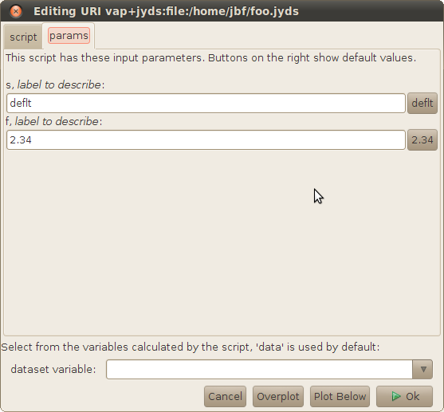

Purpose: Chapter of the Autoplot "book" which talks about scripting, and
is followed by a reference.

Audience: Developers and Interested Scientists

# Introduction

While Autoplot should be a useful application for easily plotting data
from CDF files and other sources, it also has a scripting capability
which many scientists may find useful. For example, suppose that we can
easily plot parameter A from a file, and also parameter B from the file,
but what we really want to see is A/B. Autoplot makes this easy to do
using Jython scripting, which is Python for Java applications.

In this example script, we would say something like:

```
Bz= getDataSet( '`<http://autoplot.org/data/autoplot.cdf?BGSEc&slice1=2>`' )
BMag= getDataSet( '`<http://autoplot.org/data/autoplot.cdf?Magnitude>`' )
result= Bz/BMag
```

Autoplot provides a simple editor for creating and running scripts, and
this is enabled with \[Menubar\]-\>Options-\>"Script Panel". Make sure
this is running and the "script" tab is visible. Enter the script in the
tab and click the execute button. Nothing is plotted, and we need to add
one more line to make this happen:

```
Bz= getDataSet( '`<http://autoplot.org/data/autoplot.cdf?BGSEc&slice1=2>`' )
BMag= getDataSet( '`<http://autoplot.org/data/autoplot.cdf?Magnitude>`' )
result= Bz/BMag
plot( result )
```

# Jython Data Sources

Jython scripts can be used as URIs and plotted as you would any other
URI. First remove the "plot" line so that only "result" is calculated,
then save this file to "/tmp/first.jyds". Then enter "/tmp/first.jyds"
in the Autoplot address bar, This creates a new source of data, and
allows us to store the source for future use. This .jyds file can be put
on a web site, and collaborators can also use the script.

This mode of using scripts is called the "Data Source Context," and the
commands available are limited to loading and manipulating data. That's
why the "plot" command needed to be removed, this context doesn't know
this command. You should also realize the potential security concerns
here. Data Source Context scripts, which always have a .jyds extension,
should not be able to affect the computers they run on.

There's a lot more that can be done with .jyds scripts, and we'll come
back to it later in this chapter.

# Application Context

The application context has all the functionality of the data source
context but has additional commands that allow the Autoplot application
itself to be controlled. For example, the "plot" command will take data
and plot it. We can do more useful things, like make daily PNGs:

```
plot( '`<http://autoplot.org/data/agg/efi/$Y/po_k0_efi_$Y$m$d_v$v.cdf?POTENT&timerange=2000-01-01>`' )
trs= generateTimeRanges( '%Y-%m-%d', '1999-December-30 through 2000-January-10' )
for tr in trs:
  dom.timeRange= DatumRangeUtil.parseTimeRange(tr)
  writeToPng( '/tmp/%s.png' % tr )
```

(And it's true that initially Autoplot's "Make PNG Walk" was just a
script.)

The application context has another important difference from data
context scripts: the "dom" variable. The dom is the state of the
application, storing all the plot positions, axis settings, labels, and
URIs which are plotted. A vap file is simply a copy of the dom written
to disk. Setting dom.timeRange will reset the x axis to the new range,
and writeToPng writes the canvas out to a png file.

These scripts can also be saved with the ".jy" extension, and also
reside on a web site so that anyone within a workgroup can access the
functionality. These scripts could be used by nefarious people to damage
your computer, and remote scripts will be shown before they are run.
Similarly, a miswritten script could cause damage. Either know and trust
the author of the script or carefully inspect the script before running
it.

# These are not Python scripts

Note these scripts are not Python scripts, but instead we use Jython to
provide a scripting capability that is easy to use and familiar to IDL,
Matlab, and SciPy users. Those familiar with Python or Jython know there
is no "getDataSet" command, and what's happened is Autoplot
automatically imports a large set of functions to create a familiar
environment. Some may wish to use this form for their scripts:

```
import autoplot as ap
Bz= ap.getDataSet( '`<http://autoplot.org/data/autoplot.cdf?BGSEc&slice1=2>`' )
```

This clearly indicates where the "getDataSet" command comes from. Note
however that Autoplot scripts must end in .jy or .jyds.

Also, Jython is not Python. Specifically, Jython 2.2 is used, which is
very similar to Python 2.2. However there are some Python classes which
are not available, and more importantly SciPy is not available. Quite a
bit of work has been done to explore the feasibility of a bridge which
would make it available, but this is not yet functioning. Also Jython
2.7 is available, but some work is needed to switch to it, and it should
be available by Spring 2018.

Unlike Python, Jython has access to the entire Java library, making it
easy to do everything from making GUIs to responding to Java events, as
well as loading and plotting data with Autoplot's code.

### Getting Input

```
s= getParam( 's', 'deflt', 'label to describe' )   # gets a string parameter, with default value "deflt"
f= getParam( 'f', 2.34, 'label to describe' )      # gets a float parameter, with default value 2.34
i= getParam( 'i', 100, 'array size' )              # gets an integer parameter.  Be careful--user input of a real is truncated, so 100 is quite different than
f= getParam( 'f', 100.0, 'volume' )                # gets a float parameter. 
e= getParam( 'e', 'RBSPA', 'spacecraft', [ 'RBSPA', 'RBSPB' ] )   # enumeration with the values given
b= getParam( 'v', 'F', 'apply correction', [ 'T', 'F' ] )         # booleans are just enumerations with the values 'T' and 'F'
```



Autoplot will look for this in scripts and automatically add to GUI. The
type is determined by the default value.

This is mostly used for .jyds scripts that create new datasets, but all
script types can use this command. The jyds plugin creates a GUI by
simplifying the script to just getParam calls and trivial commands, so
please let us know if this is not working for you.

Enumerations are supported as well, where a list of possible values is
enumerated. For example:

```
sensor= getParam( 'sensor', 'left', 'sensor antenna', ['left','right'] )
```

will get the parameter sensor, which can be either left or right (with
left as the default). When a GUI is created, a droplist of possible
values is used instead of a text entry field.

Last, booleans are allowed, and a checkbox is used when a GUI is
produced:

```
correct= getParam( 'correct', 'T', 'perform correction on the data', [ 'T', 'F' ] )
```

Note you cannot use the result as a boolean in the python code. You must
compare it to 'T'.

Application-context scripts can use get param as well. Right now the
default value is always used, but soon a gui will be created before
running the script. Jython scripts run using the Java class
org.virbo.autoplot.JythonMain can pass arguments into the script with
arguments following the first argument (name of the script):

```
java -cp autoplot.jar org.autoplot.JythonMain /tmp/myscript.jy sensor=right correct=T
```

#### Creating a GUI from a script

Autoplot works by making a simplified version of the script, and then
running it with getParam replaced with a function that tallies the
calls. This trick causes confusion when sometimes functions can be used
and sometimes not. These functions can be used:

```
 "range", "xrange", "lower", "upper"
```

so

```
 x= getParam( 'sc', 1, 'spacecraft ID", range(40) )
```

works, but this won't:

```
 x= getParam( 'sc', 1, 'spacecraft ID", findgen(40) )
```

# But wait there's more

  - Inline scripts are a Jython script embedded within a URI.
    vap+inline:Bmag=getDataSet('<http://autoplot.org/data/autoplot.cdf?BMagnitude>')\&Bz=getDataSet('<http://autoplot.org/data/autoplot.cdf?BGSEc&slice1=2>')\&Bz/BMag
  - Mashup scripts are a special case of Jython script, which can be
    expressed with the Data MashUp tool. N things are loaded and
    combined in one expression. These scripts are build graphically with
    the Mashup tab of the Jython editor panel.
  - Many commands: <http://autoplot.org/developer.scripting>

