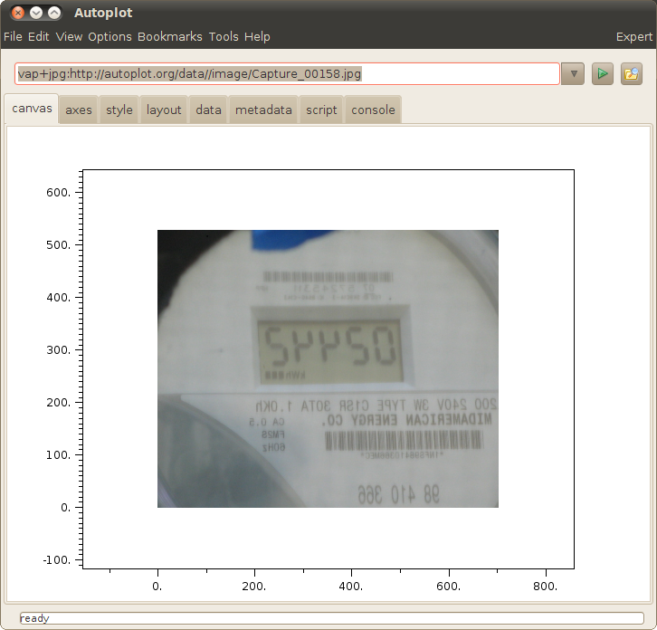

Purpose: Enumerate QDataSet data schemes, or types of data, and show
example renderings in Autoplot.

Audience: Developers and users wanting an overview of what Autoplot can
display.

Note, this page is broken because many of the dataset URIs no longer
work. TODO: point test140 at this page...

Keywords: plot types, schemes

# Introduction

QDataSet is the data representation model used within Autoplot. It was
first implemented in IDL in the software PaPCo, and has evolved quite a
bit since then. Previous data models we would use required revisiting
the code and constantly modifying the library to add new data types. It
uses a thin syntax and rich semantics to model many types of data, and
typically new types of data can be modeled without modifying the
library.

Since there's no table of Java types, this document serves to name and
enumerate the types which have been used. Also, the Java code within
QDataSet org.das2.qds.examples.Schemes will generate all types, as well
as a method for testing if a dataset is of the given type.

# Rank 1 Time Series

 Scalar quantity, such as density, is a
function of an independent parameter like time.

## Examples

  - DST\[Time\]
    vap+cdaweb:ds=OMNI2\_H0\_MRG1HR\&id=DST1800\&timerange=Oct+2016

# Rank 2 Spectrogram

 Simple table of
values which are a function of X and Y, such as Flux(Time,Energy)

## Examples

  - Flux\[Epoch,Energy\]
    <http://cdaweb.gsfc.nasa.gov/istp_public/data/polar/hyd_h0/$Y/po_h0_hyd_$Y$m$d_v01.cdf?ELECTRON_DIFFERENTIAL_ENERGY_FLUX&timerange=20000109>

# Rank 3 Join of Spectrograms

Array of spectrograms, each containing different Y-tags. Plasma Wave
Group at Iowa uses these often.

  - vap+d2s:<http://www-pw.physics.uiowa.edu/~jbf/data.backup/examples/das2stream/multiModeCassini.ascii.d2s>
  - vap+qds:<http://www-pw.physics.uiowa.edu/~jbf/data.backup/examples/das2stream/waves_srv_2011_221T16_test.qds>

# Events List

 Intervals in time, showing when events
occurred. This can contain:

  - startTime, endTime
  - startTime, endTime, plus event description (event is nominal data)
  - startTime, endTime, RGB color, and event description.

Rank 2 bundle dataset with the last dataset (description) an ordinal
unit. Here are examples:

<http://autoplot.org/autoplot/data/event/simpleEvent.txt>
<http://autoplot.org/autoplot/data/event/events.dat>

# Image

 Image, for example from a JPEG file.

## Examples

  - Image\[705,528,DEPEND\_2=3\]
    '<http://autoplot.org/data/image/Capture_00158.jpg>'

# Pitch Angle Distribution


Rank 2 dataset with one dimension representing angle and the other
radial distance. The angle dimension will be a dependence upon a dataset
with either radians for units, or UNITS=Units.degrees. Note either
dimension can be the angle dimension, the renderer will resolve this.
TODO: introduce a strict version of this with the first dimension the
angle dimension, along with a function to make loose ones strict.

## Examples

  - Flux\[Pitch,Speed\]
  - vap+jyds:<https://github.com/autoplot/app/blob/master/JythonDataSource/src/pitchAngleDistribution.jyds>
  - This needs work, you have to slice it first, then set the
    renderType:
    vap+jyds:<https://github.com/autoplot/app/blob/master/JythonDataSource/src/timasPitchAngleDistribution.jyds>

# XYZ Scatter


Autoplot's "color scatter" can be used to display xyz triples.

# Rank 0 Datum (Digital)

Dataset with no indexes, just properties like UNITS and VALID\_MIN. For
example the time "2011-12-28T00:01" can be represented as a rank 0
dataset, as can "5 Kg".

# Rank 1 DatumRange (Digital)

Rank 1 dataset with two elements, the property "BIN\_0=min,max", and
other properties like "UNITS"

# Waveforms

The Plasma Wave Group at Iowa produces waveform data where it is
impractical to timetag each measurement. Further, often the position of
each measurement to others is known very precisely, but the position of
the group is not. Therefore, waveform packets were introduced. This is a
rank 2 dataset, where the ytags are in offset units from the xtags,
typically times. When rendered, the data is displayed as though it were
rank 1 and there is a timetag associated with each measurement.

```
vap+inline:ripplesWaveformTimeSeries(10)
```
This has evolved somewhat, where the DEPEND\_1 can be a rank 2 dataset,
so that each measurement can be located precisely with a floats, and
also where a rank 3 join of rank 2 waveform datasets is supported.

# Orbit Plots

Timetags along a trajectory. There's no data scheme that triggers
Autoplot to use this form, but it can be:

```
yy[xx[tt]] where yy xx and tt are all rank 1
bundle[i;t,x,y]
```
# Complex Data

The Ops.fft function returns ds\[n,2\], where ds\[:,0\] are the real
components and ds\[:,1\] are the complex components. The property
QDataSet.COORDINATE\_FRAME will have the value "ComplexNumber".

