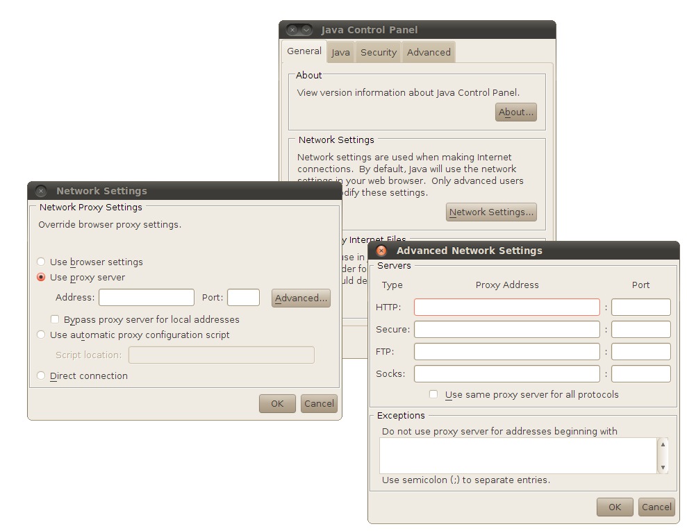

Purpose: keep track of how to manage Java and Webstart in a firewalled
environment where proxies are used to provide web access.

Audience: Autoplot users in a firewalled environment.

# Running Java directly without Webstart

Folks at LANL are using these settings successfully:

```
/usr/lib/jvm/jre-1.6.0-sun.x86_64/bin/java -Dhttp.proxyHost=proxyout.lanl.gov -Dhttp.proxyPort=8080 -Dhttp.noProxyHosts="*.lanl.gov" -jar /packages/lib/autoplot/autoplot.jar "$@"
```
# Running under Webstart

  - Java Control Panel has Network Settings and Network Proxy Settings.
    

# Resources

The script for testing the environment is
[testNetworkConnection.jy](http://autoplot.org/data/tools/testNetworkConnection.jy)

# Notes

