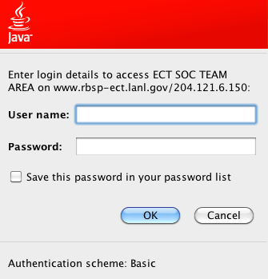

Purpose: Summarize finding related to the problem where Java Webstart
inserts an authentication dialog, preventing Autoplot's keychain from
better handling the URL.

Introduction: Java Webstart registers an Authenticator dialog that
catches when authentication is needed for a restricted site, thus
preventing Autoplot from managing credentials. This may actually be a
good thing, meaning Autoplot could not be used to hijack credentials to
a restricted site, but it does prevent the .keychain.txt feature from
working.



# Test Script

This test script demonstrates the bug (or feature, depending on how you
see it):

```
from java.net import URL
import sys
u= URL( 'http://www.rbsp-ect.lanl.gov/data_prot/' )
#u= URL( 'http://www.rbsp-ect.lanl.gov/' )
c= u.openConnection()
i= c.getInputStream()
b= i.read()
while ( b!=-1 ):
   sys.stdout.write( '%c' % b )
   b= i.read()
```
# Solutions

One solution is to turn off this dialog completely. Edit
\~/.java/deployment/deployment.properties, adding
"deployment.security.authenticator=false". Run this twice (I think), and
you should see the effect. One negative aspect of this is that all
javaws will use this rule now. We tried setting this in the .jnlp but
this has no effect.

