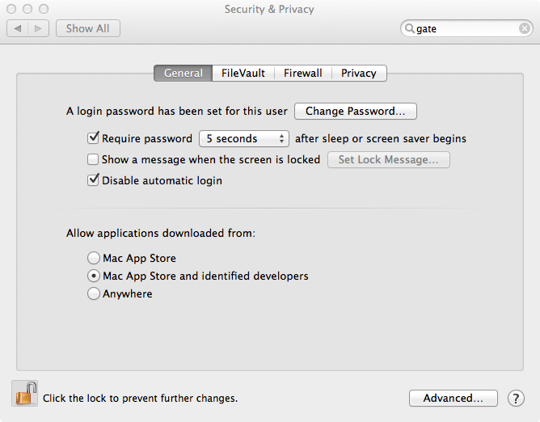

Purpose: Keep track of issues and solutions to work with Java on Mac
Lion (2012)

Audience: Autoplot users using Mac OS X 10.8 (Mountain Lion) with
Gatekeeper.

# Introduction

Mac OS X Mountain Lion introduces new security that makes running Java
applications a little more difficult. The OS now ships without Java, so
it must first be installed before Autoplot can be run. In addition, new
security restrictions limit how unsigned applications, like Autoplot,
can be run. (Digital signatures have a yearly expense that has prevented
their use so far. This may change soon.)

# Finding Webstart on Lion

Java is now installed on Mountain Lion via the Oracle site here:
<http://www.oracle.com/technetwork/java/javase/downloads/jre7u9-downloads-1859586.html>
.

# Loosening Security with Webstart Applications

Mac security must loosened to allow Java Webstart applications signed
with an untrusted certificate to work.

This page talks about Gatekeeper:
<http://support.apple.com/kb/HT5290?viewlocale=en_US>

And this page talks about jnlp and Gatekeeper:
<http://stackoverflow.com/questions/11727955/the-digital-signature-is-not-trusted-java-will-not-allow-any-access-to-this-app>

And this gives an overview useful for planning:
<https://blogs.oracle.com/talkingjavadeployment/entry/java_applications_and_gatekeeper>

# Search Terms

The Univerisity of Tennissee has Java JNLP software "Blackboard
Collaborate" with a help desk page that provides helpful information.
Presumably this is a similar environment to Autoplot's, with a smaller
user base and limited funds. The University of Iowa also uses this
software, and I should see who the local person is managing that
software. Here's a Java version checker they use:
<http://support.blackboardcollaborate.com/ics/support/default.asp?deptID=8336&task=knowledge&questionID=1473>
. Their requirements appear to be more restrictive than Autoplot's.

# Changes for WebStart for MacOS X 10.6, 10.7, 10.8

Around 2012 Oct. 16, Apple patched Java for MacOS X 10.6-8 to remove the
plugin for running Java applets in browsers and removed links for Java
WebStart. On 10.7 (Lion) and 10.8 (Mountain Lion), attempts to run Java
programs brings up a dialog box to download Oracle's Java 7 installer.
At least for now, Apple's Java 6 is installed on 10.6-8 but hidden.
Apple has a help page for returning to older behavior at "Java for OS X
2012-006: How to re-enable the Apple-provided Java SE 6 applet plug-in
and Web Start functionality" <http://support.apple.com/kb/HT5559>

While Autoplot works with Oracle's Java 7, programs that use Java3D
(TIPSOD and ViSBARD) require Apple's Java 6. To run these, add a
symbolic link from Apple's Java 1.6 package when logged into an account
with Administrator privileges. To do this, start Terminal.app from the
Utilities folder within the Applications folder, and type the following
and provide your account password:

sudo ln -sf /System/Library/Frameworks/JavaVM.framework/Commands/javaws
/usr/bin/javaws

# Wrong key usage

All platforms are seeing a warning about "Wrong key usage" starting at
Java 1.7.0\_07. The solution for this is to disable "enable online
certificate validation". Oracle is expected to fix it in Java 7 update
11. See
<http://sscweb.gsfc.nasa.gov/skteditor/Digital_Signatures.html#Failed_to_validate_certificate>.

