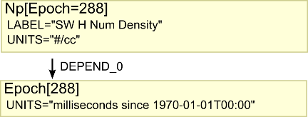
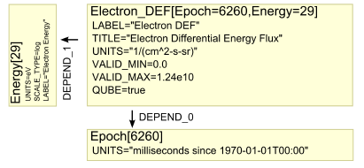

Purpose: write new page documenting QDataSet, after discovering a lack
of resources for describing Bundles. This will replace
<http://autoplot.org/QDataSet>, and will be completed as a part of the
migration of QDataSet into the das2 core.

Audience: das2 developers and interested scientists.

# Introduction

QDataSet is the mature interface used for representing, or modelling,
data in Java. When one interface is used for all data, a rich set of
operators can be developed, and software is written more quickly and
correctly. Often QDataSet is referred to as a "Data Model."

QDataSet was originally developed in 2005-2007 for PaPCO, an IDL
application, to provide a standard way of representing data between
plug-in modules for different instruments and different spacecraft.
Autoplot, a Java application, was begun in 2007, and completed this
model. Note that one of the design goals of QDataSet is to do most of
the work in semantics instead of syntax, so that the model can be
implemented in any software framework. Autoplot is more than 10 years
old and QDataSet is quite mature, providing not just the interface, but
also hundreds of operators and sources for creating QDataSets from data
files.

Because QDataSets carry rich metadata that allow the numbers to be
interpreted, rich operations can be developed that need little
documentation can be developed as well. For example waveform dataset can
be passed to the fftPower function, and a power spectrum returned, with
all the labels and frequency channels correctly calculated.

QDataSet reuses a number of conventions found in CDF and NetCDF files
and can be thought of a software interface to these formats. QDataSet
was presented at AGU: [2011
Poster](http://autoplot.org/wiki/images/InsideAutoplot-20110531.ppt)

# Simple Arrays

A QDataSet is a basically an array with metadata attached to it. An
array is a set of `N` numbers accessed by an index from `0` to `N-1`.
Some languages support 2-D and 3-D arrays, so to access any number, you
need two or three indices, respectively.

With QDataSet, we call the number of indices the "rank" of the dataset.
Core are three accessor methods:

``` python
ds.rank()         # The number of indices this QDataSet uses.
ds.length()       # The number of values in the 0th (first) index of the QDataSet.
ds.value(i)       # A value within a rank 1 QDataSet.
# or
ds.value(i,j)     # A value within a rank 2 QDataSet.
# or
ds.value(i,j,k)   # A value within a rank 3 QDataSet.
```
`
```

A rank 1 dataset is similar to a simple 1-D array. A number of elements
are available (`ds.length()`), and each element is accessed with
`ds.value(i)`. The index `i` can take on values of
`0,1,2,...,ds.length()-1`.

Metadata for a QDataSet is accessed with the property method, so for
example, ds.property('LABEL') returns a label for the dataset, and
ds.property('UNITS') returns a units representation. QDataSet.LABEL and
QDataSet.UNITS provide easy access to these property names, as well as
descriptions for each.

Autoplot's [Jython](scripting "wikilink") uses QDataSets as if they were
any other array. In this case ds\[i\] returns each value of a rank 1
dataset. ds\[i,j\] accesses values of a rank 2 dataset. Examples in this
document can be run in Autoplot, using \[menubar\]&rarr;Options&rarr;Enable
Feature&rarr;Script Panel, and then pressing the &quot;execute&quot; button to run the
script. The Log Console is usually run as well, which will show the
output of print commands.

## Rank 1 Example

``` python
# Create a Jython array
array= [ 2,3,2,4,5,4,2,1 ]
print 'Jython Array: ', array # Jython Array:  [2, 3, 2, 4, 5, 4, 2, 1]
 
# Convert Jython array into a QDataSet
ds= dataset( array )
print ds.rank() # 1
print ds.length() # 8

# Add metadata to QDataSet
ds.putProperty( QDataSet.LABEL, "frequency" )
ds.putProperty( QDataSet.UNITS, Units.hertz )

# Access metadata 
print ds.property( QDataSet.LABEL ) # frequency

# Extract data
array= [ ds.value(0), ds.value(1), ds.value(2) ]
print 'Jython Array of floats: ', array # '[2.0, 3.0, 2.0]'
# or
array= [ ds[0], ds[1], ds[2] ] 
print 'Jython Array of QDataSets: ', array # '[2.0 Hz, 3.0 Hz, 2.0 Hz]'
print 'First element has rank %d and length %d' % ( array[0].rank(), array[0].length() )
```
`
```

Autoplot's scripting has a command "getDataSet" which reads data using
an Autoplot URI.

``` python
# read in rank 1 dataset from CDAWeb
ds= getDataSet('http://autoplot.org/data/somedata.cdf?Magnitude&doDep=no')
print ds  # 'Magnitude[24] (nT)'
```
`
```

## Rank 2 Example

A rank 2 dataset is similar to a 2-D array. Like Java and unlike
Fortran, this is an array of arrays, so a rank 2 QDataSet can be thought
of as a set of rank 1 datasets, and each rank 1 dataset can have a
different length. Therefore to get the length of the second index,
`length(i)` is called, and `value(i,j)` is used to access the values.
Note most rank 2 QDataSets are actually repeated measurements of the
same thing, so `length(0)` will equal `length(1)` and all other lengths.
This special case is called "Qubes," and these are like Fortran or IDL
arrays. The "size" function returns the length of each dimension, and
makes sure that the data really is a qube.

``` python
seed=5334
x = randomn(seed,10,5)
print '%5.2f' % x[0,0]
(nrow,ncol)= size(x)     # this would raise an exception if the data is not a Qube.
for i in xrange(nrow):
   for j in xrange(ncol):
      print  '%5.2f' % x[i,j],      # trailing comma suppresses the newline
   print ''
 
scPos= getDataSet( 'http://autoplot.org/data/somedata.cdf?doDep=no&SC_pos_GSE' )
print 'scPos should have rank 2: ', scPos.rank()
```
`
```

## Rank 3 Example

Higher rank datasets exist as well, namely rank 3 and rank 4 datasets.
These have value methods value(i,j,k) and value(i,j,k,l), and might be
Qubes as well.

The method "slice" accesses the dataset at the position. For example:

```
ds.slice(0) 
```

extracts a "slice" of the dataset at the index. Calling the slice
operator of a rank 3 dataset returns a rank 2, and so on. In Space
Physics, we have lots of time series data sets, and typically the first
index corresponds to time. The slice operator allows one to look at one
of the measurements.

```
scPos= getDataSet( '`<http://autoplot.org/data/somedata.cdf?doDep=no&SC_pos_GSE>`' )
print 'scPos should have rank 2: ', scPos.rank()
print 'slice of data: ', scPos.slice(0)
print 'and one measurement: ', scPos.slice(0).slice(0)
```

# More Metadata

We can attach properties to datasets, like:

  - UNITS The units. In Autoplot this is a Java class of enumerated
    values plus additional ones encountered.
  - LABEL Human-readable label for plot axes
  - TITLE Longer, human-readable title
  - NAME Java-identifier for the dataset "flux" or "energyFlux" or
    "spacecraft\_time", suggest a name to use in scripts.
  - VALID\_MAX, double, maximum valid value (inclusive)
  - VALID\_MIN, double, minimum valid value (inclusive)

# Combining Datasets With DEPEND Property

So at what time was each measurement made? There are properties
connecting QDataSets which do this. For example, suppose there is an
array of timetags and another that is an array of density values at each
time. The density dataset has a property "DEPEND\_0" which is the
timetags.

```
ttags= density.property( QDataSet.DEPEND_0 )
```

Properties:

  - DEPEND\_0 The independent parameter "causing" the first index, which
    is also a QDataSet.
  - DEPEND\_1 The independent parameter "causing" the second index, also
    a QDataSet.
  - DEPEND\_2 The independent parameter "causing" the third index...
  - DEPEND\_3 ...

When we need a quick string representation of the data, we would print

```
density[epoch=288]
```

to indicate there are 288 elements in the rank 1 dataset "density", and
it DEPENDS on timetags in a dataset called "epoch".

# Example Datasets

## Rank 1 QDataSet



``` python
ds= getDataSet( 'vap+cdaweb:ds=OMNI_HRO2_5MIN&filter=omni&id=proton_density&timerange=2018-10-01' )
print ds.property( QDataSet.LABEL )     # "Proton Density (n/cc)"
print ds.property( QDataSet.UNITS )     # "n/cc"

epoch= ds.property( QDataSet.DEPEND_0 ) 
print epoch.property( QDataSet.UNITS )  # "cdfEpoch"


#
```
`
```

## Rank 2 QDataSet



``` python
ds= getDataSet( 'https://cdaweb.gsfc.nasa.gov/istp_public/data/polar/hydra/hyd_h0/2000/po_h0_hyd_20000101_v01.cdf?ELECTRON_DIFFERENTIAL_ENERGY_FLUX' )
print ds.rank()                          # 2
print ds.property( QDataSet.DEPEND_0 )   # EPOCH
print ds.property( QDataSet.DEPEND_1 )   # ENERGY_ELE

from org.das2.qds import DataSetUtil
print DataSetUtil.isQube(ds) # 1 (True)

dep0= ds.property( QDataSet.DEPEND_0 )
print dep0.property( QDataSet.UNITS )

dep1=  ds.property( QDataSet.DEPEND_1 )
print dep1.property( QDataSet.UNITS )
print dep1.property( QDataSet.SCALE_TYPE )  # log
```
`
```

## Others

Autoplot's Metadata tab allows the QDataSet to be browsed. Under the
"Dataset" node, the loaded QDataSet's properties are shown, and one can
see how different types of data are represented.  

# High Rank and Rank 0 Datasets

Besides rank 1 and rank 2 datasets, there are rank 3 and rank 4
datasets. You could really have any rank you would want, and should a
need for a 5-index dataset arise, it would be added to Autoplot. There
are also rank 0 datasets, which model scalar quantities. Note that this
has just the accessor "value()" and one can still call properties to get
metadata about the one value.

Note that in Jython, ds\[0\] doesn't actually return a double value. It
returns a rank 0 dataset. Typically Jython knows how to convert this to
what it needs, but sometimes you must explicitly convert the value, like
so:

```
for i in xrange( int(ds[0]) ): print i
```

# Some example operators

 Autoplot's implementation of QDataSet offers
lots of functionality. For example:

```
ds= randomn(5334,10000)   # 5334 is just a seed to make the pseudo-random sequence repeatable, which is useful for testing.
plot( histogram(ds,-5,5,0.1) )
```

There are hundreds more operators. Type in "ds=" and hit tab in the
editor to see completions.

```
ds= randomn(5334,10000)
tt= timegen('2011-01-01T00:00', '1 days', 10000 )
plot( 0, tt, ds )
plot( 1, tt, smooth(ds,101) )
```

```
reset()
ds= getDataSet( '`<http://autoplot.org/data/wav/chickadeesong.wav>`' )   # rank 1 dataset
print ds.property( QDataSet.DEPEND_0 ).property( QDataSet.UNITS )    # seconds
ps= fftPower( ds, 1024, 2, 'Hanning', monitor )          # returns rank 2 power spectrum
print ps.property(QDataSet.DEPEND_1)                     # 'dataset[511] (Hz)'
plot( ps )
```

# Ordinal Data

The units representation returned by the UNITS property may be a special
unit that allows encoding of ordinal data. For example, instead of
"density" measured in 1/cc, we might have "instrument mode" which has
the values "on", "off", and "testing."

# Bundles

The simplest bundle is a rank 2 dataset with DEPEND\_1 equal to a
QDataSet containing ordinal data, labeling each channel. The following
code shows this.

``` python
ll= labels( ['data-x','data-y','data-z'] )
ds= zeros(201,3)
ds[:,0]= sin( linspace(0,6*PI,201) )
ds[:,1]= sin( PI/3+linspace(0,6*PI,201) )
ds[:,2]= sin( 2*PI/3+linspace(0,6*PI,201) )
ds.putProperty( QDataSet.DEPEND_0, linspace( '2019-10-10T00:30', '2019-10-10T19:30', 201 ) )
ds.putProperty( QDataSet.DEPEND_1, ll )
plot(ds)
```
`
```

In this simple case, the three bundled channels must all have the same
units.

We can also model more complex tuples of data, where many measurements
are made at the same time. Suppose at a given time we collect density,
velocity, and flux. We then have an array with elements time, density,
vx, vy, vz, f1, f2, f3, f4. You can get an example bundle with
org.qds.examples.Schemes:

``` python
ds= getDataSet( 'vap+hapi:https://jfaden.net/HapiServerDemo/hapi?id=Iowa+City+Conditions&timerange=2019-09-01/2019-09-11' )
plot( unbundle(ds,'Humidity') )
```
`
```

These values can be represented in a rank 2 QDataSet with each record
having nine elements, but how do you store the different labels and
units? For this, QDataSet uses the property BUNDLE\_1, which is itself a
QDataSet, but a odd one called a BundleDataSetDescriptor. It is always
rank 2, and carries the properties for each of the bundled elements. For
example:

``` python
bds= ds.property( QDataSet.BUNDLE_1 )
print bds.property( QDataSet.TITLE, 1 )   #  'Wind Speed'  
print bds.property( QDataSet.LABEL, 2 )   #  'DewPoint'
print bds.property( QDataSet.UNITS, 2 )   #  'deg F'
print bds.property( QDataSet.NAME, 3 )    #  'Humidity'
print bds.property( QDataSet.UNITS, 3 )   #  'percent'
```
`
```

Having the BundleDataSetDescriptor allows us to model commonly-seen rank
2 table of numbers:

```
2019-08-31T23:52:00.000Z 67.0 9.0 57.0 71.0 -1.0E31 -1.0E31 30.17 1021.6 0.01 
2019-09-01T05:52:00.000Z 64.0 5.0 59.0 84.0 -1.0E31 -1.0E31 30.19 1022.3 0.0 
2019-09-01T06:52:00.000Z 65.0 3.0 58.0 78.0 -1.0E31 -1.0E31 30.19 1021.9 0.0 
```

which can be modeled and printed like so:

``` python
print ds.rank()                                 #   '2'
bds= ds.property( QDataSet.BUNDLE_1 )  
print bds.property( QDataSet.FILL_VALUE, 4 )    #  -1e31
print bds.property( QDataSet.LABEL, 4 )         #  'WindChill'

dep0= ds.property( QDataSet.DEPEND_0 )
for i in range(3):
    print dep0[i].svalue(),
    for j in range(ds.length(0)):
        print ds[i,j].value(),
    print ''
```
`
```

and a slice results in the nine-element tuple:

``` python
ds.slice(0)                               #   results in the tuple of individual measurements 
```
`
```

To access individual datasets from the bundle, the unbundle function can
be used:

``` python
print unbundle( ds, 2 )           # results in the dew point column
print unbundle( ds, 'Humidity' )  # results in the dataset with this name.
```
`
```

## High Rank Bundles

A special "high-rank" mode is also supported to unbundle rank 2 (or
greater) datasets:

``` python
from org.das2.qds.examples.Schemes import complexBundleDataSet2
ds= complexBundleDataSet2()
v= unbundle( ds, 'V' )
plot(v)
```
`
```

It can do this because there is metadata within the bundle properties
describing this dataset:

``` python
bds= ds.property( QDataSet.BUNDLE_1 )
print bds.property( QDataSet.NAME, 4 )
print bds.property( QDataSet.START_INDEX, 4 )   # 2, because Vx is at 2.
istart= bds.property( QDataSet.START_INDEX, 4 )
print bds.property( QDataSet.ELEMENT_NAME, istart )        # "V"
print bds.property( QDataSet.ELEMENT_DIMENSIONS, istart )  # "[3]"
```
`
```

Note that a rank 2 bundle could contain a rank 3 dataset. It can also
contain a simple bundle, but it cannot contain another bundle. One more,
slightly embarrassing, note, sometimes DEPEND\_0 will be a part of the
bundle itself. It's still not clear what the better form is, but codes
generally support both forms.

# BINS Dimensions

So you've seen how DEPEND\_1 can describe the columns of a rank 2
spectrogram, and how BUNDLE\_1 can describe the columns of an ASCII
table. There are a couple of other structural properties which are
useful.

Sometimes you don't have just one number describing the position of a
measurement, but a range. The BINS\_1 property is useful here. It is
just a string identifying each of the numbers in the dimension. For
example, "min,max" indicates that the two numbers are the bounds of the
bounds containing the data.

# Schemes

QDataSet is a simple interface for describing complex things. Clearly
there are things which will fit into QDataSet but are not semantically
correct. Suppose you have a Rank 1, 10 element dataset with a DEPEND\_0
Rank 1 11 element dataset. Likewise there might be things you can
imagine which do make sense but codes don't support. One example of this
is rank 2 data with rank 2 DEPEND\_1. There were CDF files with data
like this, and when we saw this was useful, we added support for it.
Every routine of the Java QDataSet library had to check the rank of
DEPEND\_1 to make sure it was properly handled. If the data was sliced,
then its DEPEND\_1 would also have to be sliced. This design has allowed
QDataSet to grow organically to meet community needs.

To enumerate all the different forms of QDataSets supported, a testable
Java code was introduced. This code is org.das2.qds.examples.Schemes,
found at

<https://sourceforge.net/p/autoplot/code/HEAD/tree/autoplot/trunk/QDataSet/src/org/das2/qds/examples/Schemes.java>

To access this in Autoplot Jython, try:

``` python
from org.das2.qds.examples import Schemes
plot( 0, Schemes.simpleSpectrogram())
plot( 1, Schemes.rank2Waveform())
```
`
```

# QDataSet Operations should Handle Metadata

Many operations are included in the Java/Jython implementation of
QDataSet. It is expected that operators should return results with as
much metadata preserved as possible. For example, the trim operator
returns a subset of a dataset. This result ought to have the same UNITS
and LABEL as the original data. Also, slice should take DEPEND\_1 and
make its result have DEPEND\_0. Likewise for BINS\_1 and BUNDLE\_1.

Note too that Jython supports operator overloading, so "+" can be
defined as the addition operator which considers units. This is all
implemented as well, so adding "5cm" to "5m" will result in "505 cm."

Jython also has a dataset operator which will parse the string (or array
or scalar) to turn it into a QDataSet.

``` python
print dataset("5cm")+dataset("5m")  # "505.0cm"
```
`
```

# Comparing IDL array operations to QDataSets

There are a number of differences between IDLs array operations and
QDataSet operations.

Note in Jython ds\[2,3\] is the same as ds.slice(2).slice(3) and similar
to ds.value(2,3). (Similar because value(2,3) returns a double, while
ds.slice(2).slice(3) returns a rank 0 dataset.)

In the following table, "ds" may change from row to row, but is the same
for the two columns. TODO: these should probably be equivalent codes.

| IDL                                                                                   | QDataSets in Autoplot's Jython                                                                        |
| ------------------------------------------------------------------------------------- | ----------------------------------------------------------------------------------------------------- |
| ds\[1,\*\] returns 1 by n array, reform used to remove the 1                          | ds\[1,:\] returns rank 1 n-element dataset.                                                           |
| ds\[1\] is a scalar                                                                   | ds\[1\] is a rank 0 dataset                                                                           |
| arrays can have 1 to 8 indices                                                        | datasets can have 0 to 4 indices                                                                      |
| single index aliases to multi-index ds\[19\] is the same as ds\[3,4\] of 4 by 5 array | single index slices to dataset of rank N-1, DataSetIterator should be used to access all elements     |
| where command returns aliased indices for 2-D arrays                                  | where returns r\[n,2\] of indices for each dimension.                                                 |
| where command returns -1 to indicate no matches                                       | where returns zero-length dataset for no matches.                                                     |
| zero-length arrays supported in IDL 8.1 and up                                        | zero-length arrays have always been supported                                                         |
| size command shows number of dimensions and size of each dimension (its geometry)     | ds.rank() and ds.length() are used to discover dataset geometry.                                      |
| arrays are qubes, having the same number of columns in each row                       | each record could have a different length, QDataSet.QUBE property asserts that the dataset is a qube. |
| **print, ds** prints all the elements                                                 | **for d in ds: print d** prints all the elements                                                      |
| help, ds shows information about the array                                            | print ds shows information about the array                                                            |
| \!dtor converts to radians                                                            | toRadians(ds) converts to radians                                                                     |

