Purpose: demonstrate the RenderTypes available.

Audience: Scientists wanting to know capabilities.

See also: <http://autoplot.org/developer.newRenderers> which shows how
new renderers are created for das2 applications and Autoplot scripts.


# Introduction

Autoplot tries guess a plot type based on the form of the data. For
example, a for rank 2 table it uses spectrogram, and for a series of
points it uses the series. There are already many ways to render data,
many of them will almost never be selected automatically. To manually
set the render type, right-click on the display to select an option
under the render type submenu, or in a script set the RENDER\_TYPE
property. See also <http://autoplot.org/developer.guessRenderType>

# Spectrogram

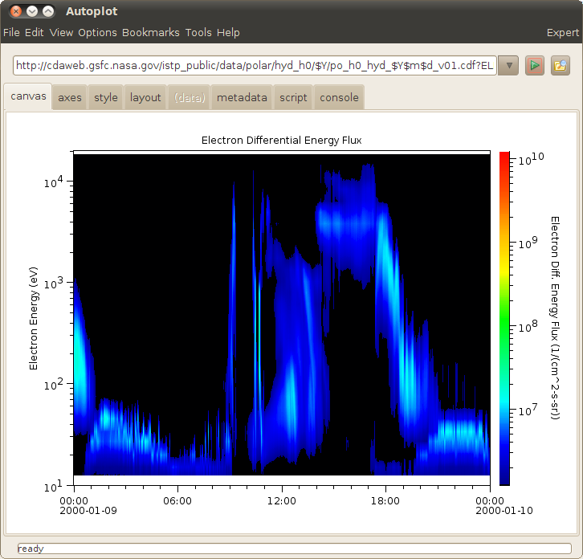 Bi-linear
interpolation is used to fill in squares of 4 data points.

```
ds[X,Y]
```
<http://cdaweb.gsfc.nasa.gov/istp_public/data/polar/hyd_h0/$Y/po_h0_hyd_$Y$m$d_v01.cdf?ELECTRON_DIFFERENTIAL_ENERGY_FLUX&timerange=20000109>

There is a plan to add new rebinning methods:
[developer.spectrogram.rebin](developer.spectrogram.rebin.md "wikilink")

# Nearest Neighbor Spectrogram

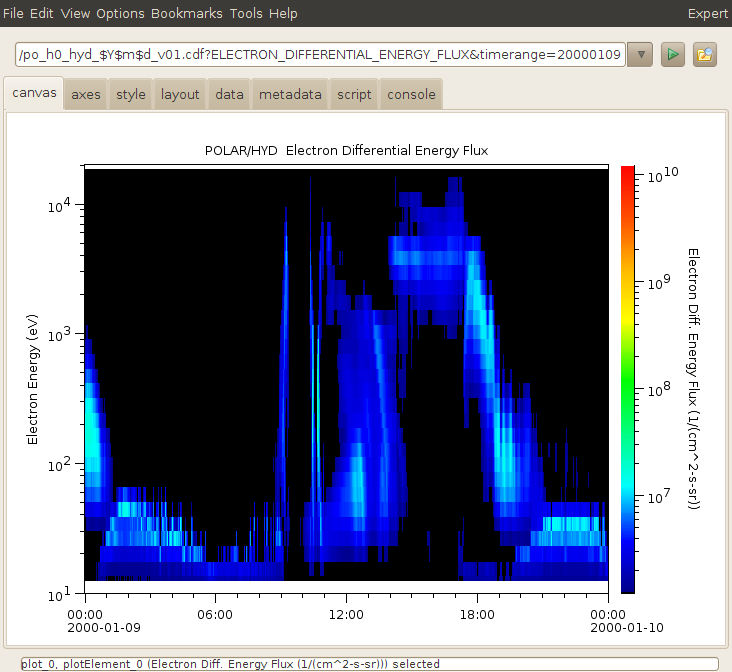 Same as
spectrogram, but the nearest neighbor is used. Note there is a setting
that makes this the default. Also datasets can hint that they prefer
this rendering with the RENDER\_TYPE property.

# Series

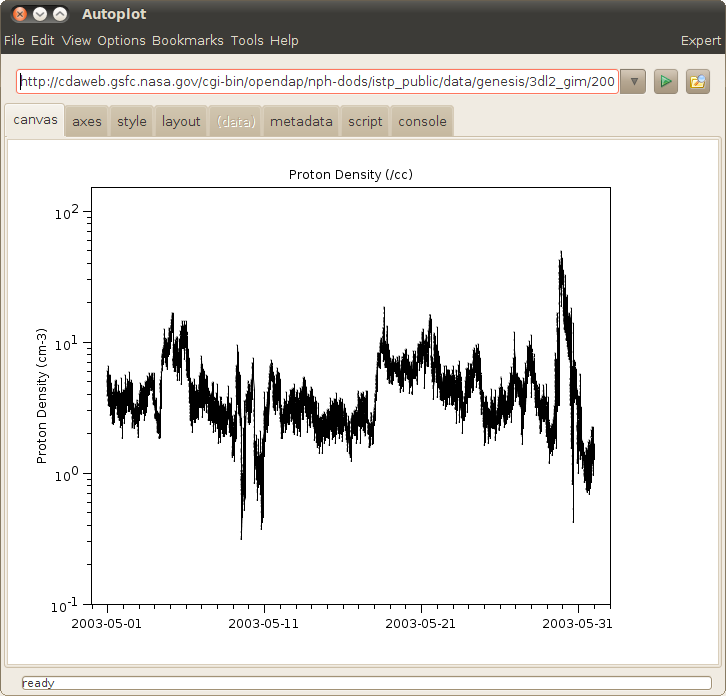 Time series of data painted by
connecting successive points. A cadence is established, and points
farther away than this cadence are not connected.

<http://cdaweb.gsfc.nasa.gov/cgi-bin/opendap/nph-dods/istp_public/data/genesis/3dl2_gim/2003/genesis_3dl2_gim_20030501_v01.cdf.dds?Proton_Density>

# Fill To Zero

The data is filled in to a reference value, a line where y=value. It has
recently been proposed that separate upper and lower thresholds and
colors be added. This is never triggered automatically.

# Scatter

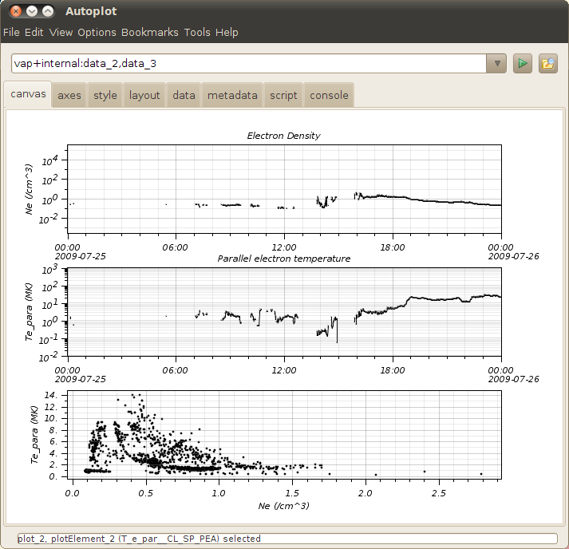 Like a time series, but the
connecting lines are not used. This is triggered when a cadence cannot
be established.

# Color Scatter

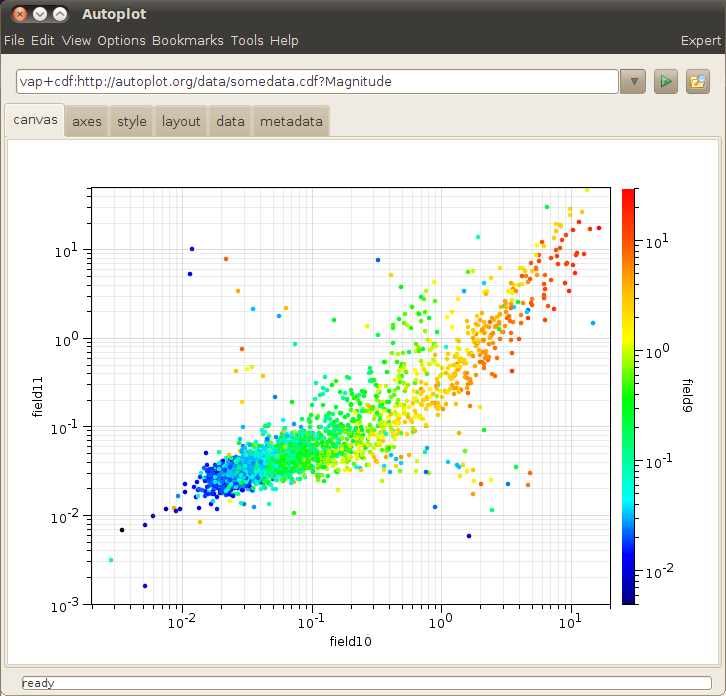 The
plot symbols are color-coded to show a third dimension.

vap+inline:rand(200),rand(200),rand(200)

vap+jyds:<http://autoplot.org/data/script/schemes/colorScatter.jyds>

# Huge Scatter

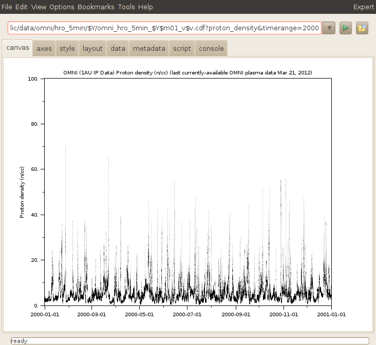 Like a series, but
the size of the dataset is sufficient that Series cannot be used.
Presently this threshold is 30000 points. Only the color can be
controlled, and connections are drawn between data in the same pixel
column.

```
vap+inline:ripples(1000000)
```
<http://cdaweb.gsfc.nasa.gov/istp_public/data/omni/hro_5min/$Y/omni_hro_5min_$Y$m01_v$v.cdf?proton_density&timerange=2000>

# Digital

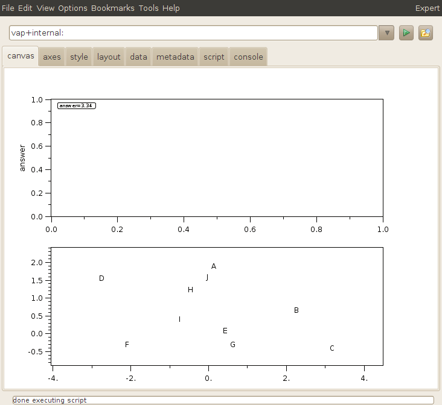 Data are rendered as a
formatted text instead of points. Most data can be plotted this way,
including rank 0 data, which is displayed in a bubble in the plot
corner. The code limits the number of points drawn, presently clipping
but soon it will subsample. Here is some python code that demonstrates:

```
ds= dataset(3.34)
ds.putProperty( QDataSet.LABEL, 'answer' )
plot(ds)
```
script:<http://autoplot.org/data/script/schemes/digital.jy>

# Events Bar

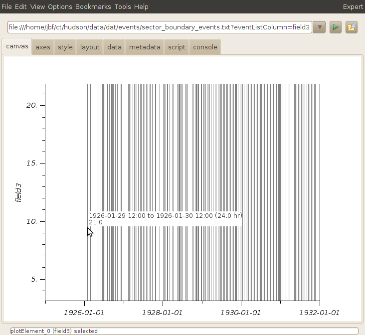 Data in datasets can be
from an enumeration, and the associate Units object maps the value to a
message. In this case an events bar shows the time and clicking on the
bar shows the message.

```
ds[:,4] where tstart,tstop,rgb,event
ds[:,2] where t,event
```
<http://autoplot.org/data/script/schemes/demoEventsBar.jyds>

# Image

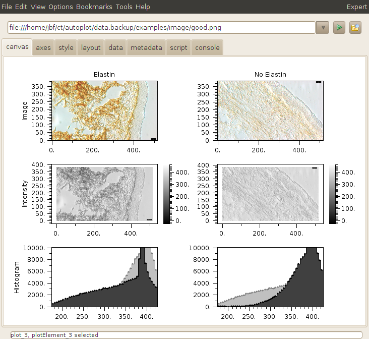 RGB values
are painted as an image.

```
ds[row,column,3] there the 3 is R,G,B.
```
vap+jpg:http://autoplot.org/data/image/Capture\_00158.jpg

# Orbit

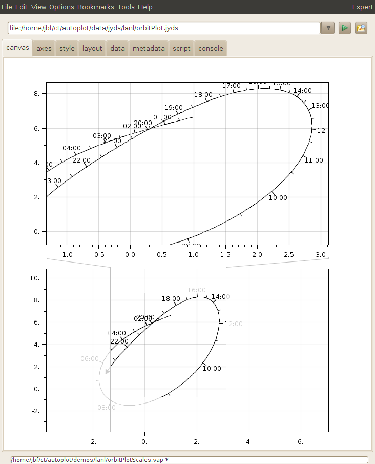 More abstract orbit plot
shows a time parameter plotted along a trajectory.

```
ds[:,3], an array of bundles of time, x, and y.
Y[X[T]]
```
script:<http://autoplot.org/data/script/schemes/orbitDemo.jy>

vap+jyds:<http://autoplot.org/data/script/schemes/orbitPlot.jyds>

# Pitch Angle Distribution

 Pitch angle distributions take rank 2 data
in the form:

```
ds[angle,radius]
```
where the angle is in radians or has units='deg'

vap+jyds:<https://autoplot.svn.sourceforge.net/svnroot/autoplot/autoplot/trunk/JythonDataSource/src/pitchAngleDistribution.jyds>

# Custom

Custom renderers, defined in Python code, will soon be an option. See
[CustomRenderers](CustomRenderers.md "wikilink").

This shows color and size used to visualize data:
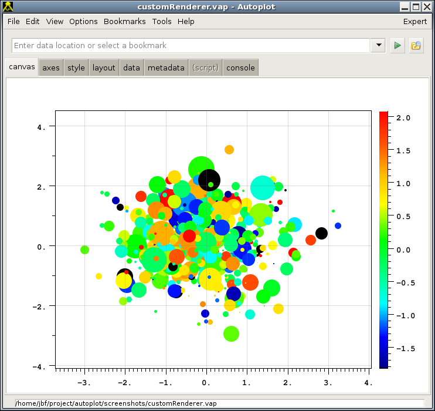

This is where jython code is used to define a renderer that shows flow:
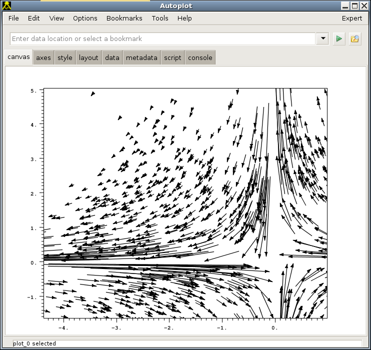

# Extra labels for axes

Note that X axes can have additional ticks added to them, by
right-clicking and providing a dataset URI. (One dataset URI presently,
multiple must be done by bundling in Jython script.)

