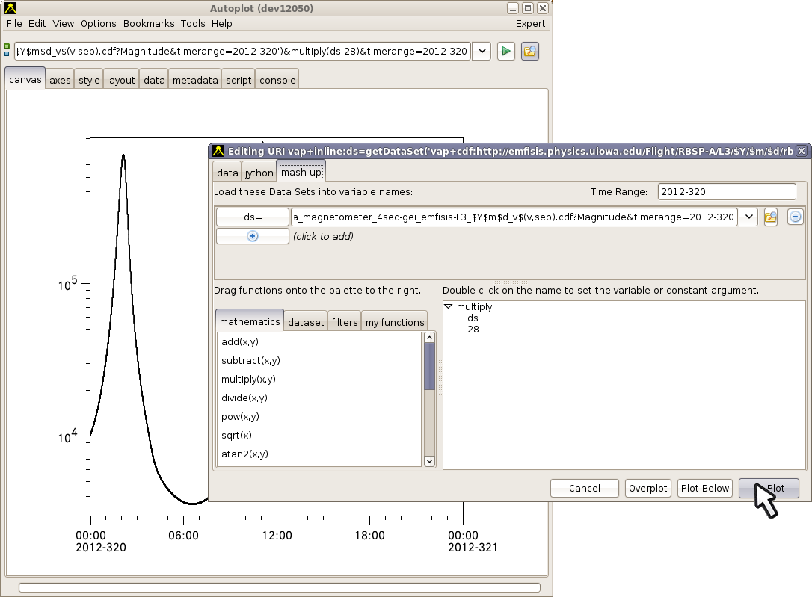

Purpose: describe the mash-up tool.

Audience: scientists and interested developers

# Using the Data Mashup Tool

In 2016 the Data Mashup Tool was introduced to Autoplot. The idea is to
provide a graphical way to combine multiple datasets into new datasets
without the need for a script.

Take for example the goal of calculating the electron gyrofrequency from
the B-Field magnitude. In the past, a script was needed to load the
B-Field magnitude and then multiply by 28. This trivial script worked
fine, but often scripts would be lost or deleted, and a new failure mode
was added to the .vap file. With the Mashup tool, you would graphically
construct the dataset (figure right):

Mashup is implemented as a vap+inline script, which is a tiny and
limited script that fits into a URI. The script loads data from multiple
URIs into given variable names, synchronizes data to one set of
timetags, and then combines the data into a result.

## Using for the first time

1.  plot
    <http://emfisis.physics.uiowa.edu/Flight/RBSP-A/L3/$Y/$m/$d/rbsp-a_magnetometer_4sec-gei_emfisis-L3_$Y$m$d_v$(v,sep>).cdf?Magnitude\&timerange=2012-320
2.  Tools-\>"Mash Data..."
3.  The existing URI should be available at the top of the GUI. Note
    that the droplist can select other datasets.
4.  Select the mathematics tab, and drag "multiply(x,y)" onto the
    palette to the right. (On a Mac, select "multiply(x,y)" and then
    right-click (context click) on the palette.)
5.  Dropping a function onto a function in the palette will replace the
    function, and put the function into the "my functions" tab.
6.  double click on the "x" argument, and select ds1 (or whatever name
    has been given to it).
7.  double click on the "y" argument, and enter the literal "28"
8.  Hit the "plot" button.

Here is a step-by-step tutorial with pictures:
<http://autoplot.org/data/tutorials/20180123_mashup/mashIntro.pdf>  
and a video: <https://www.youtube.com/watch?v=RkcYoZ8qpPw>

# Time Series Browse

Time Series Browse is the ability of a data source to create new URIs
for new time ranges, and allows the scientist to browse through a long
data day by day. For example, Autoplot knows that
/tmp/$Y$m$d.dat?timerange=2020-02-03 is followed by
/tmp/$Y$m$d.dat?timerange=2020-02-04 because Aggregation has Time Series
Browse.

When one of the loaded data sets has the time series browse capability,
then the mashup will also have the time series browse capability.

