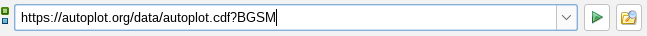

# <span id="intro"></span> Introduction

Autoplot is an interactive browser for data on the web. In the same way
that you browse content stored in HTML, JPEG, and PNG files on the web,
Autoplot allows you to interactively browse data stored in CDF, netCDF,
ASCII, and many more data file formats. You can also interact with
several types of data servers, including HAPI servers, Das2Servers, and
CDAWeb.

Autoplot tries to create a sensible plot given a URL or a name of a data
file on your computer so you can quickly get your data from one or more
data files to a presentation- or publication-ready graphic within
minutes. Plots are zoomable and annotations are easily adjusted.

Feel free to ask questions on the discussion group
[mailto:autoplot@groups.google.com](mailto:autoplot@groups.google.com)
if you need assistance, or browse the archive there at
<https://groups.google.com/forum/#!forum/autoplot>.

This document is intended to introduce scientists to the software and go
over its features. Autoplot is intended to be easy to use for new
scientists, but quite capable and suitable for those who wish to use it
for most of their science products. This document tries to be
comprehensive, but one needn't understand later sections to use the
software productively.

# Installation

Autoplot can be found at <https://autoplot.org/latest/>.  On the release
page, you'll find links to .exe installers for Windows, .dmg for Macs, and
.rpm and .deb installers for Linux.  The "latest" (or "production") releases
are made monthly after much automated and manual testing.

On the Autoplot website you'll also find a "Devel Version" which is the last 
weekly release, which may contain bugfixes for particular people or experimental
features which are not yet mature.  

More on installation can be found [here](Installation.md).

# Getting Started

Once Autoplot is running, you can enter the name of a CDF file in the
address bar or try out the demonstration bookmarks. The name in the
address bar is called an "Autoplot URI" and all data in Autoplot is
identified using URIs. This is typically the name of a data file and
additional controls needed to read in the data. For example,
<https://autoplot.org/data/autoplot.cdf?BGSM> refers to the CDF file on a
website, and the BGSM parameter which will be found inside. Autoplot
will download the CDF file to its cache, load the parameter from the
file, and plot the data.

## Bookmarks

Like a web browser, Autoplot has a list of bookmarks that helps to
locate data files and servers. Autoplot is installed with a list of
"Demo Bookmarks" which provide a few initial places where data is found
so you can see that things are working and play with Autoplot right
away. For example, from the menu bar select
&quot;\[Menubar\]&rarr;Bookmarks&rarr;Demos&rarr;Demo 1&quot;, and Autoplot will plot data
from CDAWeb at NASA/Goddard.

Some other bookmarks:

  - Demo 2: Spectrograms from the POLAR/Hydra instrument.
  - Demo 5: Data from a CDF file
  - Demo 6: Use SPASE record for metadata, file reference within for
    data.
  - Demo 9: Read data from ASCII file.
  - Demo 16: browse data from NASA/CDAWeb HAPI server

## Navigation

Autoplot uses the Das2 graphics library for displaying graphics. These
are Java codes for rendering line plots, spectrograms, and other
displays on "live" axes. You can draw a box around data to zoom in, use
the middle mouse button to pan the data, and the mouse wheel to zoom in
or out. Similarly, a spectrogram's color bar can be adjusted using mouse
actions while hovering over it.

Undo and redo actions are attached to the ctrl-Z and ctrl-Y keys
(command &#8984;-Z and &#8984;-Y for Macs).

The video below on You Tube shows Autoplot (and Das2) mouse interactivity:
[](http://www.youtube.com/watch?v=PcB3feFYb_4 "YouTube video player")


## Address Bar and URIs


  
In the address bar at the top of the GUI you can enter the name of a
supported [file format](#formats-read "wikilink") in a data address. If
the data address is a URL, HTTP or FTP is used to download the file to a
local directory within the folder "autoplot\_data" of your home directory. A fully-qualified
address will contain both the location of the file and additional
arguments to read in the data. For example, it may contain a CDF
filename followed by `?BGSM` to indicate the variable to plot. Together
these form a "URI", which is the precise address of the data. Autoplot
will help build URIs by providing graphical editors to select data.
Autoplot URIs are designed to give a concise way to refer to data: put a
data file in a web location, and send the URI to a colleague so they can
look at it too.

The green "Play" button () will tell Autoplot to load this URI. Autoplot
will decide if the URI is partial, needing more information before it
can be plotted, and if it is, an editor panel GUI will be shown, so that
the URI can be completed. For example, when a CDF file name is entered,
Autoplot rejects the URI because the parameter to plot is needed (for
example, ...cdf?BSM). Use the GUI to complete the data selection and hit
its play button to try again. To see this, compare what happens when you
enter `https://autoplot.org/data/autoplot.cdf` in the address bar versus
`https://autoplot.org/data/autoplot.cdf?BGSM`.

The folder/magnifier button (), called the "Inspect" button, will return to
the editor GUI.

Note that if you enter TAB when the address bar is selected, possible
completions will appear if they exist. This provides a quick way to
finish URIs as well.

The tiny green and blue buttons to the left of the address bar () select
which of two controls is shown. The blue button shows the current time
range, which is useful when navigating long time series of data. The
green button will swap back to the address bar.  Control-T will switch to
the time range, and Control-D will switch to the data URI.

Autoplot has a basic and expert modes. In basic mode, the address bar is not visible and is replaced with a controller for the time range.  The expert mode is used to both compose layouts and browse data, while the
basic mode is only used for browsing data.

Sometimes Autoplot URIs do not refer to files. They still locate data,
but one of Autoplot's plug-ins interprets the address. For example,
`vap+cdaweb:ds=CRRES_H0_MEA&id=FLUX&timerange=1991-10-09` points to data
from the CRRES satellite provided via CDAWeb at NASA/Goddard and
`vap+audiosystem:spec=512&len=2.5` samples from the local machine's
sound system for 2.5 seconds.

## Example URIs: Data Files

When a data file name is entered into Autoplot, it will download the
file to make it local, and the file is opened using special readers for
the file type. CDF files and ASCII files are introduced now.

### CDF Files

A CDF URI is a web address (URL) of a CDF file, which can be a local
file (file:/tmp/myfile.cdf), and the name of a parameter to load. For
example, enter the URI into Autoplot:

<https://autoplot.org/data/autoplot.cdf?BGSM>

Entering this URI will open up the file using the CDF data source,
reading the parameter identified by "BGSM." This data is loaded into
Autoplot's internal data representation model, QDataSet, and then
displayed.

Pressing the inspect button (hourglass/folder) will enter a GUI, called
a Data Source Editor, where graphical selection of parameter is made.
One can also make other selections, such as ignoring CDF ISTP metadata,
keyword constraints to help identify parameters, and subsetting the data
using another parameter.

Note the URI given above is more formally stated as:

`vap+cdf:https://autoplot.org/data/autoplot.cdf?BGSM`

and when the vap+cdf prefix (scheme) is missing, the file extension is
used to infer the data source to use.

### ASCII Files

Tables of data in ASCII files have worked fine for many data products
for decades. Autoplot's ASCII table reader tries to utilize many forms
of these, splitting the ASCII file into records by line and then each
line is split on commas or tabs. This is a simplification of this and
many controls are provided and described below. But to get started, the
URI:

<https://cdaweb.gsfc.nasa.gov/pub/data/omni/low_res_omni/omni2_1972.dat?column=field17&timeFormat=$Y+$j+$H&time=field0&validMax=999>

breaks the lines of the file into fields using spaces. The keyword
parameters 'timeFormat' and 'time' group the three fields starting at
field0 (the first field) into a time tag treating the first column as
the year, second as the day of year, and third as hour of day. The
keyword validMax means any value over 999 should be considered invalid,
and a data break should be displayed.

## Example URIs: Data Servers

Some URIs refer to data coming from data servers rather than data files.

### CDAWeb

The CDAWeb at NASA/Goddard contains roughly 1400 data products from
around 40 different missions. Each data product corresponds to CDF files
spanning a mission, containing many plottable parameters. Instrument
teams produce CDF files and provide them to the CDAWeb which makes the
data available. An example URI is:

```
vap+cdaweb:ds=OMNI2_H0_MRG1HR&id=DST1800&timerange=Oct+2016
```
which means from the data identified as "OMNI2\_H0\_MRG1HR" plot the
parameter "DST1800", loading data to cover the time range "Oct 2016."

### HAPI Servers

HAPI is an open interface groups can implement to provide access to
their data. What makes HAPI unique is that any group can set up this
API, which has been developed by a committee of heliophysics data
providers. HAPI URIs look like:

`vap+hapi:https://cdaweb.gsfc.nasa.gov/hapi?id=AC_K0_SWE&parameters=Np,Vp&timerange=2023-11-11`

which says with the HAPI server located at
<https://cdaweb.gsfc.nasa.gov/hapi>, from the dataset AC\_K0\_SWE, load
the parameters Np and Vp. Any group can set up a HAPI server using the
documentation at
<https://github.com/hapi-server/data-specification/blob/master/hapi-3.3.0/HAPI-data-access-spec-3.3.0.md>

### Das2Servers

Das2Servers, created at the University of Iowa and used at several institutions,
can be accessed by entering the address of the server.  Note Das2Servers
support fast browsing by loading reduced data to show overviews, and then
finer data is loaded when zooming in.

## Interaction

Basic user interactions include: **Left-click and drag** to zoom,
**Middle-click and drag** to pan, **Click on axis and drag** to
constrain interaction to one axis, **CTRL-Z / CTRL-Y** to undo/redo
changes, **Shift-Click** on plot to move plot box.

On a Mac, replace CTRL with CMD.

When pointer is over an axis

  - Drag axis: Middle Mouse Button Down and Drag
  - Zoom in/out: Mouse Wheel Rotate Up/Down
  - Pan: CTRL + Mouse Wheel Rotate Up/Down (Pans the axis. This allows
    for rapid scanning of the data.)

Other

  - Zoom: Left click + draw box
  - Pan: Middle click + drag
  - Reset Zoom: CTRL-R (on last plot clicked)
  - Reset Y zoom: CTRL-Shift-Y (on last plot clicked)
  - Reset X zoom: CTRL-Shift-X (on last plot clicked)
  - Move plot: Shift-Left click
  - Undo: CTRL-Z
  - Redo: CTRL-Y

More complex interaction with plots, including: mouse wheel control,
keyboard entry of axis range, context overview plots

Click here to see a video showing more actions:<br>
[](http://www.youtube.com/watch?v=Zo-QuK-KvUM "YouTube video player")


Here are more videos, described below:
<https://youtube.com/@AutoplotDevelopers>

## Keyboard Shortcuts

  - Increase font size: CTRL-plus or CTRL-=
  - Decrease font size: CTRL-minus
  - Reset font size: CTRL-0
  - Show URI completions: TAB in address bar
      - Example: <https://autoplot.org/data/> + TAB will show a list of
        files in that directory
      - Example: <https://autoplot.org/data> + TAB will only show a list
        of files that you have accessed previously that match the string
      - Example: <https://autoplot.org/data/autoplot.cdf?> + TAB will show the data found inside the CDF file.       

## Key Menu Items

  

### File &rarr; URI History

Autoplot keeps track of everything you have plotted in the file
HOME/autoplot\_data/bookmarks/history.txt. The URI history dialog is a
tool that tries to sort out the history and provides a search tool for
locating lost datasets. For example, if you know that you were plotting
a txt file, set the filter to "vap+txt" to see all the matching URIs.

### File &rarr; Export Data

Data can be exported to a number of data types. (In addition to reading
in data, some data sources will export data as well.) Only the current
selection is exported, so select the item to export, then File&rarr;Export
will bring up the dialog. From here, you can select the format (e.g. txt
for text file) and whether the original data, the processed data
(sliced, fftPower,etc), or just the visible data should be exported.

Note that while only the currently selected plot element's data is
exported, File&rarr;"Export all data..." will interpolate all the data on the plot 
to common timetags and write all data into a file.

### Options &rarr; Auto &rarr; Autoranging

Sometimes you want to look at different data on the same axis. This
provides a method that turns off Autoplot's autoranging. Note too that
the data tab will show the current focus' data URI. This URI can be
changed, loading new data without resetting the ranges (or
post-processing operations).

### Bookmarks

Bookmarks can be selected in two ways

1.  By selecting the `Bookmarks` menu item and then browsing a tree of
    bookmarks.
2.  By selecting `Bookmarks`&rarr;`Browse and Manage` and clicking on a
    bookmark.

Note that the second option allows you to view metadata associated with
a bookmark (if available) by clicking on the `Detailed Description`
button. In addition, the second option allows you to place a plot for a
given bookmark in a separate panel or on top of the current panel in
view.

### Tools &rarr; PNGWalk

The PNGWalk tool is an application for looking at series of images found
on websites. You can also run a pngwalk from the current product by
giving a timerange and a template for each filename (e.g. `$Y$m$d.png`).

For example:

1.  Enter `https://autoplot.org/data/versioning/data_$Y_$m_$d_v$v.qds` in
    the address bar
2.  This should bring up a GUI, because it doesn't have a timerange.
    Enter `2010-03-01`
3.  Select `Tools`&rarr;`Create PNG Walk`
    1.  Setting time format to `$Y$m$d_$H` will make hourly plots
    2.  Setting time range to `2010-03-01/2010-03-04`
4.  Note each png's span is based on the filename template you gave it.
    This should run the 72 images.

This works with any configuration where each plot knows how to get data
for any interval, such as with aggregation or the CDAWeb plugin.

See also [PNGWalks](PNGWalks.md "wikilink")

### Tools &rarr; Reload All Data

This will reload all of the displayed data.

### Tools &rarr; Manage and Browse

When a script is run, there's a checkbox which will add the script to
the Tools menu.  The "Manage and Browse" dialog allows these to be
reordered and organized into sub-menus.

### Tools &rarr; Additional Operations

Sometimes additional operations need to be applied to the data before
displaying. For example, suppose the data loaded is Flux which is a
three-index table of Time, Energy, and Pitch Angle. (This is often
referred to as "Rank 3" data and might be written like
Flux\[Time,Energy,PitchAngle\].) Autoplot can only display spectrograms
of data, so the data will be "sliced" before display. Autoplot does this
automatically, slicing in the middle of one of the dimensions, but you
can explicitly set the operations with this menu item. For example, you
can slice on a different dimension (energy instead of pitch angle), or
you can pick a different operation, such as averaging all the elements
of a dimension together. The are other operations, such as smooth and
detrend that are available as well.

### Tools &rarr; Cache

The Cache menu is a set of tools for managing the cache of data loaded.
When you point Autoplot to a URL like
<https://autoplot.org/data/autoplot.cdf>, Autoplot downloads the file and
stores it in a cache. (This is because most libraries need direct access
to data files, so a local copy is necessarily made.) By default this is
under the "autoplot\_data" folder in the scientist's home folder, in
fscache. This cache will grow and grow, and the "Manage Cache" tool must
be used to manually remove unneeded files.

"Reset Memory Caches" will clear fast RAM-memory caches of loaded data.
Autoplot should check data refreshness every ten seconds, but sometimes
things fail and an explicit refresh is needed.

"Manage Filesystems" is a tool for managing Autoplot's access to
filesystems. For example, if a server is unavailable when a file is
referenced, Autoplot will use a cached copy. (This is to provide offline
access to data.) The filesystem containing the file will be in an
off-line mode, meaning it can access files that have been loaded
already. If the server is back up and available again, this tool can be
used to reset the filesystem to a normal on-line mode.

The environment variable AUTOPLOT\_FSCACHE can be used to set the cache
location as well.

#### ro\_cache.txt

Note, caches can contain a file "ro\_cache.txt" (read-only cache) which
is a pointer to a local file system that contains the same files as the
remote filesystem. This allows data providers to produce .vaps that
external clients can use, without having to copy the data files into
their caches. Likewise, a collaborator may wish to mirror the site, and
they can then use a ro\_cache.txt pointer. Last, the ro\_cache.txt can
be used with the Git-based filesystem to link to a local copy of the
filesystem, so that modifications can be tested without affecting
others.

### Tools &rarr; Events List

The events list is used to load a list of times which control the
application time range. For example, suppose you are interested only in
data when we pass by the planet (perigee). You set the events list to a
list of perigee times
https://github.com/das-developers/das2meta/blob/main/orbits/junoPJ.dat, and use this
to select the perigee. Then clicking on a time will reset the
application timerange.

### Tools &rarr; Fix Layout

This will correct obvious undesired aspects of the plot, such as
overlapping labels and plots. Autoplot's layout is very flexible, more
so than is initially apparent, and because of this it can get into a bad
state. Further, its code which does the layout automatically would
oscillate between the wants of the ideal plot, and to avoid this the
result is at times not optimal. "Fix layout" allows this to be done
under the scientist's control.

## Tabs

  

### <span id="axisPanel"></span>Axes

Selecting the axis tab with show a panel with basic controls for the two
axes of the plot in focus, the plot title, and the colorbar title (the
colorbar may not be visible but it always exists).


[](http://www.youtube.com/watch?v=KrPnp3WCL60 "YouTube video player")


Ranges for the x-, y-, and colorbar are strings that are parsed using
the current axis units (such as time or dimensionless). For example,

  - For an axes with time units: "2000 through 2010", "Sept 16 2009",
    "2009-009 10:00 to 11:00", and "2009-009T00:00 to 2009-009T10:00"
    "2012-12-14T23:00/2012-12-14T24:00".
  - For physical ranges, use the keyword "to" to delimit two real
    numbers. When the axis has a physical unit, such as "m/s" the range
    can be qualified with a unit, as in "0 to 100 cm/s."
  - An automatic test showing example ranges is
    [here](https://cottagesystems.com/jenkins/job/autoplot-test026/lastSuccessfulBuild/artifact/Test026.java).

All labels support "Granny Strings," which has special codes, similar to
those used in IDL, proposed by Grandel in Nystorm. For example, \!c
inserts a new line. See
[help\#Granny\_Strings](help.md#granny-strings "wikilink") for more
information. Also html escapes like \&amp;Delta; will show like &Delta;.

When selected, **Isotropic** constrains the x- and y-axis to have the
same data-to-pixel scaling. This option is ignored when the axes do not
have compatible units.

When **Legend Label** is checked, a legend is added to the plot, and an
icon for this panel is added. Note the plot also has a legendLabel
property that when set to False (\[menubar\]&rarr;Edit&rarr;Properties) will
suppress the label.

### <span id="metadataPanel"></span>Metadata

The metadata tab provides information about the data. It is a tree view
that contains a number of nodes of information.

The metadata node in the list is metadata provided by the data source.
In general, Autoplot doesn't understand the metadata and simply provides
it for reference by the scientist. However, if the data source also
identifies a "metadata model," this is indicated in parenthesis and
Autoplot will use the metadata to get axis labels and ranges.

The statistics node provides basic statistics about the data. For
example, it shows the mean and standard deviation, and the number of
valid points. Cadence indicates the typical spacing between points and
is used to insert breaks in time series.

The dataset node allows some inspection of the dataset itself. The size
of the dataset, its named dimensions, and their size are identified.
Metadata for plotting found within the dataset is available as well. You
can look at the digital data (though only the first twenty or so points)
as well.

Autoplot's data representation model, QDataSet, supports invalid data
place holders, called "fill data." When plotting data, this data is
skipped and the line connecting points is broken. Fill is represented in
the data with a special number, for example -1e31. Autoplot has several
ways of marking fill data. The metadata property FILL\_VALUE is the
value which marks the invalid number, -1e31, -999, etc. Note NaN is
always considered fill. The data may also have VALID\_MIN and
VALID\_MAX, which indicate the range over which the data is valid, and
values outside of this range are fill. Finally, sometimes a "weights
plane" could be used to mark fill values. This is a QDataSet with zeros
where the values are invalid. When the property WEIGHTS is equal to a
QDataSet, FILL\_VALUE, VALID\_MIN, VALID\_MAX can be ignored. If none of
these values are found, then only NaN indicates fill.

Metadata can be inserted on the plot using macros. For example, from the
bookmarks plot demo 1
(vap+cdaweb:ds=OMNI2\_H0\_MRG1HR\&id=DST1800\&timerange=2016-oct) and
replace the title with %{METADATA.GlobalAttributes.TITLE}, and when the
axis is drawn, the metadata node GlobalAttributes.TITLE replaces the
macro. If the dataset contains a USER\_PROPERTIES node,
%{USER\_PROPERTIES.prop.name} can be used to show prop.name from that
tree.

### <span id="stylePanel"></span>Style

The style tab contains controls for the style of the plotted element.

Autoplot tries to pick reasonable default settings such as data
rendering method (series versus spectrogram), but also default symbol
sizes and connectors. To further specify how a plot should appear, click
on the plot element to modify its color or symbol, for example, or for
spectrograms the colorbar (e.g. grayscale vs colors).

Note that you can set the rendering method and default settings via the
plot context menu (right-click), under Plot Style.

Autoplot will swap out controls based on the rendering method.

### <span id="scriptPanel"></span>Script

The script tab is a workspace for creating Jython scripts. Jython is the
Java version of Python, and it provides a rich environment for
developing software which combine and analyze data, and also control
workflows like running process on each file of a collection of files. More 
on its use is found at
[scripting](scripting.md "wikilink"). The script tab creates an environment
optimized for creating software quickly, like an IDE for other
languages. For example, the "Run" button runs the script, and errors
are highlited with a squiggle, and pressing tab shows command completions.

Right-clicking on the editor brings up a popup-menu of useful
functions when coding, for example "Insert Code"&rarr;getDataSet will insert
a getDataSet command loading the current data Autoplot is focused on.
&quot;Actions&quot;&rarr;&quot;Inspect URI&quot; will bring up the data source editor for the
URI.

The Context Selector controls how the script will be used. There are two
types of Autoplot scripts, "Application Context" and "Data Source
Context." Application Context scripts control the Autoplot application
itself, with access to the dom (the current state of Autoplot) and can
tell Autoplot to save the canvas to a .png file. 

The Data Source Context
is a more limited scripting environment, only able to load data.  Scripts 
are unaware of the application itself or the plotting that is done with 
the data it produces. A Data
Source Context script is saved with a .jyds extention, and is loaded
into the canvas as if it were a data file.  Autoplot URIs referencing 
these files (Autoplot URIs) can be saved in .vap files.

The script panel is intended to be useful for other ascii-file tasks,
such as counting the number of characters in columns of an ascii file.
Note that when selecting text the number of characters and lines are
indicated.

Another use case for scripting is to add new functionality to the GUI. Scripts that run in the application context can be added to the Tools bookmarks, and will appear in the Tools menu. For example, run the script https://github.com/autoplot/scripts/blob/master/flashFocus.jy. This will show the script in a dialog before running it. (The scripts can do malicious things like delete files, so you must review the script!) Note in the review dialog, that there's a checkbox to add to the tools menu. The new menu item "Flash Focus" should appear. The script will cause the focus plotElement to flash three times.

### <span id="consolePanel"></span>Console

The console tab is where output from scripts and logging messages from
Autoplot are printed, and an interactive command prompt is found. For
example, at the "AP\>" prompt, enter "print 'hello'" and the text
"hello" is printed on the console. This allows data to be used
interactively, and gives a place where commands can be tested.

Autoplot uses "Loggers" throughout the system, which allow various parts
of the system to report on named channels. The print command prints on
the channel "console.stdout," while downloading a file writes to the
channel "das2.filesystem.http". Most channels will only be of interest
to developers, but you can see these channels by clicking on the
"Console Settings" button.

The "Console Settings" button controls how the console operates. Each of
the logging channels has a verbosity level, and messages that should not
be seen under normal conditions are issued at a quieter level than
"INFO" such as "FINE." Error messages are issued at more verbose levels
(such as WARNING) and will be printed on the console. Additional
information can be printed with each line, such as the logger name, and
log level. "timing" will show the elapsed seconds since each message was
printed. "threads" shows an identifier for concurrent thread of the
message, and GUI when the message was issued from the event thread.

Jython scripts can use the logging system. (This is fixed in the next
dev release, 20161020.)

```
from org.das2.util import LoggerManager
logger= LoggerManager.getLogger('analysis')
logger.info('opening file data.dat')
logger.fine('file data.dat is 140 bytes long')
logger.warning('warning!')
print 'print message'
```
The AP prompt contains an Jython session which can be used for quick
calculations and to test statements. The keyboard up arrow can be used
to get to previously-entered commands. The keyboard tab key will show
completions. Try "print datum('15hr') / datum( '5s')"

The console text can be saved to a file as well. Typically this will be
a text file containing the text in the console, though note there is a
limit to the size of the console, and some messages may no longer be
available. If the provided filename ends with .xml, then all logging
information is saved, providing complete feedback information to others.

### Data

The Data Panel (enable with `Options`&rarr;`Enable Feature`&rarr;`Data Panel`)
contains controls for processing the dataset after it is loaded.

For example, the fill value can be set manually when the dataset has
failed to identify it.

The **Data Source** subpanel controls the data source node that has
focus. A second URI controller is provided for reference, and can be
used to control the data loaded as well. Additional operations can be
applied to the data immediately after loading, such as indicating fill
values, or when for plotting slices against one another.

<span id="dataPanel_2"></span> **Data Post Processing** specifies the
operations that should applied before displaying the data. Originally
introduced to allow for slicing of high-dimension (high "rank") data
sets like Flux\[Time,Energy,Angle\], this also has a number of filters
that are described below.

When the Operations field is "|slice\<dim\>(\<index\>)" the data is
sliced to provide a view (like a cross-section) of the data. Note the
mouse wheel will allow the index of the slice to be adjusted
interactively.

When a vector component is plotted, Operations simply identifies the
component to plot, and this is implicitly the "|unbundle(c)" operation.

The magnifying glass with three vertical bars icon () enters a GUI
that allows these to be adjusted. This allows several adjustments to be
made at once, such as slicing the data then running the result through a
histogram.

**Additional Operators** When the operations field starts with the pipe
(|) character, it is a list of filters that are to be applied to the
data. These filters include (for example):

`|slice1(index)` slice the data on the first dimension at the given
index.

`|fftPower(size)` plot power spectrum by breaking waveform data in
windows of length <em>size</em>.

`|smooth(size)` boxcar average over the rank 1 data.


These filters can be chained together like so: `|slice1(10)|histogram`.
The GUI in Autoplot v2015a contains a GUI for working with this string.
In the DOM, this is the same as the "component" property of a
plotElement.

More about [filters](filters.md "wikilink") can be found here.

### Script

The script panel (enable with Options&rarr;Enable Feature&rarr;Script Panel)
provides a convenient place for writing and reviewing the Jython scripts
to control the application and load data. It provides a simple
completion and right-click to see additional options. This is intended
to provide full access to advanced users.

Note a .jyds file executed in the "data source context" and loads data
from a number of places and performs operations to create a new dataset.
.jy files are executed in the "application context" and control labels,
add components, run batches and plot ad-hoc datasets. .jyds scripts are
unaware of the application itself or the plotting that is done with the
data it produces. Further, .jyds scripts must be saved to a file, and
references to these files can be saved in .vap files.

Another use case for scripting is to add new functionality to the GUI.
Scripts that run in the application context can be added to the tools
bookmarks, and will appear in the tools menu when the app is reloaded
(or getViewWindow().reloadTools() is run). For example, run the script:
<https://github.com/autoplot/scripts/blob/master/flashFocus.jy>. This will show the
script in a dialog with an execute button. (The scripts can do malicious
things like delete files, so you must review the script\!) Note in the
review dialog, that there's a checkbox to add to the tools menu. The new
menu item "Flash Focus" should appear. The script will cause the focus
plotElement to flash three times.

Jython scripting is being finalized and documented. More documentation
is coming soon.

# Adding Plots

`Right click`&rarr;`Add Plot` can be used to add additional plots to the
canvas. Axes from multiple plots can be bound together so that adjusting
one triggers a change in others. This video shows how to add a second
plot and bind the y-axes together. Note that Autoplot tries to bind time
axes together automatically, since this is a common mode of operation.

Keyboard shortcuts:

  - Add plot: Right click on canvas and select Add Plot
  - Next plot element: CTRL-TAB
  - Previous plot element: CTRL-Shift-TAB
  - Add a plot below: CTRL + Play Button (green arrow button)
  - Add overplot: Shift + Play Button (green arrow button)


[](http://www.youtube.com/watch?v=UGA8SiDBZX8 "YouTube video player")


## <span id="layoutPanel"></span>Layout

 The Layout Panel (enable with
Options&rarr;Enable Feature&rarr;Layout Tab) provides access to all of the plots
and plot elements on the canvas. This allows you to swap plot position,
delete plot elements, add groups of plots, etc.  

### Plots

The Plots area contains a simplified view of the plots on the page. Each
plot has a context menu that allows the plot to be edited or deleted.
Also a group of plots can be added below, for example a block of 3 by 3
plots.

Multiple plots can be selected by holding the control button (command on
Macs) down while clicking. Two plots can be selected and Plots&rarr;Swap
Position will exchange their positions. Also multiple plots can be
edited at once, for example to set all the titles the same and then make
tweaks for each plot.

### <span id="dataPanel_1"></span>Bindings

This Bindings area contains a list of bindings for the application.
These are properties that are bound together. For example, a stack of
plots with a common x axis all have their x axes' range bound to the DOM
property "app\_0.timerange". If one right-clicks on a binding, it can be
deleted.

### Plot Elements

Plot elements have the job of rendering the data onto a plot. The Plot
Elements section allows them to be individually controlled and deleted.
Note when a vector is plotted (e.g. Bookmarks&rarr;Demo 5), then a plot
element is added for each component, and these are all children of an
inactive parent component. The inactive component can be used to control
all the children at once. For example, adjust the line thickness of the
parent and all the children will be modified.


# <span id="layout"></span>Modifying Layout

 showing entries for layout. Autolayout must be de-activated for changes to apply (Options&rarr;Auto&rarr;Autolayout)&quot;)

Autoplot's **canvas** consists of a number of **plots** which are the
two-dimensional spaces on which data is rendered. **Plot elements**
connect data to the plots, by identifying the data source, plot, and
method for rendering data. A plot can contain a number of plot elements,
as is the case when two datasets are drawn on the same axes, (also
referred to as an **overplot**.) A color bar is connected to all plots
so that multiple spectrograms can be rendered using the same color map.
The color bar is hidden when it is not needed.

The [cookbook](cookbook.md "wikilink") page describes quite a few useful
tricks, such as resizing plots and putting exponents in labels.

Autoplot uses rows and columns to specify the location of components on
the drawing canvas. These objects are controlled with strings that
efficiently specify the location. For example, the horizontal (column)
layout from the left is specified as a percentage plus a shift from the
left `L%+S`, where

  - L is the percentage of canvas to place the left side of the plot box
    (only data, no labels)
  - S is the shift (in px or em)

To have the labels on the y-axis rendered outside of the canvas, use
```
0%+0
```
The layout may be specified in the URI sent to the Autoplot server. In
this case, the left and right positions are comma separated, as in
`L%+S,R%+S`. The default is `0%+8em,100%-6em`. For the bottom and top
positions, the default is `100%-3em,0%+2em`.

Note that rows and columns are children of the marginRow and
marginColumn. Instead of specifying the normal position with respect to
the canvas, these rows and columns position are specified with respect
to the marginRow and marginColumn. The autolayout feature automatically
adjusts the position of the marginRow and marginColumn to make the plot
fit on the page.

  

# Saving Plots

The state of the application, including information about the plot
layout, labels, and data URIs that specify where data is loaded can be
saved in a "VAP" (Virbo AutoPlot) file using "File \> Save As".

A VAP file does not contain the data used to produce the plot, but only
references (URIs) to it.  It's important to note that local file references
will not work on others' computers.  To save data along with a VAP file,
select "Embed Data" when saving. The file created is a zip file
containing the VAP and the data required to display the VAP. See
[developer.vapzip](developer.vapzip.md "wikilink").

When a .vap is entered on the address bar, the whole application is reset to the new vap file settings. However, if File→"Add Plot From..." is used to access a vap, data URIs from within the vap are accessible.  (TODO: what happened to this feature?)

Here is an example .vap file: https://autoplot.org/data/vap/fireworks.vap

## Time Ranges in VAP Files

Timeranges or time values occur in multiple places in a VAP file:

  - URIs (vap+cdaweb:ds=AC\_H2\_SEP\&id=H1\&timerange=2005-02-04)
  - on axes (<datumRange units="us2000" value="2005-02-04"/>),
  - within defaults for each plotElement, and
  - for the overall application (in the "timeRange" property).

The timeRange property, found at the end of the VAP file, is what sets
the time range. This is what allows arguments to VAP files, e.g.,
`/tmp/foo.vap?timerange=2012-03-04`, to override the time ranges and
values specified in the file. Even though the data URIs may refer to
other times, their ability to browse to other times (their "Time Series
Browse" capability) is used to load data for the correct time.

# Exporting Data

Data can be exported using \[menubar\]&rarr;File&rarr;Export Data. This will take
the data that has the focus set by the last mouse click and export
either the data as it was originally loaded in or as it is displayed.
For example, if Flux\[Time,Energy,Angle\] is loaded, a slice is
displayed. The scientist can either export the original 4-D data, or
export a slice of just Flux\[Time,Energy\].

Autoplot's plug-in data sources can also provide methods for formatting
data, and the list of available methods for writing data are displayed.
Autoplot checks to see if the data will "fit" into the format, and
disable the option when it will not. For example, Density\[Time\] could
not be exported as a .png image, but Image\[Rows,Columns,3\] could.

Plug-in data sources may also provide a GUI which controls how the
formatting is done.

There is a second option where Autoplot is able to format many datasets
at once, in the "export all" dialog. This will show all the loaded URIs,
and will then load them all into one "bundle" dataset for export.

## Use within scripts

When scripting, the command "formatDataSet" is used. The command takes
two arguments, a dataset and a URI. The URI is similar to the URI which
would read the data, where its arguments are used to control how the
data is exported. (A URI string is used because a future version of
Autoplot will allow data to be exported to databases and websites, but
this has not yet been explored.) URI parameters for scripting are
described below. The following script shows how data is loaded from a
CDF file and formatted to an ASCII file.

```
ds= getDataSet( 'https://autoplot.org/data/ac_h2_mfi_20060101_v05.cdf?Magnitude' )
formatDataSet( ds, '/tmp/mag.txt' )
```
## Formats Supported

The parameters shown can be used in scripts, and the default value is
sometimes shown, to provide an example value.

### .idlsav

The scientist can export data to IDLSAV files. Rank 1 and rank 2 data
are now supported.

  - tunits=t1970. The time units for the data. t1970, the default, means
    the number of non-leap seconds since 1970-01-01T00:00Z. "seconds
    since 2019-01-02T00:00Z" (or whenever) is often used as well, so
    that the times are just seconds since midnight.

Note that rank 2 and higher data is transposed between this and the
org.autoplot.idlsupport.APDataSet ("IDL/Matlab Bridge") result. This is
because org.autoplot.idlsupport.APDataSet is used to provide access to
data in Matlab and Python as well, while exporting to IDLSAV is
optimized for IDL access.

### .mat

Matlab files can be used to export rank 1 and rank 2 data.

  - tunits=t1970. The time units for the data. t1970, the default, means
    the number of non-leap seconds since 1970-01-01T00:00Z. "seconds
    since 2019-01-02T00:00Z" (or whenever) is often used as well, so
    that the times are just seconds since midnight.

### .das2stream

Format streams for caching data or to explore responses for the
das2server.

  - version
  - fracsec
  - precision
  - type="ascii". Use ascii or binary for data transfer.

### .dat .txt (ascii tables)

  - tformat="ISO8601"
  - header="none". add a header to the data, for example "rich" header
    describes all sorts of metadata.
  - format
  - depend0Units units for times, such as t1970 or "seconds since
    2019-01-02T00:00Z"
  - doDep

### .nc (NetCDF)

  - type=double. the data type to use.
  - arg\_0 name for the variable.
  - doDep
  - metadata
  - append=F. add to the existing file.

### .cdf

The append option allows a cdf file to be built up. Alternatively, if it
is more convenient to have all the data in memory at once, then a bundle
of data can be exported.

  - type=double. the data type to use, for example float.
  - append=F. add to the existing file.
  - bundle=F. format each of the bundled datasets.
  - timeType=tt2000. or epoch
  - compressed=F. compress the data within the CDF.
  - arg\_0 is the parameter name.

### .wav

wav sound files.

  - scale=T. scale the data so that the full dynamic range is used.
  - byteOrder big or little.
  - type the data type, like short.
  - timeScale=1.0. rescale the times. timeScale=2 means "speed up the
    sound"
  - timetags=F. if T, then create a second ASCII file which shows the UT
    time vs index.

### .hapi

This formats responses supporting HAPI servers. HAPI server developers
may want to use this to see what properly formatted responses should
look like, and this is used with the AutoplotServlet and
AutoplotDataServer to provide responses.

This plug-in is somewhat odd, because the file given converted to a
folder name by changing the ".hapi" extension to "/hapi", and then
formatting each part of the response.

# Forming URIs

## Aggregation

Data coming from files can typically be combined, or aggregated. For
example, a single CDF file can be read (using the CDF plug-in) with the
URI:

`vap+cdf:ftp://cdaweb.gsfc.nasa.gov/pub/istp/ace/swe/2008/ac_k0_swe_20080620_v01.cdf?Np`

If this is one of a series of files, the variable `Np` can be plotted
across several files using the notation:

`vap+cdf:ftp://cdaweb.gsfc.nasa.gov/pub/istp/ace/swe/$Y/ac_k0_swe_$Y$m$d_v$v.cdf?Np&timerange=2008-June`

Most of the letters used for the wildcards for time are the same as the
Unix `date` command, for example `$Y` means a four-letter year while
`$y` means a two-letter year.

Any file-based reader that returns time for the first dimension can be
aggregated. Note &quot;Tools&rarr;Aggregate...&quot; will attempt to create an
aggregation spec from a file URL.

<span id="aggregator_main"></span>

### Aggregation GUI


Aggregation URIs will have an additional controller in the data source
editor. This allows timeranges to be browsed and selected. The field
"Time Range for Aggregation" controls the span that will be aggregated.
This is a time range parsed like other timeranges in Autoplot: 2010 is a
year, 2010-Jan is a month, 2010-Jan-01 is a day, 2010-Jan-01 07:00 to
08:00, and so on. Below are three droplists that allow an interval to be
selected. The GUI will query the server to see which intervals are
available. First select from the available years, then from available
months within that year, and then a day. "Copy" will then copy the value
into the time range text field. The reduce checkbox enables the
experimental data reduction feature where data is reduced to axis
resolution as it is read in.

### Wildcard codes

Aggregation URIs will contain from the following wildcard codes:

  - `$Y` four-digit year
  - `$y` two-digit year
  - `$j` three-digit day of year
  - `$m` two-digit month
  - `$b` three-letter month (English locale only)
  - `$d` two-digit day of month
  - `$H` two-digit hour
  - `$M` two-digit minute
  - `$S` two-digit second
  - `$(milli)` three digit milliseconds since second boundary. (Please use
    subsec instead of this)
  - `$(micro)` three digit microseconds since millisecond boundary.
    (please use subsec instead of this)
  - `$(subsec;places=3)` three digits are milliseconds. `$(subsec;places=6)`
    means the 6 digits are microseconds.  
  - `$v` version number, decimal sort. `$(v;alpha)` is for alpha sort, and
     `$(v;sep)` for "x.y.z" Note sometimes the filename will contain a V
    before this, and this should be just the number like so: V$v
  - `$o` orbit number, arguments like `$(o;id=crres)` make this useful. see
    <https://autoplot.org/developer.orbitTimeSpec#Orbits_in_Time_Ranges>
  - `$x` ignore, match anything but don't interpret the field.
    
A version wildcard is allowed. Versioned URIs have the form:

`vap+cdf:https://cdaweb.gsfc.nasa.gov/data/ace/swepam/level_2_cdaweb/swe_k0/$Y/ac_k0_swe_$Y$m$d_v$v.cdf?Np&timerange=2022-July`

Also, parenthesis can be used to modify fields. For example:

  - `$Y$m$d-$(H;span=12)` indicates the hour is the beginning of a 12 hour
    interval indicated by the name.
  - `$Y$m$d\_$H$(M;span=10)` indicates the files are in ten-minute blocks.
  - `$(m;Y=2011)$d` indicates the year field is implicit. TODO: bugs
    prevent this from working, since we look for $Y to detect
    aggregations...
  - `$Y$m$d\_$H$M$S.$(milli;span=250)`

See also
<https://github.com/uri-templates-time/uri-templates-time-code/wiki/Specification>, which
includes a more complete description.


[](http://www.youtube.com/watch?v=QI2ggl_iv64 "YouTube video player")


## Time Parsing / Formatting

One code for parsing and formatting times into strings is used
throughout Autoplot to:

  - parse times within a file
  - parse times in a filename (and URI)
  - generated times in scripts

Note this is different than the code that parses ranges to control axes.
That one must guess the format, then parse. This one is given a time
format, and then and parse strings to get timeranges or vice-versa.

Example times:

  - \$Y-\$m-\$d 2010-06-23
  - file:///tmp/\$Y\$m\$d.dat file:///tmp/20100623.dat

Field types (see [\#Wildcard\_codes](#wildcard-codes "wikilink") for
full list and definitions):

  - $Y $m $d $H $M $S $(milli) $(micro)

Field qualifiers:

  - $(H;span=4) digit indicates beginning of 4 hour interval
  - $(m;Y=2004) The year 2004 is implicit

Note %{m;Y=2004} may be used instead.

### Automatic Time Parsing

A number of places in Autoplot allow for implicit time range parsing.
For example, typing "May 2014" on a time axis is interpreted as
2014-05-01 through 2014-05-31. This allows scientists to easily convey intent
to the software without the burden of entering each field. This control
is intended to be more informal, and to provide reasonable
interpretations of how time ranges might be represented.

A number of special keywords are supported as well. For example, "now"
refers to the current time, and this can be used to ISO8601 durations to
create range specifications like "now-PT24H/now" to refer to the
previous 24 hours. Also orbits are identified for a number of
spacecraft, and intervals can be created with "orbit:SCID:ORBITID" where
SCID is the spacecraft and ORBITID identifies one of its orbits. For
example, orbit:rbspa-pp:4 refers to orbit 4 of the RBSP-A spacecraft,
which is the time range 2012-08-31 12:13 to 21:12. The "select time
range" GUI has a tab to create time ranges of this type.  See 
https://github.com/das-developers/das2meta/tree/main/orbits, and let us
know if you have additional spacecraft orbit numbers you would like to add.

Here are a number of entries and their interpretations:

| Implicit String                           | Interpreted Start                       | Interpreted Span                                         |
| ----------------------------------------- | --------------------------------------- | -------------------------------------------------------- |
| 2000-01-01T13:00Z to 2000-01-01T14:00     | 2000-01-01T13:00:00.000Z                | 60.0 min                                                 |
| 2000-01-01 13:00 to 14:00                 | 2000-01-01T13:00:00.000Z                | 60.0 min                                                 |
| 2000-01-02                                | 2000-01-02T00:00:00.000Z                | 24.0 hr                                                  |
| 2000-002                                  | 2000-01-02T00:00:00.000Z                | 24.0 hr                                                  |
| 2000-02                                   | 2000-02-01T00:00:00.000Z                | 29.0 days                                                |
| 2000-feb                                  | 2000-02-01T00:00:00.000Z                | 29.0 days                                                |
| 2000                                      | 2000-01-01T00:00:00.000Z                | 366 days                                                 |
| 2000-01-01 to 2000-01-05                  | 2000-01-01T00:00:00.000Z                | 4.0 days                                                 |
| 2000-01-01 through 2000-01-05             | 2000-01-01T00:00:00.000Z                | 5.0 days                                                 |
| 2001-01-01 span 10 days                   | 2001-01-01T00:00:00.000Z                | 10.0 days                                                |
| 2000-01-01T13:00Z/PT1H                    | 2000-01-01T13:00:00.000Z                | 60.0 min                                                 |
| 20000101T1300Z/PT1H                       | 2000-01-01T13:00:00.000Z                | 60.0 min                                                 |
| 2000-01-01T00:00Z/P1D                     | 2000-01-01T00:00:00.000Z                | 24.0 hr                                                  |
| 2007-03-01T13:00:00Z/P1Y2M10DT2H30M       | 2007-03-01T13:00:00.000Z                | 437.11 days                                              |
| 2007-03-01T13:00:00Z/2008-05-11T15:30:00Z | 2007-03-01T13:00:00.000Z                | 437.11 days                                              |
| P1Y2M10DT2H30M/2008-05-11T15:30:00Z       | 2007-03-01T13:00:00.000Z                | 437.11 days                                              |
| 2007-009/2007-021                         | 2007-01-09T00:00:00.000Z                | 12.0 days                                                |
| 2007-05-15/2007-05-30                     | 2007-05-15T00:00:00.000Z                | 15.0 days                                                |
| 2007-03-01/P5D                            | 2007-03-01T00:00:00.000Z                | 5.0 days                                                 |
| P5D/2007-03-06                            | 2007-03-01T00:00:00.000Z                | 5.0 days                                                 |
| 2000-01-01T13:00/PT1H                     | 2000-01-01T13:00:00.000Z                | 60.0 min                                                 |
| 20000101T13:00Z/14:00Z                    | 2000-01-01T13:00:00.000Z                | 60.0 min                                                 |
| 1000                                      | 1000-01-01T00:00:00.000Z                | 365 days                                                 |
| 9000                                      | 9000-01-01T00:00:00.000Z                | 365 days                                                 |
| 2000-01-01T00:00:00 span .000001 sec      | 2000-01-01T00:00:00.000Z                | 1.0 microseconds                                         |
| 2000-01-01T00:00:00 span .000000001 sec   | 2000-01-01T00:00:00.000Z                | 0.0010 microseconds                                      |
| 2002-01-01T10:10:10 span .000000001 sec   | 2002-01-01T10:10:10.000Z                | 0.0 microseconds                                         |
| Aug 1969 through Sep 1970                 | 1969-08-01T00:00:00.000Z                | 426 days                                                 |
| 2004-12-03T20:19:59.990/PT.02S            | 2004-12-03 20:19:59.990 to 20:20:00.010 | within 30.0 micros (0.0 microseconds -0.25 microseconds) |
| 2004-12-03T20:19:56.2/PT.2S               | 2004-12-03T20:19:56.200Z                | .2 seconds                                               |
| 2014-08-29T13:27:43.253Z                  |                                         |                                                          |
| P1D                                       | (1 day ending at the current time)      | 1 day                                                    |
| PT1H                                      | (1 hour ending at the current time)     | 1 hour                                                   |
| orbit:rbspa-pp:403                        | 2013-01-27T18:58:17.392Z                | 8.9789 hr                                                |
| orbit:rbspa-pp:403-406                    | 2013-01-27T18:58:17.392Z                | 1.4965 days                                              |
| 1972/now-P1D                              | 1972-01-01 00:00 to (24 hours ago)      |                                                          |
| now-P10D/now-P1D                          | (10 days ago) to (1 day ago)            |                                                          |
| lastday-P1D/lastday                       | yesterday (UTC), beginning of the day   | 1 day                                                    |

# Cookbook

The [cookbook](cookbook.md "wikilink") page describes quite a few useful
tricks, such as resizing plots and putting exponents in labels.

# Advanced Topics

## Granny Strings

All labels may include "Granny" strings defined by Grandle and Nystrom
[1](http://www.csb.yale.edu/userguides/graphics/explorer/html/doc/ref/stan/nagtext.htm).
A few of these are

  - \!A superscript
  - \!B subscript
  - \!E superscript with smaller font size
  - \!D subscript with smaller font size
  - \!N normal position
  - \!C carriage return (newline)
  - \!S push current position and size on to stack.
  - \!R pop position and size from stack.

so that `!A2!Ns!A-2!N` results in m<sup>2</sup>s<sup>-2</sup>.

Labels may include Unicode (indicated using its entity number, e.g.,
`&#197;`). In addition, the named html entities listed at
<http://www.fileformat.info/format/w3c/htmlentity.htm> may be used. The
list includes:

  - Greek letters (use without quotes): "\&Alpha;" "\&Beta;" "\&Delta;"
    "\&alpha;" "\&beta;" "\&delta;" "\&pi;" "\&rho;" "\&omega;"
  - Math symbols: &quot;\&amp;sum;&quot; (&sum;) &quot;\&amp;plusmn;&quot; (&plusmn;)

## TimeSeriesBrowse and other Capabilities

Autoplot allows each data source to advertise additional capabilities
beyond data loading. The most commonly used capability is
TimeSeriesBrowse.

### TimeSeriesBrowse

TimeSeriesBrowse is the feature provided by some data sources which
allows data from any interval to be loaded. For example, a day's worth
of data is displayed on the screen, the scientist can click on a button
to advance to the next day, and the data source will then load data for
this interval.

The aggregating data source provides this capability. When
<https://autoplot.org/data/agg/efi/$Y/po_k0_efi_$Y$m$d_v$v.cdf?POTENT&timerange=2000-01-01>
is loaded, the data source tells Autoplot that it can load data for
other intervals as well.

Conventionally, data sources supporting this will use the keyword
"timerange" to control the time. For example the CDAWeb data source also
supports time series browse:

```
vap+cdaweb:ds=PO_K0_EFI&id=POTENT&timerange=2000-01-01
```

When a .jyds script has the argument "timerange", it will also have TimeSeriesBrowse.

### Updating

Data sources can provide other capabilities, such as updating. This
capability will cause Autoplot to periodically check back with the data
source to see if updates can be loaded. For example, file-based URIs
often support filePollUpdating=5, which will check for updates in any of
the files every five seconds.

## Caching

  - FileSystem cache - The data files are kept on your local file
    storage. HTTP HEAD requests are used to check if new versions are
    available, limited to once per 10 seconds.
  - Reference cache - Many data sources use the reference cache to keep
    track of loaded data. As long as someone is using data, and a
    reference to it exists in machine memory, the reference will stay
    valid. If no one is using data, the Java "garbage collector" is free
    to remove it from memory.
  - DataSource cache - Some data sources use a mechanism called caching
    to cache extra data that is loaded.

Note \[menubar\]&rarr;Tools&rarr;&quot;Reload All Data&quot; will reset all in-memory
caches. Files will be reloaded if the remote file is updated (which will
happen anyway).

If the data source is jyds, and inputs and script has not changed,
execution may be faster because output values are cached. To see this in
action, run a script and then hit the play button again. The second
execution will be faster.

Some data sources cache data, where several quantities that were
expensive to calculate were calculated, so instead of throwing them away
we cache them in case someone else needs them. Suppose there is a
JythonDataSource script that loads three quantities and then produces a
derived quantity. Often the quantities used to derive are interesting as
well, and will be plotted alongside the derived quantity.

## Plug-ins

### Data Sources

Plug-in data sources are used to load data into Autoplot using a URI
specification. The URI is used to identify the plug-in and then the
plug-in uses the URI and its parameters to read in the data (into
Autoplot's internal data model, [QDataSet](QDataSet.md "wikilink")). Some
plug-in data sources have graphical (GUI) editors that make it easier to
compose URIs. For these plug-ins, clicking the folder icon next to the
address bar will launch the editor, otherwise the URI completions is
used to provide the scientist with the available parameters.

For example, the ASCII Table reader URIs have the form

```
vap+dat:<file>?<params>
```
and the params identify how to parse the ASCII table with parameter
names like skipLines and delim. The

```
vap+dat:
```
explicitly requests a plug-in (a guess is made if not given). (Details
on how the ASCII table reader is implemented is described at
[ascii\_data\_source](ascii_data_source.md "wikilink").)

Note data from servers that use query parameters (with URLs containing
?) cannot be read directly, since the query parameters are interpreted
by the Autoplot reader plug-in. Either read the data to a local file
(changing the name so that it does not contain a question mark) and read
that, or a Jython script (.jyds) can be used to read the data.

### Discovery

A discovery plug-in helps the scientist develop a valid URI to enter into the
address bar.

Discovery plug-ins are activated by entering their vap prefix (e.g.
vap+cdaweb:) into the address bar and are typically accessed using a GUI
by selecting File&rarr;&quot;Add Plot From ...&quot;.

In some cases, these plug-ins use knowledge of conventions used for the
layout of a data bases to allow the scientist to browse all available data
from a given data provider. In other cases, these plug-ins help the scientist
plot data from one or more data providers, data directories, and/or data
files without having to enter a complex URI into the address bar.

Data providers interested in making their plug-ins discoverable should
see [Adding\_Data\_Sources](Adding_Data_Sources.md "wikilink").

#### CDAWeb

The CDAWeb at NASA/Goddard has special services which organize and allow
for discovery of datasets stored in CDF files.  [CDAWeb](Source_CDAWeb.md)

#### Das2Server

[Das2 servers](Source_Das2Server.md) are used to supply data to Das2 applications for the University
of Iowa's Plasma Wave Group and its collaborators.  It supports multi-resolution
reads, so data is loaded at pixel resolution and finer resolutions as the scientist
zooms into the data.

#### HAPI Servers

[HAPI servers](Source_HAPI.md) were introduced around 2017 and are intended to be a useful
data discovery and transfer system.  These servers always end in "hapi" so
Autoplot recognizes any HAPI URL automatically.  []

## Formats Read

The data source type is determined by the extension of the file
used (cdf for data.cdf). The data source type can be explicitly specified by prefixing the
URI with "vap" plus an extension followed by a colon. For example:
`vap+dat:https://autoplot.org/data/autoplot.asc` tells Autoplot to
treat the data returned by this URI as ASCII table formatted.

Once the data source type (most often the file format type) is
identified, the URI's parameter string is interpreted. Different URI
types may have different parameter arguments. Additional formats may be
added - see the tutorial for adding a data source to Autoplot:
[Adding\_Data\_Sources](Adding_Data_Sources.md "wikilink")

Note that if a parameters string is not given, the parameters in the
file or data stream can often be listed by clicking the folder icon to
the right of the address bar, or by pressing Tab to trigger completions.

### ASCII Table
<span id="ascii_main"></span>
ASCII Tables are text files typically containing one record per line 
with fields separated by commas or spaces.  [Source_ASCII.md](Source_ASCII.md)

### Binary table
BinaryTableReader reads in datasets from binary files. Data are assumed
to be in records of fixed-length. [Source_Binary.md](Source_Binary.md)

### CDF
<span id="cdf_main"></span>
CDF files are binary files containing structural data allowing storage
of named data arrays. [Source_CDF.md](Source_CDF.md)


### PDS3 and PDS4 Files
PDS3 Label files (with the extension .lbl) can be the target of the 
URI, and the named quantities described by the label can be plotted.  PDS4
XML files are detected (along with a few other data types in XML) and
the named quantities are plotting as with PDS3.  Note the PDS4 library
used has an odd dependence which is not found in Java 11 and newer,
so only the .dmg, .exe, .deg, and .rpm releases can access this data.  This
problem will be addressed at some time in the near future.

### NcML

NcML is an XML representation of netCDF metadata.

  - Example URL:
    [6](https://autoplot.org/data/autoplot.ncml?skt_surface)

### SPASE

  - SPASE: If the URL or filename corresponds to a SPASE XML file with a
    NumericalData element, an attempt is made to plot the first
    AccessURL in the AccessInformation section. (In the future, default
    behavior will be to look for a URL in the Granule element and to use
    the information in the NumericalData node to populate the metadata
    tree.)

<!-- end list -->

  - Example URL:
    [7 https://autoplot.org/data/autoplot.xml](https://autoplot.org/data/autoplot.xml)


### Das2Streams and QStreams
Das2Streams are self-describing, streaming
format developed and used by the Plasma Wave Group at the University
of Iowa.  QStreams were introduced for the RBSP mission and are a serial version of Autoplot's
internal data model (QDataSet).  [This page](Source_Das2Stream_QStream.md) talks about this 
in more depth.

### CEF File Reader

Reads data in the Cluster Exchange
Format for the ESA Cluster mission.  This is similar to a
CDF file, but is entirely text-based.

  - Example URL:
    [11 https://autoplot.org/data/C1_CP_CIS-CODIF_HS_H1_PSD__20010226_050000_20010226_061000_V070529.cef?3d_ions__C1_CP_CIS-CODIF_HS_H1_PSD](https://autoplot.org/data/C1_CP_CIS-CODIF_HS_H1_PSD__20010226_050000_20010226_061000_V070529.cef?3d_ions__C1_CP_CIS-CODIF_HS_H1_PSD)

### netCDF file reader

Reads in a variable from a
[netCDF](https://www.unidata.ucar.edu/software/netcdf/) file.

  - mime type: application/x-netcdf
  - extension: .nc, .ncml, .hdf5, .h5
  - Example URL (described on the [unidata web
    page](https://www.unidata.ucar.edu/software/netcdf/examples/files.html)):
    * [12 http://www.unidata.ucar.edu/software/netcdf/examples/tos_O1_2001-2002.nc?tos](http://www.unidata.ucar.edu/software/netcdf/examples/tos_O1_2001-2002.nc?tos)
    * [13 https://www.unidata.ucar.edu/software/netcdf/examples/test_echam_spectral.nc?aclcac](https://www.unidata.ucar.edu/software/netcdf/examples/test_echam_spectral.nc?aclcac)
  - parameters
      - The parameter is the name of the netcdf variable.
      - If not specified, a list of possible variables is given.

Times can be encoded in NetCDF files as ISO8601 times, using a 2-D array
of characters. The second dimension should be between 14 and 30
characters, for example 20110101T00:00 is 14 chars long,
2011-Jan-01T00:00:00.000000000 is 30 characters long.

### HDF5 (HDF) files

  - extension: .hdf5, .h5

The NetCDF reader has the ability to read many HDF5 files as well. There
are a few data schemes (grids) which will are not readable. Note older
HDF files are probably not readable.

### OPeNDAP

Reads in data from [OpenDAP](http://opendap.org) servers. When data
files are served from an OPeNDAP server, subsets of a variable in a file
may be requested.

  - mime type:
  - extensions: .dds and .dods
  - Example URL:
    [13](http://cdaweb.gsfc.nasa.gov/cgi-bin/opendap/nph-dods/istp_public/data/genesis/3dl2_gim/2003/genesis_3dl2_gim_20030501_v01.cdf.dds?Proton_Density)
  - Parameters
      - The parameter following the question mark is the name of the
        OPeNDAP variable. If not specified, a list of possible variables
        is given.
      - Numbers in brackets optionally control the cadence in the
        notation \[min:step:max\] or \[min:max\]. See the [OPeNDAP/DODS
        documentation](http://www.opendap.org/user/quick-html/quick_1.html).

### Excel Spreadsheet

Data is read from a Microsoft Excel spreadsheet using [Jakarta
POI](http://poi.apache.org/).

  - mime type: application/vnd.ms-excel
  - extension: .xls
  - Example URL:
    [14](https://autoplot.org/jnlp.cgi?https://autoplot.org/data/autoplot.xls?column=A)
  - Supports formatting: yes, rank 1 and 2
  - parameters
      - **column** is the name of the column (e.g. "C"), and in brackets
        the starting and ending rows.
      - **depend0** is the name of the column identifying the X values
        for each value.
      - **plane0** is a third parameter. Use with caution, this will
        probably go away.
      - **firstRow** is the first row to read (1 is the first row)
      - **sheet** is the name of the sheet within the workbook to read.
      - **recCount** limit the number of records to read.

Note .xlsx files cannot be read presently.  This could probably be enabled with
a newer library.

### TSDS

Data is read from a [TSDS](http://tsds.net) server.  Note this server type is no longer in use.

  - Mime type:
  - Extension: tsds (use vap+tsds:<http://>...)
  - Example URL:
    [15](vap+tsds:http://timeseries.org/get.cgi?StartDate=20030301&EndDate=20030401&ext=bin&out=tsml&ppd=1440&param1=OMNI_OMNIHR-26-v0)
  - parameters
      - None
  - Dependencies
      - BinaryDataSource

### FITS

Flexible Image Transport System
[16 http://fits.gsfc.nasa.gov/fits_intro.html](http://fits.gsfc.nasa.gov/fits_intro.html). This is using a library
that limits what it can access.  An alternate library is available which should enable reading
from more FITS sources, but this is a low priority.  Email if this is something you would like to
see sooner than later.

  - extension: .fits .fts
  - Example URLs:
    * [17 https://autoplot.org/data/hsi_qlimg_5050601_001.fits](https://autoplot.org/data/hsi_qlimg_5050601_001.fits)
    * [18 https://autoplot.org/data/hsi_fsimg_5050612_001.fits](https://autoplot.org/data/hsi_fsimg_5050612_001.fits)

### Images

PNG, JPG, and GIF images can be read in as data, which is useful for demonstrations and providing context.
Additional controls like blur and fog can be added, and [Rich PNG metadata](richPng.md) can be used to 
grab plots out of png files.  See [Source Images](Source_Images.md).

### Wav Files

Plots the waveform within wav files.

  - extension: .wav
  - supports formatting: yes, rank 1 to 16 bit PCM. xtags must be
    seconds or UT time.

Example URLs:
[20 https://autoplot.org/data/trainMono.wav](https://autoplot.org/data/trainMono.wav)

  - Parameters:
      - **channel** the channel to plot (by default, only the 0th
        channel is plotted as a time series).
      - **offset** the number of seconds into the file to start at
      - **length** the number of seconds to plot

### Jython Files (jyds)

Jython scripts can be used to create new datasets by combining other
datasets.  See [Source_jyds.md](Source_jyds.md).

### Inline

Inline URIs allow data to be encoded directly into the URI, when there
are just a few data points, or when simple Jython commands can be used to load
and combine data. [Source_Inline.md](Source_Inline.md)  Inline URIs
are used to implement the Mash Up Tool's combinations of data.

## PNGWalk Tool

The PNG Walk Tool provides efficient browsing of a series of images.
Autoplot has a menu item for generating PNG walks. More information
about this can be found at [PNG\_Walks](PNG_Walks.md "wikilink").

## Run Batch Tool

The Run Batch Tool generates inputs for Jython scripts, and manages
batch runs. More info at [batch](batch.md "wikilink").

## Annotations

Annotations are additional labels that can be added to the canvas. More
information about this can be found at
[Annotations](Annotations.md "wikilink").

## Axis Autorange Hints

Autoplot allows additional hints when autoranging, such as the center of
the autorange or the width. See
[AxisAutoRangeHints](AxisAutoRangeHints.md "wikilink").

## Managing the Cache

Autoplot caches remote files to the local directory
$HOME/autoplot\_data/fscache. Not only is having local copies necessary
for many formats, such as CDF files, but this allows Autoplot to be used
when no internet connection is available. This area will grow as more
data is read, and presently there is no mechanism to automatically
remove infrequently used resources. Autoplot provides a GUI that can be
used to manage this cache, see \[menubar\]&rarr;Tools&rarr;Cache&rarr;&quot;Manage Cached
Files."

### Data Providers

#### ro\_cache.txt

Data providers will want to know that you can set up a link between your
local file cache and the local file location of the data, so that the
local cache is not used. For example,
<http://jfaden.net/~jbf/1wire/data/furnace.$Y$m$d.d2s> is a resource I
want to make available to everyone, but in
/home/jbf/public\_html/1wire/data I have the data locally. In my local
file cache, I would use the link file to avoid downloading the data to
my local cache, making a second copy. When Autoplot looks for the
resource, it will use files from here before downloading.

```
jfaden.net> cat /home/jbf/autoplot_data/fscache/http/jfaden.net/~jbf/ro_cache.txt
/home/jbf/public_html
```
#### keychain.txt

Often we need to run batch processes, and the keychain.txt allows data
providers to store credentials for batch processing. Note only a minimal
amount of thought has gone into this, so please be careful with these
facilities and use them at your own risk\!
[developer.headless](developer.headless.md "wikilink") talks about this
more.


# Server Mode

Autoplot provides a server mode, where external programs can connect to
Autoplot for plotting and data reading services. See
<https://autoplot.org/server>. This is not well-used, and the two
following modes might be more useful.

Autoplot can be run from the command line to produce graphics for
CGI-based websites.

It can also be run as a servlet with a Java web server such as
Apache/Tomcat. A war file is available which works with these servers.
See <https://autoplot.org/servlet_guide> .

# Abbreviations

  - CDF Common Data Format
  - CEF Cluster Exchange Format
  - JYDS Jython Data Source. Jython script used to load data into
    Autoplot.
  - JY Jython Script. Jython used to operate Autoplot as a batch mode.
  - RTE Run-Time Exception. This is an error that occurs that the scientist
    should not see, and is given the opportunity to submit the bug to
    developers.
  - RFE Request For Enhancement, or feature request.
  - TCA Time Correllated Axes, which are axes with ephemeris information
    attached to each tick.
  - TSB Time Series Browse capability, which is the ability for a data
    source to load data at different time intervals.
  - HAPI Heliphysics Application Programmer Interface

See also <https://autoplot.org/glossary>

# Logging

Autoplot uses multiple-channel logging, so instead of printing
everything to the console, messages are sent to named channels with
verbosity levels. This means that normally Autoplot quietly processes,
hiding thousands of messages which are useful for debugging problems
when things don't work. The verbosity is controlled on the console tab,
via the "Console Settings" button. Pressing this will show a set of
loggers and allow their verbosity to be controlled.

For example, suppose you are developing CDF files for your instrument,
but things are not working as you would expect. You define a valid range
with the VALID\_MIN and VALID\_MAX metadata, but Autoplot is not
respecting these. The verbosity of the logger "apdss.cdf" (Autoplot
dataset source) is increased to FINER, meaning messages issued while the
CDF file is loaded at the FINER, FINE, INFO, and WARNING levels will be
displayed. Load the CDF file again and a message showing the problem
(maybe that VALIDMIN should have been used) is now visible.

The log console also has an option to highlight messages matching a
search string. Often you'll increase the verbosity, getting many
messages, and you'll be interested in one message. This is a regular
expression, but simple strings that don't contain brackets or other
special symbols should work fine.

Note too that when Autoplot matches a string, it will grab the stack
trace showing where the message is issued in the source code. This can
be useful when developing Jython Scripts, as the Jython script location
can be found in the stack trace as well. Any messages issued with the
simple "print" command will appear in the channel "console.stdout".
Presently the tooltip for the "AP\>" prompt contains the stack trace,
and look for "pycode" to find the line number.

