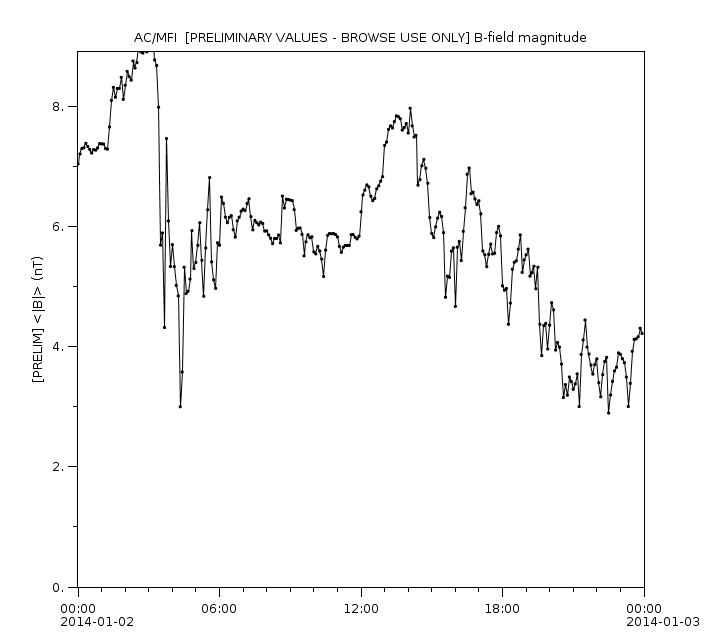

Audience: Developers and science teams

Purpose: Define Rich PNG standard

# Introduction

Png image files have the interesting feature that additional metadata
can be buried inside them. For example, we identify images produced by
Autoplot as having Software=Autoplot. We also embed metadata about the
plot and axis information, so that future programs can better utilize
the images. For example, the unix grep command can be used to look for
strings within axis labels, and the thin client uses this metadata to
interpret mouse gestures. We call this richPng, and the hope is that
other image producers and consumers might adopt this standard as well.

# RichPNG Standard

Each png file block has a type, and one with type text (tEXt) is added
with the keyword "plotInfo" and is equal to a JSON block with the
following scheme:

```
{ 'size':[640,480], 'numberOfPlots':2, 'plots': [...] }
```
The plots node is an array of:

```
{ 'title':'the title', 'xaxis': { ... }, 'yaxis': { ... } }
```
with the yaxis, for example (note top of canvas is 0):

```
{ 'label':'B-field', 'min':0.1, 'max':100, 'type':'log', 'units':'nT', 'top':78, 'bottom':644 }
```
and the xaxis, for example:

```
{ 'label':'delay', 'min':0, 'max':10, 'type':'lin', 'units':'nT', 'left':78, 'right':644 }
```
You can also have UTC times encoded in ISO8601:

```
{ 'label':'Epoch', 'min':'2013-01-01T00:00Z', 'max':'2013-01-02T00:00Z', 'type':'lin', 'units':'UTC', 'left':78, 'right':644 }
```
# Examples

For the image here (click to download),



there's the JSON block "plotInfo" within:

```
{ "size":[722,639],
  "numberOfPlots":1,
  "plots": [
     {
       "title":"AC/MFI  [PRELIMINARY VALUES - BROWSE USE ONLY] B-field magnitude", 
       "xaxis": { "label":"", "min":"2014-01-02T00:00:00.000Z", "max":"2014-01-03T00:00:00.000Z", "left":78, "right":644, "type":"lin", "units":"UTC" },
       "yaxis": { "label":"[PRELIM] <|B|> (nT)", "min":4.440892098500626E-16, "max":8.9, "top":52, "bottom":587, "type":"lin", "units":"nT" }
     }
  ]
}
```
Try:

```
 unix> wget -N https://raw.githubusercontent.com/autoplot/documentation/refs/heads/main/md/product_20140102.png
 2015-12-10 05:53:29 (583 KB/s) - product_20140102.png saved [34667/34667]
 unix> strings product_20140102.png | grep "AC/MFI" 
     "title":"AC/MFI  [PRELIMINARY VALUES - BROWSE USE ONLY] B-field magnitude", 
```
# Example Applications

  - Autoplot Thin Client
  - grep for image labels
  - verify axis settings for a large set of png files.
  - Autoplot PNGWalk Tool allows digitizing (clicking on plot will print
    coordinates at the bottom of the GUI).
  - Autoplot ImageDataSource allows plots to be grabbed from images
    (http://autoplot.org/wiki/images/product\_20140102.png?plotInfo=0),
    rendering with correct axes to allow for overplots.

# Unresolved

What happens with this is vaguely defined:

  - Inverted axes
  - colorbar labels
  - timerange node. timeranges are so ubiquitous in our field that it
    would be useful to allow the plot timerange to be easily found at
    the root JSON node.

# To be done

  - make insert Rich PNG Metadata routines for Java, IDL, and Matlab
  - Figure out how to insert metadata into PDF as well.
  - define convention for decorating existing images, for example have
    ".richpng" file alongside the original.
  - a JSON schema should be written to describe the format.

