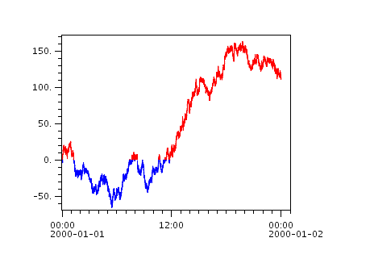
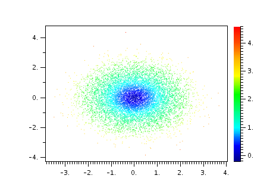
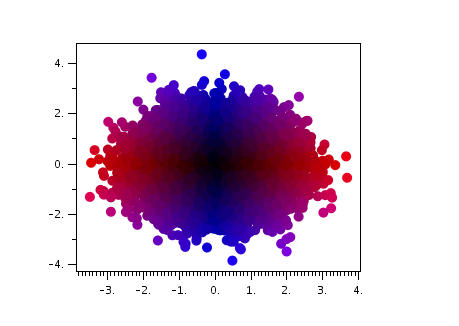

# Scripts with Callbacks

Some scripts have "callbacks" where Autoplot calls the script to respond
to human-operator events or other actions.

## Single-Point Digitizer

We want to digitize X,Y points from a data plot. Perhaps this is a
spectrogram with a cutoff, or the top of a peak. We need to make a
call-back which will receive the data points from the Das2 library.

```
# title: Add Point Digitizer
# label: Point Digitizer
# Click events are registered on the tab "digitizer." If the data is a spectrogram,
# report the Z value as well.  Note this will not work with the pitch angle distribution.
# This also provides feedback showing the digitized data and the data points selected in the 
# digitizer tab. 
```
  
```
typ= getParam( 'typ', 'Click', 'Digitizer Type', ['Click','Key'] )
```
  
```
from org.das2.components import DataPointRecorder
from org.virbo.dataset import SemanticOps
from org.das2.dataset import DataSetUpdateListener
from org.das2.graph import SpectrogramRenderer
import java.util.HashMap
```
  
```
if ( len(dom.plotElements)<3 ):
    uri= dom.dataSourceFilters[0].uri
    setLayoutOverplot(3)
    plot(0,uri)
```
  
```
dpr= DataPointRecorder()
```
  
```
addTab( 'digitizer', dpr )
```
  
```
class MyUpdateListener( DataSetUpdateListener ):
   def dataSetUpdated( self, e ):
       ds= dpr.getDataPoints()
       print ds
       if ( ds!=None ):
           plot( 2, ds[:,0], ds[:,1], color=Color.GRAY, symbolSize=8, lineStyle='none' )  
       else:
           plot( 2, "" )
           
dpr.addDataSetUpdateListener( MyUpdateListener() )
```
  
```
class MySelectionListener(DataSetUpdateListener):
  def dataSetUpdated(self,event):
       ds= dpr.getSelectedDataPoints()
       if ( ds!=None ):
           plot( 1, ds[:,0], ds[:,1], color=Color.YELLOW, symbolSize=11, lineStyle='none' )  
       else:
           plot( 1, ""  )  
```
  
```
dpr.addSelectedDataSetUpdateListener( MySelectionListener() )
           
pp= dom.plots[0].controller.dasPlot
```
  
```
from org.das2.event import DataPointSelectorMouseModule
from org.das2.event import CrossHairRenderer
```
  
```
dprr= CrossHairRenderer( pp,None,pp.getXAxis(),pp.getYAxis() )
mm= DataPointSelectorMouseModule( pp, None, dprr, 'digitizer' )
```
  
```
if ( typ=='Key' ):
   mm.setReleaseEvents(False)
   mm.setKeyEvents(True)
   mm.setDragEvents(False)
else:
   mm.setReleaseEvents(True)
   mm.setKeyEvents(False)
   mm.setDragEvents(False)
       
def dataPointSelected(event):
   x= event.getX()
   y= event.getY()
   if ( typ=='Key' ):
       map= java.util.HashMap()
       map['key']= event.getPlane('keyChar')
       dpr.addDataPoint( x, y, map )
   else:
       dpr.addDataPoint( x, y )
   pes= dom.controller.getPlotElementsFor(dom.plots[0])
   if ( len(pes)==0 ): 
       setStatus('no data found for plot')
       return
   ds= pes[0].controller.getDataSet()
   if ( ds==None ):
       setStatus('nothing plotted')
       return 
    
mm.dataPointSelected=dataPointSelected
```
  
```
pp.dasMouseInputAdapter.primaryModule= mm
```
  
```
# make sure the focus is on the 0th plot element.  The 2nd will be the selected points and above that is the digitized.
dom.controller.plotElement= dom.plotElements[0]
```
  
```
import javax.swing.JOptionPane
if ( typ=='Key' ):
   javax.swing.JOptionPane.showMessageDialog( getViewWindow(),'Click on the plot and press a key, and it will be recorded on the digitizer tab')
else:
   javax.swing.JOptionPane.showMessageDialog( getViewWindow(),'Click on the plot, and it will be recorded on the digitizer tab')
```
  
```
dom.plots[0].yaxis.autoRange= False
```

## Property Change Listener

You can register actions when properties change. For example, suppose
you want to run an analysis the the visible time range. You can add a
property change listener which takes action each time.

```
from java.beans import PropertyChangeListener 
```
  
```
class MyPCL( PropertyChangeListener ):
    def propertyChange( self, e ):
        print e
```
  
```
dom.plots[0].xaxis.addPropertyChangeListener(MyPCL())
```

Note Jython allows you to state this more succinctly:

```
def axisChange( e ):
    print e
```
  
```
dom.plots[0].yaxis.propertyChange= axisChange
```

Now let's do something with the property:

```
def axisChange( e ):
    if ( e.propertyName=='range' ):
        print '%s -> %s' % ( e.oldValue, e.newValue )
```
  
```
dom.plots[0].yaxis.propertyChange= axisChange
```

Here's a function which adds a callback when a property changes, culling
rapidly occurring events:

```
def addPropertyChangeListener( bean, prop, callback ):
   'add a property change listener to the bean'
   from java.beans import PropertyChangeListener
   from org.autoplot.util import TickleTimer
   class TTPCL( PropertyChangeListener ):
      def propertyChange(self,evt):
          print 'tt propertyChange'
          invokeLater( callback )
   tt= TickleTimer(250,TTPCL())           
   class MyPCL( PropertyChangeListener ):
      def propertyChange(self,evt):
          print 'propertyChange'
          tt.tickle()
   bean.addPropertyChangeListener( prop, MyPCL() )
```

So with one line we can add a listener:

```
def update():
    print 'it changed'
addPropertyChangeListener( dom.plots[0].xaxis, 'range', update )
```

## Custom Renderer

Autoplot v2017a\_6 makes it easy to add custom renderers, which convert
data into pixels, in scripts.

```
from org.das2.graph import Renderer
from java.awt.geom import GeneralPath
```
  
```
class HistogramRenderer( Renderer ):
   def doAutorange( self, ds ):
       xr= extent( ds )
       yr= extent( ds.property( QDataSet.DEPEND_0 ) )
       bds= join(rescaleRange(xr,-0.1,1.1),rescaleRange(yr,-0.1,1.1))
       return bds
```
  
```
   def render( self, g, xaxis, yaxis, monitor ):
       xzero= xaxis.transform(0,xaxis.getUnits())
       ds= self.getDataSet()
       if ( ds==None ): return
       yds= ds.property(QDataSet.DEPEND_0)
       ddy= float( ( yds[1]-yds[0] ) / 2 )
       cc= self.getColorControl('color',Color.BLUE)
       gp= GeneralPath()
       yd= yaxis.transform(yds[0]-ddy,yaxis.getUnits())
       gp.moveTo( xzero, yd )
       for i in range(ds.length()):
           y= yds.value(i)
           x= ds.value(i)
           xd= xaxis.transform(x,xaxis.getUnits())
           yd= yaxis.transform(y,yaxis.getUnits())
           yd0= yaxis.transform(y-ddy,yaxis.getUnits())
           yd1= yaxis.transform(y+ddy,yaxis.getUnits())
           gp.lineTo( xd, yd0 )
           gp.lineTo( xd, yd1 )
       gp.lineTo( xzero, yd1 )       
       g.setColor( cc )
       g.fill( gp )
```
  
```
# demo code below shows its use.
reset()
ds= append( randomn(5334,10000) , 3+randomn(5335,20000) )
setCanvasSize(724,460)
plot( ds, xpos='3em,70%-3em', ypos='50px,400px', color=Color.BLUE, renderType='scatter', symbolSize=3 )
```
  
```
plot( 1, histogram(ds,50), xpos='70%+2em,100%-2em',  ypos='50px,400px', color=Color.BLUE, 
      ydrawTickLabels=False, renderer= HistogramRenderer() )
```

## Add Buttons To PngWalkTool

We wanted a faster way to create "QC" (Quality Control) Records, which
tag images as okay or problem. Normally this would take several mouse
clicks per image, so we wanted a faster way to go through the set. This
adds buttons which are short-cuts to the QC buttons.

```
pngs = getParam('pngDir', '`<file:///home/jbf/pngwalk/voyager1/>`*.png', 'directory to examine')  
```
  
```
from org.autoplot.pngwalk import PngWalkTool 
p= PngWalkTool.start(pngs, getViewWindow())
```
  
```
# may need, depending on if QC has already been started...
if not p.isQualityControlEnabled(): p.startQC()
```
  
```
from javax.swing import JLabel, JPanel, JButton, ImageIcon
from java.awt import FlowLayout
from org.autoplot.pngwalk import PngWalkView,QualityControlRecord
```
  
```
def greenAction(evt): 
    p.setQCStatus( "",QualityControlRecord.Status.OK );
    p.sequence.next()
def greyAction(evt): 
    p.setQCStatus( "",QualityControlRecord.Status.IGNORE );
    p.sequence.next()
def redAction(evt): 
    p.setQCStatus( "",QualityControlRecord.Status.PROBLEM );
    p.sequence.next()
```
  
```
mytl= JPanel()
mytl.setLayout( FlowLayout( FlowLayout.LEFT ) )
mytl.add( JButton( ImageIcon(PngWalkView.getResource("/resources/badge_ok.png")),actionPerformed=greenAction ) )
mytl.add( JButton( ImageIcon(PngWalkView.getResource("/resources/badge_ignore.png")), actionPerformed=greyAction ) )
mytl.add( JButton( ImageIcon(PngWalkView.getResource("/resources/badge_problem.png")), actionPerformed=redAction ) )
```
  
```
p.addActionComponent( mytl, None )
```

# Scripts

## Setting the color of each plot symbol

Suppose you have scatter data which you want to encode with colors.
There are a couple of ways you can do this. The simplest is when there
are just a couple of colors, and you can have two calls with an
overplot. 

```
reset()  # reset to one empty plot
y= accum( randomn( 5334,10000 ) )  # 5334 is a random seed
t= linspace('2000-01-01T00:00','2000-01-02T00:00',10000)
r= where( y.ge(0.) )
plot( 0, t[r], y[r], color='red' )
r= where( y.lt(0.) )
plot( addPlotElement(0), t[r], y[r], color='blue' )
```

Sometimes you want to color-code by another dataset, using a colorbar to
transform from Z value to color. The "color scatter" mode does this:


```
reset()  # reset to one empty plot
x= randomn( 5334, 10000 )
y= randomn( 5335, 10000 )  
z= sqrt( x**2 + y**2 ) 
plot( x, y, z )
```

Last, you can use a kludge, where if the z data has units Units.rgbColor
then the Z value specifies the color
directly.

```
reset()  # reset to one empty plot
x= randomn( 5334, 10000 )
y= randomn( 5335, 10000 )  
red= floor( lesserOf( abs( x ) / 4 * 256, 255 ) )
blue= floor( lesserOf( abs( y ) / 4 * 256, 255 ) )
rgb= rgbColorDataset( red, dataset(0), blue )
plot( x, y, rgb, symbolSize=10 )
dom.plots[0].zaxis.visible= False  # the Z axis needs to be disabled manually.
```

## Histograms and Stats

There are a number of routines which perform statistics and other
reduction on data. For example, the histogram does a histogram of the
data:

```
ds= randn(200000)
h= histogram(ds,40)
plot(h)
```

You can more precisely specify the bins with:

```
ds= randn(200000)
h= histogram(ds,'-10','10','0.1')
plot(h)
```

These are in quotes because you might have datums like "-10cc" or
"2017-001".

## Importing New Libraries like Apache Math

I needed the Bessel function to support a SciPy implementation of
Geopack. I can import it using the addToSearchPath command, which can
download and mount a jar.

```
import sys
addToSearchPath(sys.path,'`<http://www.trieuvan.com/apache//commons/math/binaries/commons-math3-3.6.1-bin.zip/commons-math3-3.6.1/commons-math3-3.6.1.jar>`', monitor ) 
```
  
```
from org.apache.commons.math3.special import BesselJ
```
  
```
print BesselJ(1).value(1.0)  # This should be the same as special.J1(1.0)
print BesselJ(1).value(2.0)  # This should be the same as special.J1(2.0)
print BesselJ(0).value(1.0)  # This should be the same as special.J0(1.0)
print BesselJ(0).value(2.0)  # This should be the same as special.J0(2.0)
```

