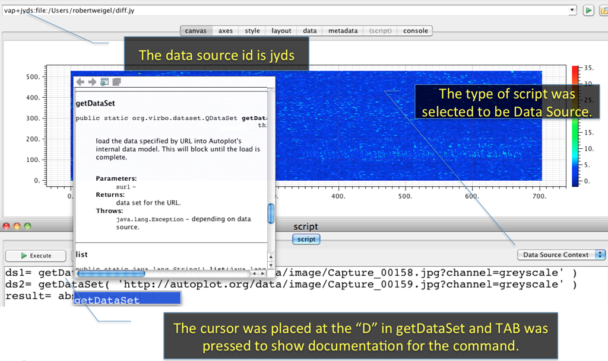

Audience: Scientists and programmers

Purpose: Introduce scripting in Autoplot, which can be used to control
Autoplot, load new types of data, and create new more specialized
applications.

See also [developer.scripting](developer.scripting.md "wikilink"),
<http://autoplot.org/data/jyds>, and <http://autoplot.org/data/tools/>.

More scripts in the SVN repository:
[1](https://autoplot.svn.sourceforge.net/svnroot/autoplot/autoplot/trunk/Autoplot/src/scripts/)
(All scripts before and including areaSelect.py have been verified to
work with current DOM).

# Introduction

Autoplot can be scripted using
[Jython](http://wiki.python.org/jython/JythonFaq/GeneralInfo#What_is_Jython.3F).
Jython is an implementation of the Python scripting language. A Jython
script has easy access to Java libraries.

Scripting can be used for various purposes, including to:

  - load data from multiple data sources and combine them to make a new
    dataset,
  - automatically create a series of images, typically one image per
    file, called a pngwalk,
  - plot complex ASCII files,
  - modify the default way in which a data file is rendered, and
  - create a new application.

Mathematical operations may be applied on Autoplot data objects
([QDataSets](QDataSet.md "wikilink")) using a syntax that is similar to
operations on arrays and matrices in IDL or MATLAB. Unlike arrays and
matrices in IDL and MATLAB, [QDataSets](QDataSet.md "wikilink") have
metadata and physical units; the physical units must be consistent for
certain operations to be carried out.

For example, this script

``` python
ds1= getDataSet( 'https://autoplot.org/data/image/Capture_00158.jpg?channel=greyscale' )
ds2= getDataSet( 'https://autoplot.org/data/image/Capture_00159.jpg?channel=greyscale' )
plot( abs( ds2- ds1 ) )
```

loads two grayscale images and plots the result. If this script is
copied into the script editor (`Options->Enable Feature->Script Editor`)
and executed, a spectrogram showing the differences between the two
grayscale images is plotted.

There are two types of scripts:

  - [\#Data Source Context](#data-source-context "wikilink"): Used for
    loading data. These have a URI and can be used like any other data
    source.
  - [\#Application Context](#application-context "wikilink"): Used for
    controlling Autoplot itself.

Finally, scripts can be shared with others. For example, if a script is
put on a website (http://autoplot.org/data/imageDiff.jyds), it can be
run by anyone by entering the name of the script in the address bar.

# Script Editor

Autoplot has script editor GUI. Selecting `Options->Enable
Feature->Script Panel` will reveal a tab named "script" where scripts
may be entered and executed. When a remote script is accessed, the
script editor will be used show the contents of the script for
reference. Pressing "execute" will run the script (or load the data in
the case of the .jyds script), and shift-execute will show a parameters
dialog so that parameters can be changed interactively.



  
The script editor is often used with the console tab, where any messages
printed will appear.

The script editor provides a simple environment where scripts can be
quickly composed or inspected. Context-clicking (right mouse click or
alt mouse click) will show a popup menu of available shortcuts and
settings, and the editor provides simple completions for this
environment. To see completions, enter TAB or ctrl-space. (Note there is
a preference for disabling TAB for completion, since some may wish to
use tabs in their scripts.)

# Data Source Context

Autoplot scripts have two different contexts, which determine what a
script can do. The "Data Source Context" is only for loading data, and
the "Application Context" can do everything. Data Source Context scripts
can be used in more applications--for example they can be used within a
data server that knows nothing about the Autoplot application.

## Overview

In this context, scripts load data and return a new dataset (or
datasets). Data context scripts have file extension `jyds` (Jython data
dource).

If the above script

``` python
ds1= getDataSet( 'https://autoplot.org/data/image/Capture_00158.jpg?channel=greyscale' )
ds2= getDataSet( 'https://autoplot.org/data/image/Capture_00159.jpg?channel=greyscale' )
result= abs( ds2- ds1 )
```

was saved and uploaded to

<http://autoplot.org/data/imageDiff.jyds>

then

<http://autoplot.org/data/imageDiff.jyds?result>

would refer to this dataset.

Data Source scripts are unaware of the Autoplot GUI and DOM; they can
load and operate on data, but they cannot manipulate how the data is
plotted (for example, the color of the lines may not be modified in a
Data Source script). These scripts can be used outside of Autoplot for
this reason, for example in custom applications that use Autoplot's data
loading but not the application itself.

Commands available in this context are listed at
[developer.scripting\#Ops](developer.scripting.md#ops "wikilink"). These
commands will also appear in a selection menu when TAB is pressed on a
blank line in the script panel.

**Examples**:

  - In the repository:
    [2](https://autoplot.svn.sourceforge.net/svnroot/autoplot/autoplot/trunk/JythonDataSource/src/)
    .
  - In [cookbook\#Scripting](cookbook.md#scripting "wikilink")

## Example: Reading ASCII file from URL

Autoplot can plot many ASCII files automatically by using either the
[help\#ASCII\_Editor](help.md#ascii-editor "wikilink") or a [URL
template](help#ASCII_table "wikilink"). However, many ASCII files have
unusual structure and require a script to convert the data in the file
into a [QDataSet](QDataSet.md "wikilink").

Consider this file
[3](ftp://ftp.ngdc.noaa.gov/STP/GEOMAGNETIC_DATA/INDICES/KP_AP/1986),
which has lines of the form

```
8601012082243337373350403340303 18 22 22 18 48 27 18 27 251.26  0 67.00 
8601022082253740303040372720260 22 27 15 15 27 22 12  7 181.05  0 67.60
```
The file format specification is given at
[4](ftp://ftp.ngdc.noaa.gov/STP/GEOMAGNETIC_DATA/INDICES/KP_AP/kp_ap.fmt).
This script reads the file and convert it into a
[QDataSet](QDataSet.md "wikilink"):
[wdc\_kp\_ap.jyds](https://svn.code.sf.net/p/autoplot/code/autoplot/trunk/JythonDataSource/src/wdc_kp_ap.jyds)

## Example: Reading ASCII response URI

Consider a CGI script that returns a simply structured ASCII table

<https://omniweb.gsfc.nasa.gov/cgi/nx1.cgi?activity=retrieve&res=hour&spacecraft=omni2&start_date=20180101&end_date=20180130&vars=8&vars=23>

the first few lines of the response are

``` python
 <HTML>
 <HEAD><TITLE>OMNIWeb Results</TITLE></HEAD>
 <BODY>
 <center><font size=5 color=red>OMNIWeb Plus Browser Results </font></center><br>
 <B>Listing for omni2 data from 20180101 to 20180130</B><hr><pre>Selected parameters:
  1 Scalar B, nT
  2 SW Proton Density, N/cm^3 
 
 YEAR DOY HR    1     2 
 2018   1  0   8.2  13.7
 2018   1  1  10.8  16.8
 2018   1  2  10.0  17.4
```

Because the ASCII table is simple, we would like to apply the ASCII
template

```
time=field0&column=field4&timeFormat=$Y+$j+$H
```
If the URI was to a file

```file:/tmp/data.txt```

we could append an ASCII template to the URI into Autoplot's address bar

```file:/tmp/data.txt?time=field0&amp;column=field4&amp;timeFormat=$Y+$j+$H```

and a plot with the correct time axis would be shown.

However, because the CGI script URI has query parameters, we must use a
script. Autoplot can load data from remote files, but to load data from
services it must have additional code.

To plot this data, use

``` python
uri      = 'https://omniweb.gsfc.nasa.gov/cgi/nx1.cgi?'
params   = 'activity=retrieve&res=hour&spacecraft=omni2&start_date=20180101&end_date=20180130&vars=8&vars=23'
template = 'time=field0&column=field4&timeFormat=$Y+$j+$H'

file  = downloadResourceAsTempFile( URL(uri+params), monitor).toString() 

data= getDataSet( 'vap+dat:'+file+"?"+template+"&allowHtml=T" )  # allowHtml is needed to prevent HTML warning (v2018a_11)

data.putProperty( QDataSet.UNITS, 'N/cm^3' )
```

## Example: Query Parameters

Scripts can also have query parameters which allow more control of the
script. The parameter names and values are passed to the script. For
example, if you created a script `readData.jyds` with the following
lines at the top

``` python
s= getParam( 's', 'deflt', 'label to describe' )   # gets a string parameter, with default value "deflt"
f= getParam( 'f', 2.34, 'label to describe' )      # gets a float parameter, with default value 2.34
```

The user would be able pass options to the script in the URI:

`vap+jyds:file:/tmp/foo.jyds?s=abc&f=3.14159`


The parameter can be type string, int, float, boolean, File, or URI. The
type is determined by the default value.

### constraints

If a fourth parameter is provided, this should be either an array of
allowed values, or a dictionary. When it is a dictionary, the following
can be used as tags:

  - values is a list of all allowed values.
  - examples is a list of values, but the scientist can specify things
    other than the examples.
  - labels is an array which must be the same length as the enumerated
    values (values).

## TimeSeriesBrowse

Scripts can easily support the "Time Series Browse" capability, so that
scripts can be used to browse over long time series. For example, a
script could read any file from
vap+cdf:<http://cdaweb.gsfc.nasa.gov/istp_public/data/polar/efi/$Y/po_k0_efi_$Y$m$d_v$v.cdf>,
and then derive data from this (http://autoplot.org/data/tsbDemo4.jyds):

```
# demonstrate how script can have timeSeriesBrowse to modify another dataset
timerange= getParam( 'timerange', '2000-01-09', 'timerange to plot' )
uri= 'vap+cdf:http://cdaweb.gsfc.nasa.gov/istp_public/data/polar/efi/$Y/po_k0_efi_$Y$m$d_v$v.cdf?POTENT&timerange=%s' % timerange
ds= getDataSet( uri, monitor )
if ( ds==None ): 
  result= None
else:
  result= abs(ds)
  result.putProperty( QDataSet.TITLE, 'Positive Spacecraft Potential' )  
```
This would then have URIs that have a default time range of 2000-01-09,
but any timerange can be plotted by adding (for example)
"?timerange=2000-01-08". Scanning on the time axis will cause the script
to be called again and more data is loaded.

  

## Monitors

Often a process takes a little while, and it would be nice to indicate
to the scientist that the process is proceeding. This is done with the
monitor object. See
<http://autoplot.org/developer.scripting#Building_Scripts> .

# Application Context

## Overview

All scripting commands are available in this context. Application
Context scripts modify the GUI, default canvas view, and the DOM.
Application context scripts have file extension `jy`.

**Examples**:

  - In the repository:
    [5](https://autoplot.svn.sourceforge.net/svnroot/autoplot/autoplot/trunk/VirboAutoplot/src/scripts/)
    (All scripts before and including areaSelect.py have been verified
    to work with current DOM).
  - In [cookbook\#Scripting](cookbook.md#scripting "wikilink")

## Example: Modify Canvas

Change line color

``` python
result= getDataSet( 'http://autoplot.org/data/autoplot.xls?column=A' )
dom.plotElements[0].style.color= Color.RED
```

## Example: Plot all files in directory

``` python
trs= generateTimeRanges( '%Y-%m-%d', '2010-January' )
for tr in trs:
    dom.timeRange= DatumRangeUtil.parseTimeRange(tr)
    writeToPng( '/tmp/%s.png' % tr )
```

runs the application through each day of the month January 2010, making
images of each day.

## Example: Progress Monitor

All scripts may use a progress monitor to provide feedback to users.
This built-in variable is named `monitor` .

``` python
monitor.setTaskSize(200)                     # the number of steps (arbitrary units)
monitor.started()                            # the task is started.  
 
for i in xrange(200):
    if ( monitor.isCancelled() ): break       # if not called, the cancel button will be insensitive
    monitor.setProgressMessage('at %d' % i)   # this describes actions done to perform the task.  
    monitor.setTaskProgress(i)
    java.lang.Thread.sleep(100);
 
monitor.finished()     # indicate the task is complete
```

## Example: Create your own tool

Application Context scripts can be added to the Autoplot GUI by putting
them in the HOME/autoplot\_data/tools/ folder.
<http://autoplot.org/data/tools/> shows some example scripts.

Under `Options->Rendering Options` there is a option for showing dates
as "YYYY-MM-DD" or "YYYY-DOY". This option could be made available under
`Tools`&rarr;`Toggle Day-of-Year` by placing the following in
`HOME/autoplot_data/tools/toggleDayOfYear.jy` and restarting Autoplot.

```
setScriptLabel( 'Toggle Day-of-Year' )
val= dom.options.isDayOfYear()
val= 1-val 
dom.options.setDayOfYear(val)
```
Note there is \[menubar\]&rarr;Tools&rarr;"Manage and Browse Tools" now, which
lets you manage the tools just like the bookmarks. This also allows
tools to reside on remote sites, and for teams to have a standard set of
tools with the remote bookmarks mechanism.

# Scripting Context

Often we want to create a specialized application for a particular
science task. Invoking Autoplot with the --script option will run the
script at startup. For example, you could have a digitizing application
that you always want to come up in a particular configuration. The
digitizer is added and the data is loaded automatically.

Invoked using the `--script` launch option

The name of the script (e.g. /tmp/script.jy) following the --script
keyword is invoked at launch.

