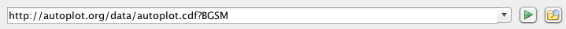

#  Introduction

Autoplot is an interactive browser for data on the web. In the same way
that you browse content stored in HTML, JPEG, and PNG files on the web,
Autoplot allows you to interactively browse data stored in CDF, netCDF,
ASCII, and many more data file formats. You can also interact with
several types of data servers, including HAPI servers, Das2Servers, and
CDAWeb.

Feel free to ask questions on the discussion group
[mailto:autoplot@groups.google.com](mailto:autoplot@groups.google.com)
if you need assistance, or browse the archive there at
<https://groups.google.com/forum/#!forum/autoplot>.

This is typically the name of a data file and
additional controls needed to read in the data. For example,
<http://autoplot.org/data/autoplot.cdf?BGSM> refers to the CDF file on a
website, and the BGSM parameter which will be found inside. 

Undo and redo actions are attached to the ctrl-Z and ctrl-Y keys
(command ⌘-Z and ⌘-Y for Macs).

<iframe width="560" height="315" src="https://www.youtube.com/embed/PcB3feFYb_4?rel=0" title="YouTube video player" frameborder="0" allow="accelerometer; autoplay; clipboard-write; encrypted-media; gyroscope; picture-in-picture; web-share" allowfullscreen></iframe>

## Address Bar and URIs

  
In the address bar at the top of the GUI you can enter the name of a
supported [file format](#Formats_Read "wikilink") in a data address. If
the data address is a URL, HTTP or FTP is used to download the file to a
local directory within the folder "autoplot\_data." 

To see this, compare what happens when you
enter `http://autoplot.org/data/autoplot.cdf` in the address bar versus
`http://autoplot.org/data/autoplot.cdf?BGSM`.

Note the URI given above is more formally stated as:

`vap+cdf:`<http://autoplot.org/data/autoplot.cdf?BGSM>

But to get started, the URI:

<https://cdaweb.gsfc.nasa.gov/pub/data/omni/low_res_omni/omni2_1972.dat?column=field17&timeFormat=$Y+$j+$H&time=field0&validMax=999>

breaks the lines of the file into fields using spaces.

## Interaction

Basic user interactions include: **Left-click and drag** to zoom,
**Middle-click and drag** to pan, **Click on axis and drag** to
constrain interaction to one axis, **CTRL-Z / CTRL-Y** to undo/redo
changes, **Shift-Click** on plot to move plot box.

On a Mac, replace CTRL with CMD.

When pointer is over an axis

  - Drag axis: Middle Mouse Button Down and Drag
  - Zoom in/out: Mouse Wheel Rotate Up/Down
  - Pan: CTRL + Mouse Wheel Rotate Up/Down (Pans the axis. This allows
    for rapid scanning of the data.)

More complex interaction with plots, including: mouse wheel control,
keyboard entry of axis range, context overview plots

<addhtml id="123">
<iframe width="560" height="315" src="https://www.youtube.com/embed/Zo-QuK-KvUM?rel=0" title="YouTube video player" frameborder="0" allow="accelerometer; autoplay; clipboard-write; encrypted-media; gyroscope; picture-in-picture; web-share" allowfullscreen></iframe>
</addhtml>

  

### File → URI History

Autoplot keeps track of everything you have plotted in the file
HOME/autoplot\_data/bookmarks/history.txt. 

### Bookmarks

Bookmarks can be selected in two ways

1.  By selecting the `Bookmarks` menu item and then browsing a tree of
    bookmarks.
2.  By selecting `Bookmarks → Browse and Manage` and clicking on a
    bookmark.

### Tools → Cache

The Cache menu is a set of tools for managing the cache of data loaded.
When you point Autoplot to a URL like

#### ro\_cache.txt

Note, caches can contain a file "ro\_cache.txt" (read-only cache) which
is a pointer to a local file system that contains the same files as the
remote filesystem. 

### Axes

Selecting the axis tab with show a panel with basic controls for the two
axes of the plot in focus, the plot title, and the colorbar title (the
colorbar may not be visible but it always exists).

|                                                                                                                                                                                                                                                                                                       |
| ----------------------------------------------------------------------------------------------------------------------------------------------------------------------------------------------------------------------------------------------------------------------------------------------------- |
| <addhtml id="x"> <iframe width="560" height="315" src="https://www.youtube.com/embed/KrPnp3WCL60?rel=0" title="YouTube video player" frameborder="0" allow="accelerometer; autoplay; clipboard-write; encrypted-media; gyroscope; picture-in-picture; web-share" allowfullscreen></iframe> </addhtml> |

