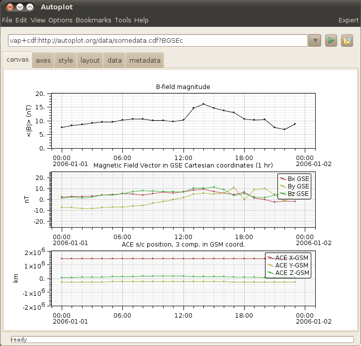
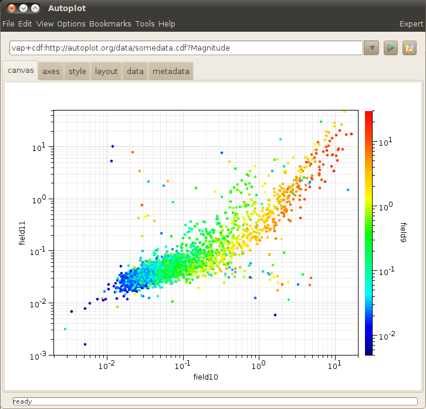

# Cooking at LANL

The folks at LANL asked for a set of procedures and resultant images
showing how to get more complex plots.

# Stack of three plots

It's useful for everyone to know how to make a stack of plots.

  - plot <http://autoplot.org/data/somedata.cdf?Magnitude> by pasting
    this in the address bar, and hitting the play button to plot the
    data.
  - Turn on "Expert" mode if Basic mode is on, checking the upper-right
    corner for the status.
  - File-\>Add Plot...
  - Edit the URI to be <http://autoplot.org/data/somedata.cdf?BGSEc>.
    Note the inspect icon will open a GUI to make this easier.
  - Hit "Plot Below" to add a new plot below the current "focus" plot.
  - Click on the bottom plot to change the focus to one of the plot
    elements
  - File-\>Add Plot...
  - Edit the URI to be
    <http://autoplot.org/data/somedata.cdf?SC_pos_GSM>. Note the inspect
    icon will open a GUI to make this easier.
  - Hit "Plot Below" to add a new plot below the current "focus" plot.
  - This product could be saved as a vap file using File-\>Save

# Efficient stack of three plots

 We want to make the stack of three
more efficient, removing ticks and putting the labels on the outside.

  - Tear off the axis tab so you can see the canvas and the axis tab at
    the same time.
      - right-click on the axis tab, and click "undock"
  - Click on the top plot.
  - De-select show labels on the X-Axis panel.
  - Click on the middle plot.
  - Add "B-GSE, nT" to the Y-Axis label.
  - De-select show labels and delete the title
  - Click on the bottom plot.
  - Add "GSM Pos, km" to the Y-Axis label. (Or try "GSM Pos\!ckm, for a
    two-line label)
  - Delete the title
  - Tools-\>Fix Layout will remove the extra spaces in between the plots
    (and overlaps).

# Tweak Label Position

 Two plots of our three have labels colliding
with data. This shows how to use property editors to move the labels to
the outside.

  - Right-click (or Ctrl-Click single button mouse on a Mac) on the
    middle plot, and select "Plot Properties".
  - In the middle is "legendPosition", set it to "OutsideNE" and click
    "apply"
  - Repeat the procedure for the bottom plot.
  - (Note the default initial legend position will be a user option
    soon.)

# Color Scatter Plot

Mike asked how to make a color scatter plot, which is a scatter plot
where the points are color-coded.

  - File-\>Add plot...
      - Plot the URI:
        vap+dat:<http://autoplot.org/data/sampex.dat?column=field9>
      - Against X:
        vap+dat:<http://autoplot.org/data/sampex.dat?column=field10>
      - Against Y:
        vap+dat:<http://autoplot.org/data/sampex.dat?column=field11>
  - Plot.
  - The symbols can be made larger on the style tab.

Right now only one data source can produce data in this form, the Excel
Spreadsheet reader, but soon a scheme for rich ascii files will be
introduced.
