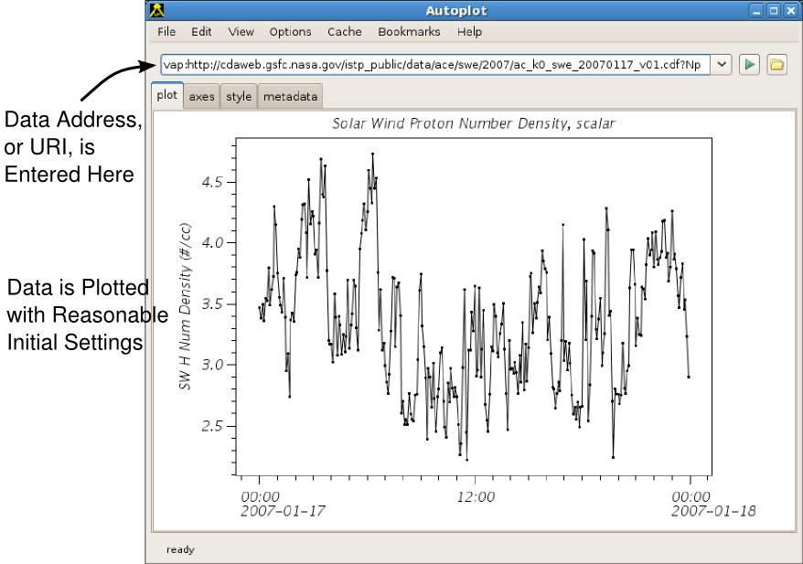
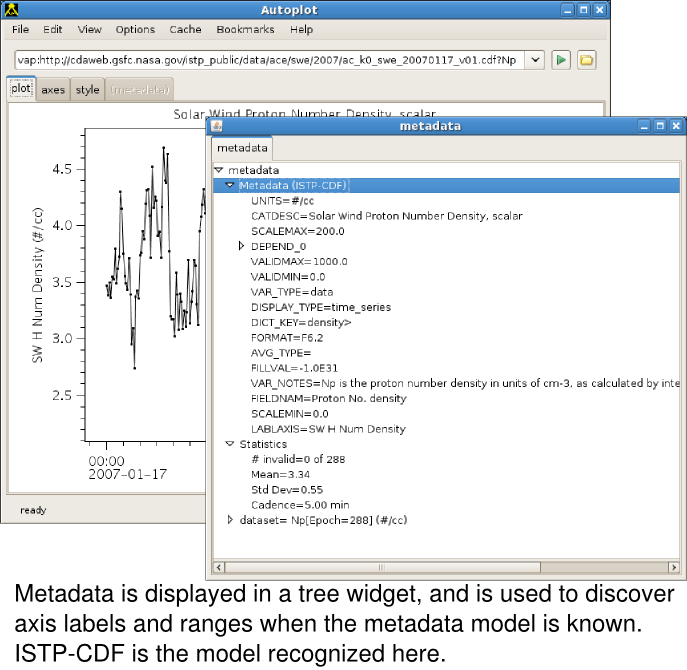

Audience: Science Community

Purpose: Autoplot is described in this introductory guide. This includes
an initial section on plotting data in Autoplot, and then later sections
introduce scripting and introducing new data sources into Autoplot.

# Introduction

## Data is Identified with URIs

Autoplot (http://www.autoplot.org) plots data from many different
sources using an interface that is familiar and simple.

Data address, or URI, is entered in an address bar, and the data is
plotted with reasonable initial settings.

Data URIs are often URLs, such as the location of an CDF file, plus
additional parameters that identify a plottable parameter. For ASCII
tables, the file resource is identified, and the URI parameters may
configure the parser used to read the data. Here are some example URIs:

` `<http://cdaweb.gsfc.nasa.gov/istp_public/data/ace/swe/2008/ac_k0_swe_20080816_v01.cdf?Np>  
` `<ftp://nssdcftp.gsfc.nasa.gov/spacecraft_data/omni/omni2_1977.dat?time=field0&timeFormat=$Y+$j+$H&column=field8&fill=999.9>

 Metadata is displayed in a
tree widget, and is used to discover axis labels and ranges when the
metadata model is known.

Browse to a file resource using file system completions to list the
remote folder. Clicking on the folder icon triggers completion, which is
a list of options that build the URI. Autoplot is able to browse HTTP
and FTP filesystems as if they were local.

 Data Sources provide completion engines to
configure the URI. Completion on the (NASA/SPDF) CDF data source shows
plottable parameters. Completion is triggered by tapping control and
space in the address bar. When the URI is incomplete, for example if
just the name of a CDF file is entered without the parameter name,
completion is triggered to guide the user.

 Some data sources have graphical user
interfaces for creating URIs. For example, clicking the folder icon for
an ASCII text file displays the data in a table, indicating how the data
will be parsed. GUI components allow the parsing to be configured. When
the file is parsed properly, the ascii file URI is updated and the file
is parsed completely for plotting.

## Browsing the Data

Browsing the data is fast and intuitive.

**zooming**. To zoom in, drag out a range with the left mouse button.
The mouse wheel works as in Google maps: press the mouse wheel and drag
to pan the axis. Spin the mouse wheel to zoom in and out. Similar
gestures on the x or y axis will adjust just the one axis.

**undo/redo**. Control-Z will undo the last operation performed, and
control-Y will redo the operation. These actions are found under the
"Edit" menu of the menu bar, as well as the option to undo many
operations at once.

**scanning**. At the ends of the x-axis are hidden "scan previous" and
"scan next" buttons. These are useful for scanning through a long time
series dataset. Note when control is pressed while the mouse wheel is
spun, the axis will pan instead of zooming.

Right-click on an axis to adjust its properties.

Right-click on a plot, and select "context overview." This creates a
copy of the plot with the same data at the original zoom level. A
"connector" indicates the position of the top plot on the overview plot.

### More Mouse Actions

Additional "mouse module" actions are available by right-clicking on the
plot. For example, you can draw a box around points to display data in a
popup with "Display Data," measure the distance between two points with
"Length," or read the mouse position with "Crosshair Digitizer." These
mouse actions are extensible, and scripts may add additional
functionality for interacting with data.

## .vap files

/what is a .vap file /

## Bookmarks

/Section on bookmarking datasets and .vap files/

## File Cache

/how das2 filesystems download data and file cache manager /

## layout tab

/layout tab use/

## metadata tab

/explain the nodes of the tree/

## Autoplot Plots Data From Many Sources

Autoplot plug-ins allow it to access many different forms of data.
Plug-ins adapt file formats, and also interfaces like OpenDAP. For
example, the Java NetCDF code is adapted for Autoplot so that NetCDF
files can be read in. Here are a few examples with the file extensions:

  - Ascii tables (.dat, .txt, .csv) Data in flat ascii tables. By
    default a delimiter is identified and newlines separate the fields.
  - Binary tables (.bin) Data in flat binary tables. Parameters
    configure record length, data types, endianess, etc.
  - Excel speadsheets (.xls) Data is read via the Apache POI library.
  - CDF files. (.cdf) SPDF CDF files are binary files with embedded
    metadata used commonly in Space Physics.
  - CEF files. (.cef) Cluster Exchange Format is used on the Cluster
    mission.
  - NetCDF files. (.nc, .ncml) Binary files with metadata used commonly
    in Atmospheric and Oceanic Physics.
  - OpenDAP (.dds) HTTP-based servers for transmitting data and metadata
    used commonly in Atmospheric and Oceanic Physics, but NASA/SPDF
    provides a server as well.
  - Fits files. Images used commonly in Astronomy.
  - Wav files. (.wav) Sound files are read in, mostly because the files
    are familiar and contain both data and metadata.
  - Image files. (.png, .jpg) Images are read in, again because the
    files are familiar. But occasionally it's useful for digitizing
    applications.
  - TSDS Server. (.tsds) Virbo Time Series data server has a custom
    plug-in for getting data at many time scales.
  - QStreams (.qds) is a serialized version of the Autoplot internal
    data model, useful for exchanging data, caching, etc.

To see a list of the active plug-ins, enter "<about:plugins>" in the
address bar.

### Overriding the Data Source Type

Often you need to explicitly set the data source type, for example, with
a binary file with a .dat extension. In this case you can fully-qualify
the URI with the extension:

` vap+bin:`<file:///home/user/data/foo.dat>

## Launching Autoplot

The production version of Autoplot is launched from a link at the top of
<http://www.autoplot.org>.

Autoplot is released using Sun Microsystems' Java Webstart and runs on
Java 1.5. When webstart is properly configured, Autoplot is launched by
clicking a link on a web site. Most desktops have Java installed already
and can run webstart applications. The production version of Autoplot is
linked at the top of www.autoplot.org.

Java can be downloaded freely from Sun (or Apple), and instructions for
configuring webstart can be found at www.autoplot.org.

Development versions of Autoplot are distributed on the Autoplot site.
These releases help to prove new features and provide quick access to
bugfixes without the rigor of a production-quality release.

Note that Autoplot is also supported as a single executable jar file, an
applet, and as a servlet.

# Power Users and Admins

Autoplot is different from other plotting tools in a number of ways:

  - simple, general-purpose interface increases acceptance and broadens
    utility
  - Java Webstart makes installation and maintenence trivial
  - remote filesystem layer plus aggregation templates provide excellent
    browsing using a simple server
  - handles data at many levels of abstraction, from array of numbers to
    timeseries with physical units
  - all data is converted to standard, uniform model
  - anti-aliased fonts and graphics improves ledgibility and appearance
  - highly interactive graphics components
  - extensible plug-in data sources
  - plug-ins output digital data to Excel, CDF, many others to come
  - Jython scripting allows derivation of new datasets, complex
    applications, and programmatic control
  - separation of Model and Controller code from View allows for use on
    the server-side as well as client-side
  - open-source, and building procedure documented from SVN checkout to
    invocation

In this section we explore some of the more advanced features of
Autoplot.

## Aggregation

You can use file name templates to aggregate multiple files into a long
time series. MenuBar-\>Bookmarks-\>Make Aggregation can do this
automatically.

## Data can be output in many ways

  - Render to SVG, PNG, and PDF
  - Save Autoplot configuration to .vap file
  - Copy and Paste image into email or PowerPoint
  - Export Data to ASCII table, Excel Spreadsheet, CDF, Binary table

## There are many hidden features

  - The menu bar contains many features, such as exporting data,
    bookmarks, and local file cache management.
  - The Tabs "Canvas," "Axis," "Metadata," etc, undock so that the
    panels can be viewed side-by-side.

## Das2 Graphics Library

Das2 is the graphics library used for rendering and interacting with the
plots. The library provides many of the useful features found in
Autoplot, such as:

  - Anti-aliased graphics rendered with the Java 2D library.
  - Rendering directly to SVG, PDF, and PNG.
  - Mouse Modules. Mouse Modules handle the low-level mouse events to
    create useful science actions such as horizontal, vertical, and
    angle data slicing. Many modules such as length, display selected
    data, and crosshair digitizer are selected by right-clicking on the
    component.
  - Property Editors. Many graph components and the DOM can be edited by
    right-click, edit properties. This component edits any Java Bean,
    quering the object for its adjustable properties. Also this can edit
    multiple nodes of the same type simultaneously. For example, select
    a few panels, then edit panels.
  - Tear Off Tabs. The application comes up as a deck of tabs containing
    different component groups: plot, style, axes, etc. Any of these can
    be undocked into a separate pane for side-by-side viewing. Also the
    "slide right" feature has been added recently, which creates a new
    window that is stuck to the original pane.
  - Renderers. The data is rendered with das2 renderer objects. Editing
    the renderer directly allows fine control of rendering.

More information about it is available at <http://www.das2.org>.

## Autoplot DOM

The DOM is a tree of objects that represent the application state. This
tree is used to create configuration files (.vap files), store
information for undo/redo, and describe the unlimited number of
configurations for the application. For example, application.plots is
the array of all the plots on the canvas. application.panels are the
panels that render the data URIs onto the plots. You can look at the DOM
(and edit any property of the application) with Edit-\>Edit DOM on the
menu bar.

Note many of the nodes of the DOM tree have a "controller" node below
them. The controller object manages the node, and properties under it
will not part of the application state and will not be saved to .vap
files. Note that by way of the controller, you can drill down into the
das2 objects that are used to implement the application.

## Java BeansBinding

Java BeansBinding is a relatively new java technology. It makes it easy
to connect properties of objects together, and is used throughout
Autoplot to make a flexible application. For example, you can add a
binding that forces the y-axes of all the plots to have the same range.
This is done graphically by right-clicking on a y-axis, select "Add
Binding..." then "Bind to Plot Above". As new plots are plotted,
Autoplot may guess if the plot should be automatically added to the
application's timeRange property so all time axes display the same time.
Bindings can be created programmatically from the console with the
"bind" command.

## Autoplot Data Handling

Autoplot uses Data Source Plug-ins to access new data sources. The
plug-ins standardize the data and metadata, but also provide the schema
for creating valid URIs. Data sources are registered by extension and
optionally mime-type. A URI can explicitly request a data source by
using "vap+ext:" as the uri scheme. Some plug-ins also provide
formatting, adding another option to the export data dialog. You can
look at the list of loaded plug-ins by entering "<about:plugins>" in the
address bar.

"QDataset" is the working name for the internal data model. It borrows
good ideas from NetCDF, CDF, and CEF. It uses a thin syntax layer and
semmantics to achieve abstraction. QDataSets can be serialized to a
"QStream" without any information loss.

## Scripting

Jython is the Python language in Java. Autoplot presents a programming
interface so that Jython can be used to programmatically control
Autoplot. QDataSets can be used with operator overloading to form an
expressive language with rich operators, such as unit-aware addition,
slicing and subsetting.

New datasets can be derived using Jython scripts. There are example
scripts on the Autoplot website.

Note, Autoplot can also provide data to IDL and Matlab. This is
documented on the Autoplot website.

Jython scripting introduces flexibility. For example, two parameters are
read in and plotted against one another. Scripting is also used for
batch plotting of data, adding features, and other tasks.

The Script panel is enabled using Options-\>Enable Feature-\>Script
Panel.

## Architecture

Model-View-Controller Architecture makes Autoplot well-suited for server
side applications as well. An example servlet is provided that shows how
Autoplot and Tomcat make a high-performance graphics server.
