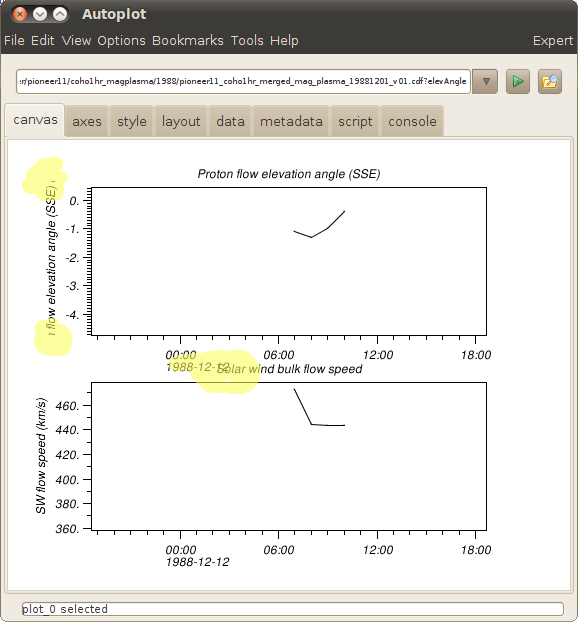

# Purpose

Define new version of Autolayout that removes gaps and overlaps between
plots.

# Introduction

The existing version of Autolayout goes back to the original coding of
the DOM version of Autoplot. While it controls the outer margin to make
room for colorbars and outside labels, it doesn't try to improve the
spacing between plots. This is one of the most-requested improvements to
Autoplot, but is also one of the more difficult ones to implement. We
will define the function first then describe the implementation.

Note, the existing Autoplot plots can be resized to resolve this problem
interactively by shift+click on plot corners.

# Problem

  - controlling the margins addresses these problems:
      - colorbars need room to the right of a plot.
      - long labels, in the outside NE position, run outside the plot.
      - tall labels with multiple lines run outside the plot.
  - but the problems still remain:
      - tall tick labels, such as the two-line <time>\!c<date>, run into
        titles of the plot below
      - two-line titles run into the ticks of the axis above
      - the gaps between plots reduce space efficiency, and limit the
        number of plots in the stack.
  - plot positions can be tweaked by grabbing corners, but adding
    additional plots will revert changes made by the user.
  - There's no way to easily adjust height. For example, we should be
    able to make a plot taller, possibly so that it would overlap the
    next plot, but then the autolayout would correct this.

# Examples

 Bug
reports:

  - <https://sourceforge.net/tracker/index.php?func=detail&aid=3092413&group_id=199733&atid=970682>
  - <https://sourceforge.net/tracker/index.php?func=detail&aid=3030658&group_id=199733&atid=970682>
  - <https://sourceforge.net/tracker/index.php?func=detail&aid=3042070&group_id=199733&atid=970682>

# Solution

  - margin control is effective.
  - we need to define a set of rules that are applied that correct the
    problems. This would be provided as a toolbar action to the user.
  - we need to define a set of properties that we listen to, so that
    this is applied automatically.
  - the axis tab would have a checkbox to hide the x-axis labels.

## Set of Rules that must be followed

  - relative heights of the plots are not affected. If plot A has 90% of
    the height of plot B, then after the operation, A height should
    still be 90% of B.
  - turning off an x-axis then applying this operation should have the
    same affect as the "add hidden plot" feature, except for the single
    colorbar. Plots will have a 1em space between them.
  - adding many labels to an x-axis, such as with ephemeris data, should
    be supported between plots.
  - em offsets should be used when labels are used, otherwise products
    will not resize properly.
  - applying this action twice should have no effect the second time,
    otherwise there's no way it could be automatic.
  - tick labels must have an identifiable height. For example, we must
    be careful that if the label could be time\!Cdate, then it is always
    two lines height, even if this is not used. For example, the
    Autoplot formatter will use one line for dates when you zoom out.

## Algorithm

  - identify conversion from 1 em to pixels, and percent (normalized
    position) to pixels.
  - identify total height of plots in pixels
      - If a plot is not visible, then it is not counted.
  - identify total number of lines between rows. For each row i,
    calculate two quantities that are the max of each plot's:
      - MaxUp\_i in pixels:
          - Number of lines for title
          - 1 em between title and plot
      - MaxDown\_i in pixels:
          - Math.max(ticklen,0) between plot and x axis
          - Number of lines for x axis labels
          - Number of lines for x axis title
  - Calculate the relative height of each plot. This will be preserved.
      - TotalPlotHeight= sum( PlotHeight\_i )
      - RelativePlotHeight\_i= PlotHeight\_i / TotalPlotHeight
  - Calculate the height remaining for plots
      - Let CanvasHeight be the total height in pixels
      - NewPlotTotalHeight= CanvasHeight - sum( MaxUp\_i ) - sum(
        MaxDown\_i )
      - PlotHeight\_i= NewPlotTotalHeight \* RelativePlotHeight\_i
  - PlotHeight\_i is height in pixels. This needs to be converted to
    normalized coordinates, but also we need to take offsets into
    account.
  - NormalPlotHeight\_i= ( PlotHeight\_i + MaxUp\_i + MaxDown\_i ) /
    TotalPlotHeight
  - Calculate the new positions of each row.
      - position=0
      - for each row i:
          - position+= MaxUp\_i / normToPixel
          - rows\[i\].top= "%f%%+%+fem" % ( position, MaxUp\_i )
          - position+= NormalPlotHeight\_i
          - rows\[i\].bottom= "%f%%+%f+em" % ( position, MaxDown\_i )
          - position+= MaxDown\_i / normToPixel

# New algorithm

The problem with the current algorithm is that em heights are not
preserved. When there are events bars that are 1 em high, the em-height
is converted to a normalized height with undesirable results.

One thought is to only allow the normalized portion to be adjusted. It
would be easy to calculate the normalized portion of the display, and to
calculate what it could be if all the space were utilized.

# Resolution

This is coded and initial testing looks good. See
<https://sourceforge.net/p/autoplot/feature-requests/243/> .
