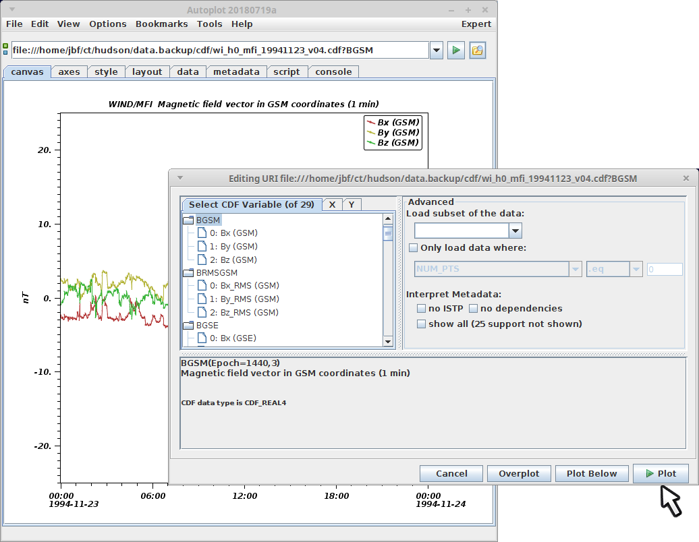

# Introduction

CDF files are used in space physics, invented and maintained at the
Goddard Space Physics Data Facility. They are a binary format which
stores data in blocks of records, each parameter having a short name,
with associated metadata. CDF has a mature metadata standard, and
parameters can be related, such as asserting that each index of
"Density" is associated with an "Epoch" time when the data was
collected.

apds.cdf.jpg</img>

# Using CDF Files

Point Autoplot at a CDF file, and a list of the parameters found is
shown. A parameter name is selected and "Plot" will show this parameter.
A little metadata about the parameter is displayed in the panel below,
such as its description found in the CDF, and how many records are
found. Note too that the dependencies are reflected as well, so
BGSM\[Epoch=1440,3\] indicates that the first index changes with time.
Note that when the data contains named components (e.g. BGSM has Bx, By,
and Bz) then either individual components or the set of all components
can be plotted.

CDF is able to store time in three ways, with Epoch (double milliseconds
since 0000-00-00T00:00), Epoch16 which was used on the Cluster and
Themis missions, and finally TT2000, which should be used in all new CDF
files.

# Advanced Options

Advanced options include subsetting, where only a portion of the records
are loaded. Example entries here include \[0:10\] to load the first ten
records, \[::2\] to load every other record, and \[:-100\] to load the
last 100 records.

"Only Load Data Where" allows filtering based on another parameter.
Sometimes a quality flag is included in the file, and this can be used
to load only the records having a high-quality rating.

Initially these are the "data" parameters, and the "support data"
parameters are hidden. The data parameters are what is measured (e.g.
Density), and the support data is when and where it is measured (e.g.
Time). The checkbox "show all" will update the list of parameters to
include the support data as well.

"no dependencies" and "no ISTP" are useful when developing CDF files,
where a malformed CDF file cannot be loaded (for example the number of
density and time records is different). These will ignore metadata so
that the raw numbers can be examined. This is also useful for odd CDF
files which were created without any attempt to use CDF conventions.

# Quirks

## Single-Record Parameters may be Interpreted as Non-Record-Varying

A parameter can be identified as non-record-varying (NRV), meaning the
parameter is constant for any time. So for example, suppose you have the
three parameters Flux, Time, and Energy. For each record of Flux, there
is a record of Time. Energy is marked as NRV, so it is understood that
the one record of Energy applies to all records of Flux.

The problem is that many CDF files don't mark the parameter as
non-record-varying. Autoplot must then guess what CDF author's the
intent was, and the logic is that a single record is always interpreted
as NRV.

# Glossary

In an effort to establish standard names for things:

  - parameter is a science quantity stored in a CDF.
  - "variable" is used as an alias for parameter.
  - "parameter id" is the name identifying the parameter.

<addhtml>

</addhtml>
