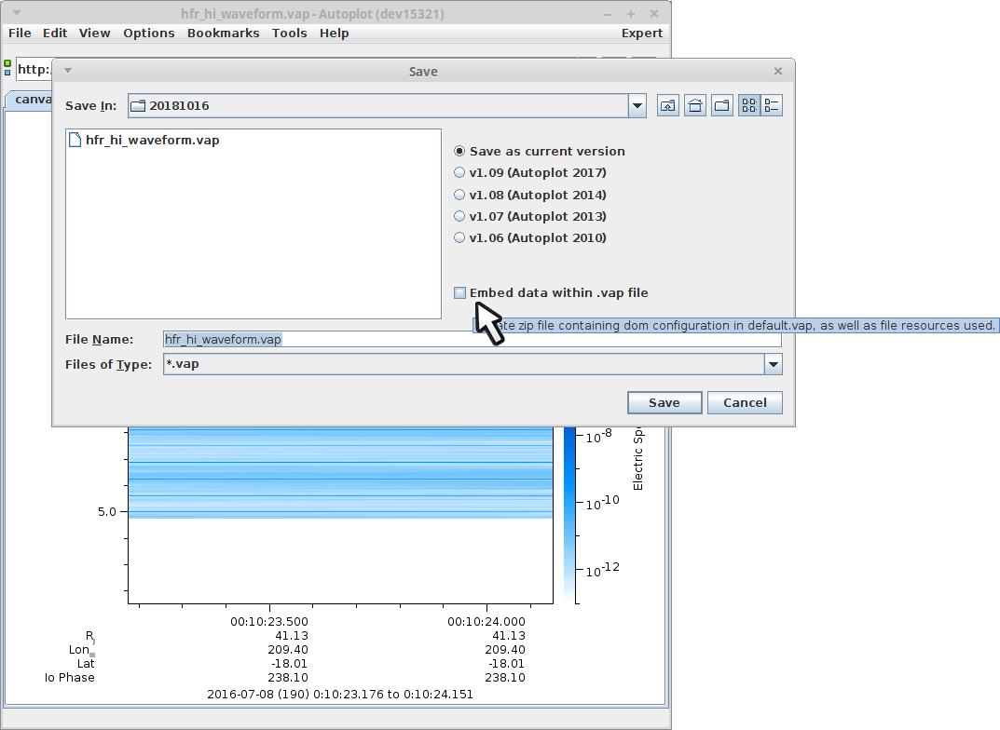

Purpose: Discuss the feature where data is embedded within a vap file.

Audience: Developers and interested scientists.

# Introduction

%{PWD} can be used within a vap to provide references to data relative
to the vap location. This also means that when the file default.vap is
stored in a zip file along with relative references, we now have a
complete and consistent way to make a vap that contains the data.

# Save VAP Dialog

The dialog to save a .vap file has a checkbox "embed data within .vap
file", which when selected will embed local data which would note work
on other machines. This provides an easy way to create a .vap which will
always work on other computers.

Note, references to local data files used in .jyds scripts is not
embedded, because it is too difficult to calculate which data would be
needed.
