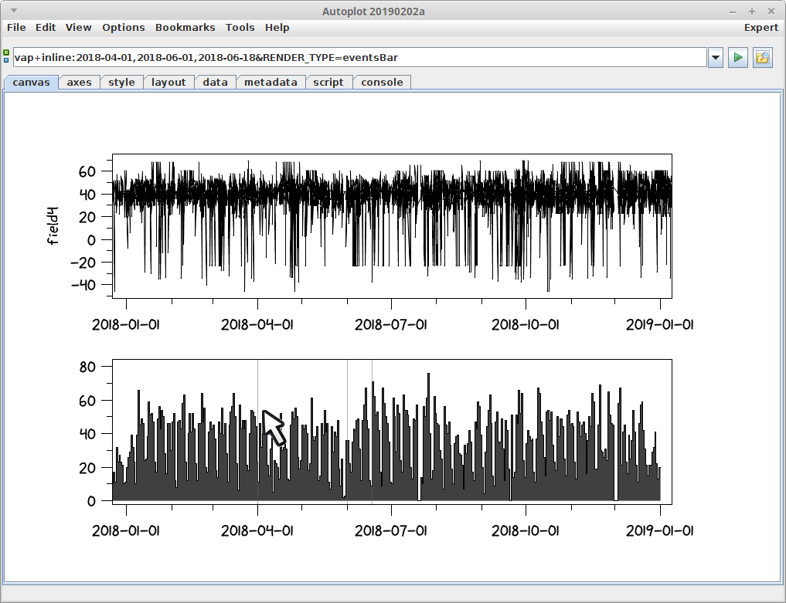

Audience: scientists

Purpose: describe how events bars are drawn

# Introduction

Events bars mark when events occur along a time axis. Often this is just
a vertical bar at a set of times, but Autoplot also supports bars having
width and color, along with annotating text.

See
<http://autoplot.org/wiki/index.php?title=cookbook&section=5#Events_Bar_under_all_plots>

# In-Line Events Lists

To mark just a few events, such as the start and ending boundaries, you
can use inline URIs, which are URIs which contain data. For example,
vap+inline:2018-04-01\&RENDER\_TYPE=eventsBar will be drawn as a
vertical line at the time.
vap+inline:2018-04-01,2018-06-01\&RENDER\_TYPE=eventsBar will be drawn
as two vertical lines. Note the inspect icon will bring up a table for
editing the events.

